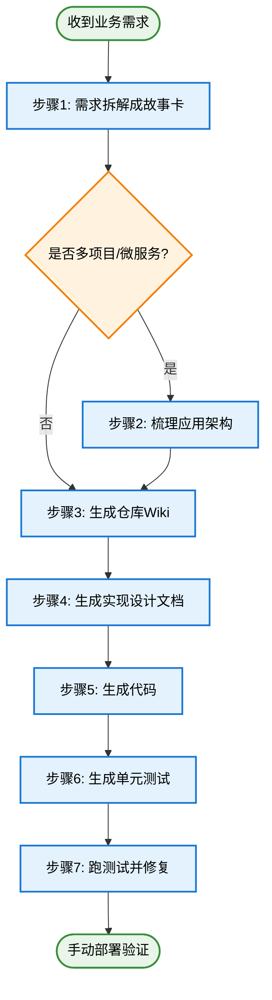
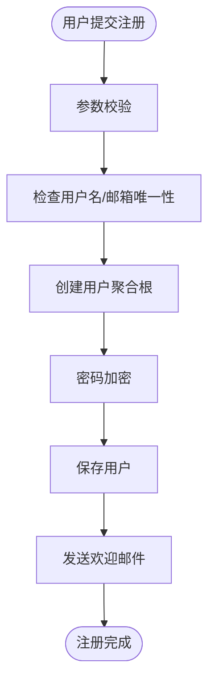

# AI辅助软件开发完整工作流使用指南

> 从需求到代码的系统化、高质量交付方案

## 🎯 引言：为什么需要这套工作流？

在软件开发过程中，我们常常面临这些挑战：

- **需求理解偏差**：开发理解的需求和产品期望的不一致
- **架构认知模糊**：新人不清楚代码应该写在哪个项目、哪个模块
- **上下文缺失**：不了解项目已有能力，重复造轮子
- **设计文档缺失**：直接开始写代码，缺乏系统化设计
- **测试覆盖不足**：单元测试流于形式，质量无保障

本工作流通过**7个结构化步骤**，利用AI的能力，系统性地解决这些问题，帮助团队实现**高质量、可追溯、标准化**的软件交付。

---

## 📊 工作流全景图



**核心理念**：从需求到代码的每一步都有明确的输入、输出和质量标准，AI作为协作伙伴全程参与。

---

## 📋 步骤1：需求拆解成故事卡

### 🎯 目标
将业务需求文档拆解为**可独立开发、测试、部署**的用户故事卡，确保需求理解一致、范围明确。

### 📥 输入
- 业务需求文档（Word/Markdown/PDF等）
- 产品原型图（如有）
- 业务流程说明

### 🔧 使用方法

**第一步：整理需求**
```
将所有需求整理成一份完整的文档（建议Markdown格式），包含：
- 业务背景和目标
- 功能需求列表
- 数据模型说明
- 业务规则和约束
- 非功能性需求（性能、安全等）
```

**第二步：启用提示词**
```
在Cursor中打开需求文档，引用提示词：
@产品经理标准故事卡生成提示词.mdc

对AI说："请帮我将这份需求拆解为标准故事卡"
```

**第三步：HIL协作确认**
AI会通过结构化提问，与你确认关键信息：
- **数据录入方式**：单条录入 vs 批量导入？
- **字段关联方式**：单选 vs 多选？数据来源？
- **国际化策略**：多语言如何实现？
- **状态管理**：有哪些状态？如何流转？
- **功能边界**：权限控制、审计日志、性能要求？

**第四步：逐卡审核**
AI会逐个生成故事卡并保存到 `.po/story/` 目录：
```
.po/story/
├── P1-用户管理-用户注册-前端.md
├── P1-用户管理-用户注册-后端.md
├── P2-订单管理-订单创建-前端.md
├── P2-订单管理-订单创建-后端.md
└── ...
```

**第五步：沟通修改**
阅读每份故事卡，发现问题时：
```
"P1-用户管理-用户注册-后端.md 这个故事卡中，
邮箱验证逻辑需要改为异步验证，发送验证码到邮箱"
```

### 📤 输出
- ✅ 一组结构化的用户故事卡（前后端分离）
- ✅ 每个故事卡包含：用户故事、验收标准、技术实现要点、接口设计、依赖关系
- ✅ 故事卡之间的依赖关系清晰

### 💡 最佳实践
- **前后端强制分离**：前端和后端必须拆分为独立故事卡
- **单卡工作量控制**：每个故事卡1-5天工作量
- **避免过度拆分**：相近功能可合并（如CRUD+外部对接）
- **零猜测原则**：不确定的地方AI会主动提问，不会臆造

---

## 📐 步骤2：梳理应用架构（多项目/微服务场景）

### 🎯 目标
**适用场景**：多项目、微服务架构、多应用系统

明确项目关系、职责边界、依赖关系，让开发人员知道**代码应该写在哪个项目的哪个模块**。

### 📥 输入
- 项目代码仓库结构
- 已有的架构说明（如有）
- 业务领域划分

### 🔧 使用方法

**启用提示词**
```
@application_architecture_guide.mdc

对AI说："帮我梳理应用架构"
```

**6个阶段引导**

AI会通过6个阶段，渐进式引导你描述架构：

1. **阶段1：应用全景识别**
   ```
   问题：系统包含几个独立的应用？每个应用的名称和定位？
   
   示例回答：
   - 用户中心应用 - 负责用户管理、认证授权
   - 订单管理应用 - 负责订单全流程管理
   - 支付应用 - 负责支付、结算
   ```

2. **阶段2：项目清单梳理**
   ```
   问题：每个应用下包含哪些项目（Maven/Gradle模块）？
   
   示例：用户中心应用包含
   - user-service-api - API定义包
   - user-service - 业务服务
   - user-admin - 后台管理BFF
   - user-portal - 门户网站BFF
   - user-common - 公共组件
   ```

3. **阶段3：项目类型定义**
   ```
   AI会提供12种常见项目类型供选择：
   - 业务服务（Business Service）
   - API包（API Package）
   - BFF-后台管理、BFF-门户、BFF-移动端
   - API网关、配置中心、注册中心
   - 公共组件、业务组件
   - 定时任务、消息消费者
   
   同时识别内部架构：DDD四层架构 / 传统三层架构
   ```

4. **阶段4：依赖关系梳理**
   ```
   AI会检查依赖规则：
   ⚠️ BFF不应直接依赖业务服务实现
   ⚠️ API包不应依赖业务实现
   ⚠️ 不允许循环依赖
   ⚠️ BFF不应直接访问数据库
   ```

5. **阶段5：职责边界划分**
   ```
   对每个业务服务明确：
   - 服务使用场景（谁会调用？什么时候调用？）
   - 核心职责（应该做什么？）
   - 职责边界（不应该做什么？）
   - 与其他服务的边界说明
   ```

6. **阶段6：内部架构设计**
   ```
   针对DDD架构的业务服务，详细说明：
   - Controller层（OHS）：RPC端点、DTO转换
   - App层（应用层）：编排、事务管理
   - Domain层（领域层）：聚合根、实体、值对象、领域服务
   - Infr层（基础设施层）：Repository实现、Mapper、外部集成
   ```

### 📤 输出
- ✅ 完整的架构文档（保存到 `.cursor/rules/` 目录）
- ✅ 架构全景图（Mermaid格式）
- ✅ 依赖关系图（Maven依赖、RPC调用、中间件依赖）
- ✅ 职责边界矩阵
- ✅ 开发规范和禁忌清单

### 💡 最佳实践
- **提前准备材料**：项目清单、pom.xml依赖、业务需求文档
- **分阶段确认**：每个阶段完成后确认，避免后续推倒重来
- **及时澄清**：发现架构不合理时，AI会提示，及时讨论调整

---

## 📚 步骤3：生成仓库Wiki（补充AI上下文）

### 🎯 目标
为AI生成一份**项目能力说明书**，描述清楚：
- 对外提供的能力（API接口）
- 内部具备的能力（业务模块、领域对象）
- 依赖的技术栈（数据库、Redis、MQ、外部服务）

这样在后续生成实现设计文档时，AI能够**复用现有能力**，而不是重复造轮子。

### 📥 输入
- 项目代码仓库
- 架构文档（步骤2生成的，如有）

### 🔧 使用方法

**启用提示词**
```
@repo_wiki_generator.mdc

对AI说："请为这个Java项目生成工程级知识库"
```

**执行流程**

AI会按照TOT（Tree of Thoughts）流程执行：

```
节点1：环境检查
├─ 验证Git分支（必须在main分支）
├─ 检查工作目录状态
└─ 记录当前commit版本

节点2：项目结构扫描
├─ 扫描Maven/Gradle模块
├─ 识别分层架构（controller/service/domain/repository）
├─ 识别接口层（Controller、API）
├─ 识别数据层（Entity、Repository）
├─ 识别业务层（Service、Domain）
└─ 识别适配器层（Client、Adapter）

节点3：生成文档规划
├─ 预估文档数量和行数
├─ 制定生成计划
└─ ⚠️ 强制HIL确认点：等待用户确认规划

节点4：生成项目概述
├─ 项目介绍和核心价值
├─ 服务定位和使用场景
├─ 对外接口能力清单
├─ 数据模型和关系
├─ 业务/领域模块划分
└─ 依赖服务和中间件

节点5：生成业务模块文档
├─ 按模块循环生成
├─ 核心流程（Mermaid流程图）
├─ 流程节点详解
└─ 使用示例

节点6：生成项目规范
└─ 编码规范、设计原则、最佳实践

节点7：最终整合
├─ 验证所有文档质量
├─ 生成索引文档（README.md）
└─ ✅ 完成
```

### 📤 输出

生成的知识库位于 `gientech/wiki/` 目录：

```
gientech/wiki/
├── README.md                          # 知识库索引
├── 00-项目概述.md                      # 项目全局概览
│   ├─ 项目介绍和核心价值
│   ├─ 服务定位和使用场景
│   ├─ 对外接口能力（所有Controller接口）
│   ├─ 数据模型和仓储层（Entity、Repository）
│   ├─ 业务/领域模块（Service、Domain）
│   ├─ 防腐层/适配器层（Client、Adapter）
│   └─ 中间件依赖（Redis、MQ、ES等）
├── 01-业务模块-用户管理.md              # 业务模块详细文档
├── 01-业务模块-订单管理.md
├── 01-业务模块-支付管理.md
└── 99-项目规范.md                      # 项目编码规范
```

**核心特性**：
- ✅ **可追溯性**：所有类、方法引用都标注文件路径和行号
  ```
  来源：UserService.createUser() (src/main/java/.../UserService.java:45-60)
  ```
- ✅ **使用示例**：每个类和方法都有使用场景示例
- ✅ **预估行数**：每个章节标注预估行数，方便评估复杂度
- ✅ **支持自动校验**：格式规范，未来可自动校验文档与代码一致性

### 💡 最佳实践
- **在main分支执行**：确保生成的文档与代码版本一致
- **定期更新**：代码重构后重新生成，保持文档同步
- **分模块生成**：大型项目可分多次生成不同模块的Wiki
- **作为AI上下文**：在后续生成实现设计文档时，引用这些Wiki

---

## 🎨 步骤4：生成实现设计文档

### 🎯 目标
基于**需求文档（步骤1）+ 架构文档（步骤2）+ 仓库Wiki（步骤3）+ 项目规范**，生成详细的实现设计文档，指导代码编写。

### 📥 输入
- 用户故事卡（步骤1）
- 应用架构文档（步骤2，如有）
- 仓库Wiki（步骤3）
- 项目规范（如 DDD项目规范）
- 实现设计文档规范模板

### 🔧 使用方法

**准备材料**
```
1. 打开要实现的故事卡，如 P1-用户管理-用户注册-后端.md
2. 准备好相关文档：
   - 需求文档（原始业务需求）
   - 架构文档（.cursor/rules/PROJECT_ARCHITECTURE.mdc）
   - 仓库Wiki（gientech/wiki/）
   - 项目规范（.cursor/rules/ddd_project_standards.mdc）
```

**启用编程协作提示词**
```
@java_coding_assistant_v2.mdc

对AI说：
"请基于以下材料，为故事卡【P1-用户管理-用户注册-后端】
生成实现设计文档：

需求文档：@需求文档.md
架构文档：@PROJECT_ARCHITECTURE.mdc
仓库Wiki：@gientech/wiki/00-项目概述.md
项目规范：@ddd_project_standards.mdc
实现设计规范：@implementation_design_template.mdc
```

**AI工作流程**

AI会按照**场景1：从原始需求到代码实现**的流程执行：

```
Step 0：项目理解（强制执行）
├─ 扫描项目结构
├─ 阅读相关现有代码
├─ 分析依赖关系（grep确认枚举类、常量类）
├─ 识别现有模式（命名、注释、异常处理）
└─ 深入理解需求文档

Step 1：需求理解与澄清
└─ 深入理解业务需求，必要时提问澄清

Step 2：方案设计与讨论
├─ ⚠️ 优先级原则：先设计核心编排逻辑，再补充细节
├─ 提出2-3个可行方案
├─ 阐述优缺点
└─ 推荐最优方案

Step 3：生成实现设计文档
└─ 包含：核心编排逻辑、类设计、方法设计、代码生成步骤

Step 4：与用户沟通，修改实现设计文档
└─ ⚠️ 进入场景3（方案讨论），可能多轮迭代

Step 5：用户确认方案，同意生成代码
└─ ⏸️ 等待用户明确同意（HIL强制要求）

Step 6-9：生成代码（详见步骤5）
```

### 📤 输出

**实现设计文档**（保存到 `.po/design/` 目录）：

```markdown
# 用户注册功能实现设计

## 📐 核心编排逻辑（优先级1）

### 整体流程图


### 关键角色职责
- **UserController**：接收HTTP请求，参数校验，DTO转换
- **UserApplicationService**：编排用户注册流程，管理事务
- **User（聚合根）**：维护用户业务规则，密码加密
- **UserRepository**：用户持久化
- **EmailClient**：发送邮件

## 🎯 关键抽象设计（优先级2）

### User 聚合根
```java
public class User implements AggregateRoot<Long> {
    // 字段定义
    private Long id;
    private String username;
    private String email;
    private Password password;  // 值对象
    private UserStatus status;
    
    // 工厂方法
    public static User register(String username, String email, String rawPassword);
    
    // 业务方法
    public void activate();
    public void resetPassword(String rawPassword);
}
```

### Password 值对象
（封装密码加密逻辑）

## 📋 代码生成步骤

### 第1步：Domain层（核心）
- [ ] User.java - 聚合根（包含注册逻辑）
- [ ] Password.java - 值对象
- [ ] UserStatus.java - 状态枚举
- [ ] UserRepository.java - 仓储接口
- [ ] UserDomainService.java - 领域服务（唯一性校验）

### 第2步：Infr层（实现）
- [ ] UserRepositoryImpl.java - 仓储实现
- [ ] UserMapper.java - MyBatis Mapper
- [ ] UserPO.java - 数据库对象
- [ ] EmailClient.java - 邮件客户端

### 第3步：App层（编排）
- [ ] UserApplicationService.java - 应用服务

### 第4步：Controller层（接口）
- [ ] UserController.java - HTTP接口
- [ ] RegisterUserRequest.java - 请求DTO
- [ ] RegisterUserResponse.java - 响应DTO

### 进度跟踪
| 步骤 | 文件数 | 已完成 | 待创建 | 完成率 |
|------|--------|--------|--------|--------|
| 第1步 | 5 | 0 | 5 | 0% |
| 第2步 | 4 | 0 | 4 | 0% |
| 第3步 | 1 | 0 | 1 | 0% |
| 第4步 | 3 | 0 | 3 | 0% |

## 📝 详细实现（优先级3）

### User.register() 工厂方法
（详细的方法实现设计...）

### UserApplicationService.registerUser() 编排逻辑
（详细的编排流程...）

...（其他详细实现）
```

### 💡 最佳实践

**设计优先级原则**：
1. **优先级1**：核心编排逻辑（主干流程、角色协作）
2. **优先级2**：关键抽象（接口、聚合根、值对象）
3. **优先级3**：详细实现（具体方法、数据结构）

**禁止简化实现**（最高优先级铁律）：
- ❌ 不能省略方法实现（TODO或空实现）
- ❌ 不能简化业务逻辑
- ❌ 不能压缩上下文
- ✅ 可以拆分子任务分步骤生成，但每步都要完整

**禁止无依据设计**（最高优先级铁律）：
- ❌ 不能凭空假设类结构（必须grep确认）
- ❌ 不能臆造枚举值（必须从需求文档提取）
- ✅ 所有设计必须基于现有代码或需求文档

---

## 💻 步骤5：生成代码

### 🎯 目标
基于实现设计文档，生成高质量、可执行的代码。

### 📥 输入
- 实现设计文档（步骤4）
- 项目规范（如 DDD项目规范）

### 🔧 使用方法

**执行场景2：基于实现方案的代码实现**

```
@java_coding_assistant_v2.mdc

对AI说：
"请基于实现设计文档，生成代码：

实现设计文档：@用户注册功能实现设计.md
项目规范：@ddd_project_standards.mdc
```

**AI工作流程**：

```
Step 0：文档大小检查
└─ 检查实现设计文档是否超过10,000行，超过则拆分

Step 0.5：项目理解（强制执行）
├─ 扫描项目结构
├─ 阅读相关现有代码
├─ ⚠️ 使用枚举前必须grep确认字段名和方法名
└─ 识别现有编码模式

Step 1：方案解读
└─ 仔细阅读实现设计文档的所有细节

Step 1.5：生成代码生成步骤（如文档没有）
└─ 在实现设计文档末尾追加"代码生成步骤"章节

Step 2：可行性评估
└─ 检查方案与现有架构的兼容性

Step 3：实现计划制定
├─ 拆解为具体的实现步骤
└─ ⚠️ 单文件超过500行时拆分为子任务

Step 4：用户授权
└─ ⏸️ 呈现代码生成计划，等待用户同意（HIL强制要求）

Step 5：代码实现
├─ 遵循所有编码规范
└─ ⚠️ 不得简化实现（最高优先级铁律）

Step 6：一致性检查
└─ 对比实现设计文档，检查代码是否完全实现

Step 7：会话记录
└─ 代码生成完立即追加会话记录

Step 8：进度更新
└─ 更新实现设计文档中的代码生成步骤进度表
```

### 📤 输出

**生成的代码文件**（遵循项目规范）：

```
user-service/src/main/java/com/company/user/
├── domain/user/
│   ├── model/
│   │   ├── User.java              # 聚合根（充血模型）
│   │   ├── Password.java          # 值对象
│   │   └── UserStatus.java        # 状态枚举
│   ├── repository/
│   │   └── UserRepository.java    # 仓储接口
│   └── service/
│       └── UserDomainService.java # 领域服务
│
├── app/user/
│   └── UserApplicationService.java  # 应用服务（编排）
│
├── controller/user/
│   ├── UserController.java         # HTTP接口
│   └── dto/
│       ├── RegisterUserRequest.java
│       └── RegisterUserResponse.java
│
└── infr/
    ├── repository/
    │   └── UserRepositoryImpl.java # 仓储实现
    ├── mapper/
    │   └── UserMapper.java         # MyBatis Mapper
    ├── po/
    │   └── UserPO.java             # 数据库对象
    └── client/
        └── EmailClient.java        # 邮件客户端
```

### 💡 代码质量保障

**编码前检查清单**（AI会自动遵守）：
- ✅ 是否采用面向对象设计（识别角色，对象协作）？
- ✅ 是否遵循信息专家原则（逻辑跟着信息走）？
- ✅ 是否符合开闭原则（易扩展）？
- ✅ 是否高内聚低耦合？
- ✅ 是否添加了必要的注释（@author从git获取，@date为当前日期）？
- ✅ 是否有完善的异常处理？
- ✅ 是否使用卫语句减少嵌套？
- ✅ 方法是否遵循单一职责（不能既计算又赋值）？
- ✅ 对象是否在创建时就完备（不可变性原则）？

**强制规则**：
- ⚠️ **禁止简化实现**：不能省略方法实现、简化业务逻辑、压缩上下文
- ⚠️ **禁止无依据设计**：所有类、方法、枚举值必须有依据（现有代码或需求文档）
- ⚠️ **强制项目理解**：生成代码前必须先理解项目结构和现有代码
- ⚠️ **强制HIL确认**：代码生成前必须制定计划并获得用户明确同意

---

## 🧪 步骤6：生成单元测试

### 🎯 目标
基于**需求文档 + 生成的代码**，生成高质量的单元测试，确保代码质量。

### 📥 输入
- 需求文档（原始业务需求）
- 生成的代码（步骤5）
- 单元测试规范

### 🔧 使用方法

**启用单元测试提示词**
```
@unit_test_guidelines.mdc

对AI说：
"请为User聚合根生成单元测试：

需求文档：@需求文档.md
被测试类：@User.java
```

**AI工作流程**（场景5：单元测试模式）：

```
Step 1：需求分析
├─ 阅读业务需求文档，理解业务目标
├─ 识别函数的输入参数和返回值
├─ 识别前置条件和后置条件
├─ 识别异常场景
└─ 识别完整业务流程（包括过滤、转换、聚合）

Step 2：测试用例设计
├─ 正常场景：符合预期的输入和输出
├─ 边界条件：最小值、最大值、临界值
├─ 异常输入：null、空字符串、负数、超大值
├─ 业务规则：各种业务规则的组合
└─ ⚠️ 测试期望基于完整业务流程的最终输出

Step 3：测试计划呈现
└─ ⏸️ 列出所有测试用例，等待用户确认

Step 4：测试代码实现
├─ 使用JUnit 5 / TestNG
├─ 使用AssertJ / Hamcrest断言
├─ 测试方法命名清晰（should_XXX_when_YYY）
└─ 每个测试方法只测试一个场景

Step 5：测试执行
└─ 运行所有测试用例，收集结果

Step 6：失败分析与沟通
├─ ⏸️ 立即停止，不要自行修改代码或测试
├─ 向用户报告失败的测试用例
├─ 提供失败原因分析（实际结果 vs 预期结果）
└─ ⏸️ 询问是业务逻辑错误还是测试用例设计错误

Step 7：测试报告
└─ 生成测试报告（通过率、覆盖率、问题列表）
```

### 📤 输出

**单元测试代码**：

```java
package com.company.user.domain.user.model;

import org.junit.jupiter.api.Test;
import org.junit.jupiter.api.DisplayName;
import static org.assertj.core.api.Assertions.*;

/**
 * User聚合根单元测试
 * 
 * @author xinjin
 * @date 2025-10-31
 */
@DisplayName("User聚合根测试")
class UserTest {
    
    @Test
    @DisplayName("should_create_user_successfully_when_all_parameters_valid")
    void should_create_user_successfully_when_all_parameters_valid() {
        // Given: 有效的用户参数
        String username = "johndoe";
        String email = "john@example.com";
        String rawPassword = "Password123";
        
        // When: 调用注册方法
        User user = User.register(username, email, rawPassword);
        
        // Then: 用户创建成功，状态为待激活
        assertThat(user).isNotNull();
        assertThat(user.getUsername()).isEqualTo(username);
        assertThat(user.getEmail()).isEqualTo(email);
        assertThat(user.getStatus()).isEqualTo(UserStatus.PENDING);
        assertThat(user.getPassword().isEncrypted()).isTrue();
    }
    
    @Test
    @DisplayName("should_throw_exception_when_username_is_null")
    void should_throw_exception_when_username_is_null() {
        // Given: 用户名为null
        String username = null;
        String email = "john@example.com";
        String rawPassword = "Password123";
        
        // When & Then: 抛出业务异常
        assertThatThrownBy(() -> User.register(username, email, rawPassword))
            .isInstanceOf(BusinessException.class)
            .hasMessage("用户名不能为空");
    }
    
    @Test
    @DisplayName("should_throw_exception_when_password_too_short")
    void should_throw_exception_when_password_too_short() {
        // Given: 密码少于8位
        String username = "johndoe";
        String email = "john@example.com";
        String rawPassword = "Pass1";
        
        // When & Then: 抛出业务异常
        assertThatThrownBy(() -> User.register(username, email, rawPassword))
            .isInstanceOf(BusinessException.class)
            .hasMessage("密码长度必须在8-20位之间");
    }
    
    // ... 更多测试用例
}
```

### 💡 单元测试核心原则

**黑盒测试立场**：
- ✅ 不关注内部实现，只验证输入输出
- ✅ 基于业务需求设计用例，而非代码结构

**业务驱动**：
- ✅ 基于需求文档设计测试用例
- ✅ 测试期望基于完整业务流程的最终输出
- ✅ 理解表达式的业务含义，而非字面含义

**失败分析机制**：
```
测试失败时：
1. 理解失败现象（实际结果 vs 期望结果）
2. 定位根本原因
3. 判断错误类型：
   - 类型A：测试期望设置错误 → AI可直接修正
   - 类型B：业务逻辑bug → 必须与用户沟通

⚠️ 禁止为了通过测试而修改测试用例（除非确认是测试错误）
⚠️ 禁止在未与用户沟通的情况下修改业务代码
```

---

## 🔍 步骤7：跑测试并修复

### 🎯 目标
执行单元测试，根据测试结果修复代码或测试，确保质量。

### 🔧 使用方法

**执行测试**
```bash
mvn test -Dtest=UserTest
```

**分析测试结果**

**情况1：测试全部通过**
```
✅ 恭喜！所有测试通过，代码质量符合预期
```

**情况2：部分测试失败**
```
将测试报告和失败信息提供给AI：

@java_coding_assistant_v2.mdc

"以下测试失败，请分析原因：

测试类：UserTest
失败用例：should_throw_exception_when_email_invalid
预期：抛出BusinessException("邮箱格式不正确")
实际：没有抛出异常

@User.java
@UserTest.java
```

**AI分析流程**：

```
Step 1：理解失败现象
├─ 预期结果是什么？
├─ 实际结果是什么？
└─ 差异在哪里？

Step 2：定位根本原因
├─ 对比业务需求文档
├─ 阅读被测试代码逻辑
├─ 理解表达式的业务含义
└─ 考虑过滤、转换等中间处理步骤

Step 3：判断错误类型
├─ 类型A：测试错误
│   ├─ 测试期望值设置错误
│   ├─ 测试场景设计不完整
│   └─ 测试数据构造错误
│   └─ 决策：AI直接修正测试
│
└─ 类型B：代码错误
    ├─ 业务逻辑bug
    ├─ 计算逻辑错误
    └─ 过滤条件错误
    └─ 决策：⏸️ 必须与用户沟通

Step 4：修复
├─ 如果是测试错误：AI修正测试代码
└─ 如果是代码错误：与用户讨论修复方案
```

**修复后重新测试**
```bash
mvn test -Dtest=UserTest
```

### 💡 测试修复最佳实践

**原则**：
- ✅ 测试是发现问题的工具，不是通过测试的工具
- ✅ 失败的测试往往揭示真实的业务逻辑问题
- ⚠️ 不要为了通过测试而降低测试标准

**常见问题**：
1. **测试期望理解错误**
   - 症状：误解业务流程的最终输出
   - 解决：重新阅读需求文档，理解完整流程

2. **表达式语义理解错误**
   - 症状：从字面理解表达式，而非业务含义
   - 解决：分析表达式计算的业务单位和实际含义

3. **边界条件遗漏**
   - 症状：正常场景通过，边界场景失败
   - 解决：补充边界条件测试用例

---

## 🚀 步骤8：手动部署验证（最终环节）

### 🎯 目标
将代码部署到测试环境，进行端到端的手动测试，验证业务功能。

### 🔧 操作步骤

1. **代码提交**
   ```bash
   git add .
   git commit -m "feat: 实现用户注册功能 #123"
   git push origin feature/user-registration
   ```

2. **创建合并请求（MR/PR）**
   - 填写MR描述（包含故事卡链接、实现设计文档链接）
   - 请求代码评审

3. **代码评审通过后合并**
   ```bash
   # 合并到develop分支
   git checkout develop
   git merge feature/user-registration
   git push origin develop
   ```

4. **部署到测试环境**
   ```bash
   # 触发CI/CD流水线
   # 或手动部署
   ./deploy.sh test
   ```

5. **手动功能测试**
   - 按照故事卡的验收标准逐项测试
   - 测试正常场景、异常场景、边界条件
   - 测试与其他功能的集成

6. **问题反馈**
   - 发现问题时，记录详细的复现步骤
   - 回到步骤4或步骤5，修改实现设计或代码
   - 重新生成、测试、部署

---

## 🌟 工作流优势总结

### 💪 核心优势

1. **需求理解一致**
   - 通过故事卡标准化需求表达
   - HIL机制确保关键信息完整
   - 验收标准明确，减少返工

2. **架构清晰可控**
   - 明确项目关系和职责边界
   - 新人快速了解代码应该写在哪里
   - 避免职责不清导致的架构腐化

3. **复用现有能力**
   - 仓库Wiki让AI了解已有功能
   - 避免重复造轮子
   - 提高代码一致性

4. **设计质量保障**
   - 设计优先级原则（先编排后细节）
   - 禁止简化实现（最高优先级铁律）
   - 禁止无依据设计（基于现有代码）

5. **代码质量可控**
   - 强制遵循编码规范
   - 面向对象设计（充血模型、依赖倒置）
   - 单元测试覆盖核心逻辑

6. **可追溯可演进**
   - 所有文档标注来源（文件路径+行号）
   - 支持未来自动校验和更新
   - 双记忆系统持续优化提示词

### 🎯 适用场景

**非常适合**：
- ✅ 新项目从0到1搭建
- ✅ 复杂业务功能开发
- ✅ 多项目、微服务架构
- ✅ 团队协作开发
- ✅ 需要高质量代码和文档的场景

**需要调整**：
- ⚠️ 简单的CRUD功能（可简化步骤1-3）
- ⚠️ 紧急bug修复（直接从步骤5开始）
- ⚠️ 原型验证（可跳过测试和文档）

---

## 📝 附录：快速参考卡片

### 提示词清单
```
步骤1：@产品经理标准故事卡生成提示词.mdc
步骤2：@application_architecture_guide.mdc
步骤3：@repo_wiki_generator.mdc
步骤4：@java_coding_assistant_v2.mdc + @implementation_design_template.mdc
步骤5：@java_coding_assistant_v2.mdc + @ddd_project_standards.mdc
步骤6：@unit_test_guidelines.mdc
步骤7：@java_coding_assistant_v2.mdc
```

### 输出物清单
```
步骤1输出：.po/story/*.md（故事卡）
步骤2输出：.cursor/rules/PROJECT_ARCHITECTURE.mdc（架构文档）
步骤3输出：gientech/wiki/*.md（仓库Wiki）
步骤4输出：.po/design/*.md（实现设计文档）
步骤5输出：src/main/java/**/*.java（代码）
步骤6输出：src/test/java/**/*Test.java（测试）
```

### 关键检查点
```
✅ 步骤1：零猜测原则，不扩展scope
✅ 步骤2：依赖规则检查，职责边界清晰
✅ 步骤3：在main分支执行，标注来源
✅ 步骤4：设计优先级原则，禁止简化实现
✅ 步骤5：禁止无依据设计，强制项目理解
✅ 步骤6：黑盒测试立场，业务驱动
✅ 步骤7：测试失败时与用户沟通
```

