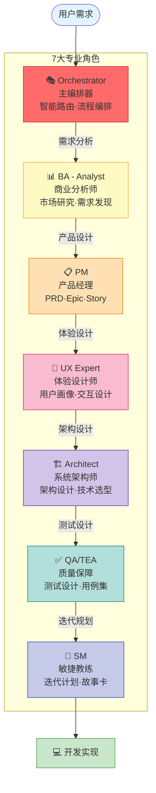
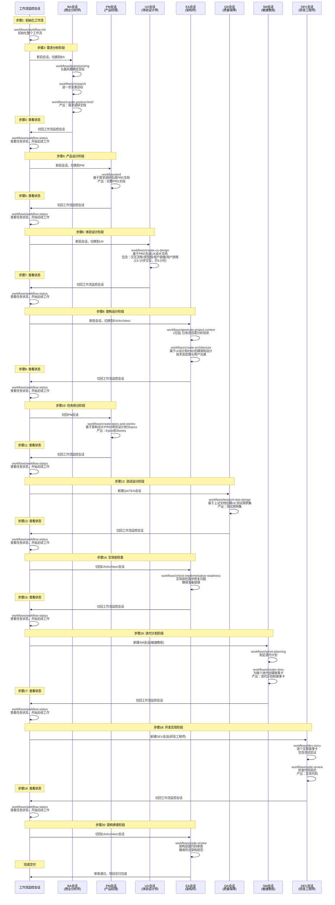
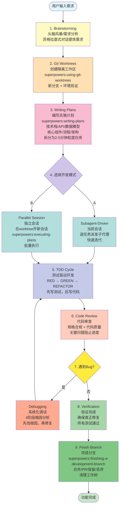
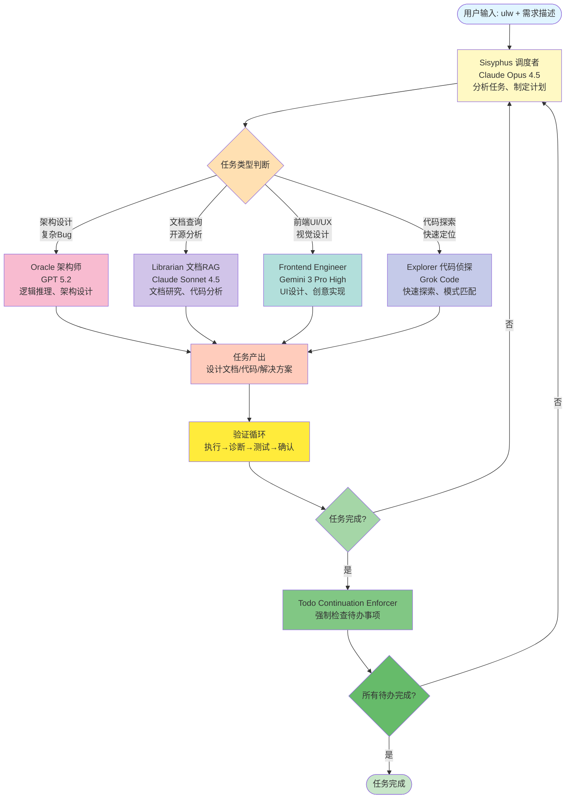
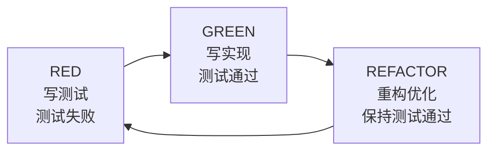
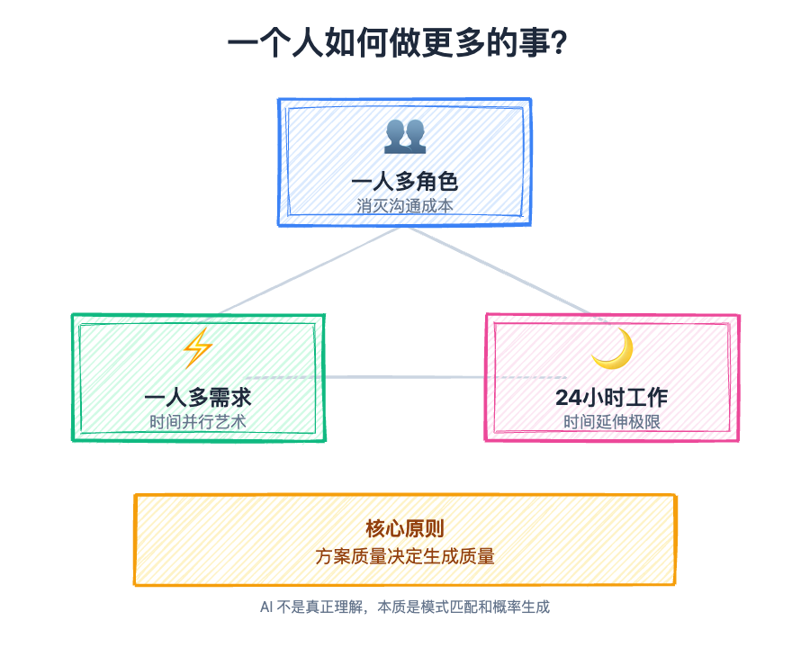

# AI时代的研发提效：24小时闭眼炼丹

**文 | 三七** （转载请注明出处）  
**公众号：三七-编程实战**

### 🎨 封面图片提示词

未来感的三层空间场景：第一层是一个开发者身兼多个角色（周围环绕BA、PM、UX、EA、QA的半透明全息投影），第二层是多个工作台并行运行（3-5个项目同时进行），第三层是24小时时钟背景（白天黑夜无缝切换，AI Agent持续工作）。整体呈现蓝紫色赛博朋克风格，代码流、神经网络和炼丹炉的隐喻融合，中间一道分界线，一边是"生产成本↓"，另一边是"获客成本↑"，暗示成本转移。3D渲染，科技与哲思并存。

> **不积跬步无以至千里，欢迎来到AI时代的编码实战课**

## 📝 文章摘要

效能提升30%+裁员20%，这是2025年技术团队的生存命题。一个人如何做更多的事？本文基于百万级代码生成实战经验，深度解析三个提效方向：**一人多角色**（消灭沟通成本）、**一人多需求**（并行开发3-5个功能）、**24小时工作**（AI持续炼丹）。全面剖析BMAD、Superpowers、Ralph Loop、OMO四大SDD框架的机制、流程、优劣与选型，提炼8条黄金实践（重方案、RAG、Subagent、Skills、Planning-with-Files、TDD、Worktrees、Loop）。

**更重要的是**，本文揭示了AI时代的两个深刻洞察：1）未来AI不仅接管代码，也将接管方案设计，人的价值从"怎么做"转向"做什么"；2）成本转移陷阱——生产成本降低会导致获客成本暴涨，差异化才是唯一出路。这不是一篇单纯的技术教程，而是AI时代软件开发范式变革的全景图。

---

## 一、场景引入：KPI背后的生存焦虑

上午10点，北京某互联网公司的会议室里，技术VP正在给团队负责人开季度会：

> "各位，今年公司的KPI很明确：**效能提升30%，同时裁员20%**。说白了，就是一个人要干原来1.5个人的活。Q2必须拿出可量化的提效数据，否则大家都不好过。"

会议室里陷入沉默。裁员已成定局，剩下的人如何活下来？如何证明自己的价值？

这不是危言耸听，而是2025年技术团队的真实写照。我最近为几个IT团队做效能提升咨询，发现技术领导们都面临同一个命题：**AI时代，研发团队的产出必须提高，成本必须降低**。

但问题来了：一个人要怎么做更多的事？

从目前的实践来看，可以从以下三个方向做突破：

1. **角色方向**：一个人做多个角色的事（BA + PM + DEV + QA）
2. **任务方向**：一个人同时做多个需求（并行开发3-5个功能）
3. **时间方向**：一个人做更长时间的事（24小时持续工作）

方向明确了，怎么做：传统软件工程方法并无法在这三个方向达到这个变革效果的期望。我们需要新的框架、新的工具、新的工作方式。

接下来，我将分享这个三个经过实战验证的提效方向，以及背后的框架和工作方式。每个方向都有其适用场景和代价，没有银弹。希望对你执行效能提升能有些参考价值。

---

## 二、方向一：一人多角色——消灭沟通成本的终极方案

### 2.1 提效的核心逻辑

我们都知道，软件工程的很大一部分成本花在**沟通**上：

- BA（商业分析师）调研需求，写需求文档给PM
- PM（产品经理）设计产品，画原型图给UX
- UX（体验设计师）设计交互，输出设计稿给架构师
- EA（企业架构师）做技术选型，写架构文档给开发
- DEV（开发工程师）写代码，提交测试给QA
- QA（测试工程师）测试，反馈bug给开发
- SM（敏捷教练）组织会议，协调各方……

每个角色交接都有信息损耗，每次会议都是时间黑洞。那么问题来了：**如果一个人可以做所有角色的事，是不是就能干掉沟通成本，还能保证需求不失真？**

这就是第一个提效方向的核心思路。

### 2.2 框架选择：BMAD——真实的虚拟软件工程团队

BMAD（Business Modeling and Architecture Development）框架相当于为你配备了一个**专业的软件工程团队**，包括BA、PM、UX、EA、QA、SM、DEV等所有角色，提供从咨询规划到交互落地的全链路工作。

官方文档：[https://github.com/bmad-code-org/BMAD-METHOD](https://github.com/bmad-code-org/BMAD-METHOD)

**快速安装：**

```bash
# 前置要求：Node.js v20+
npx bmad-method install
```

按照安装向导提示完成配置，然后在项目目录中打开AI IDE（Claude Code、Cursor、Windsurf等）。

**验证安装：**

```bash
# 在AI IDE中运行
/bmad-help
```

成功后会看到完整的命令列表和使用指南。

#### 2.2.1 BMAD的工作方式

BMAD将真实的软件工程流程1:1搬进AI协作系统，通过角色隔离和工作流编排，确保每个环节都符合专业标准。

**核心特点：**

1. **角色专业化**：每个AI角色相当于该领域的专家从业人员，发现问题的角度和提出的建议都是专家级别
2. **工作流固化**：将每个角色的SOP（标准操作流程）固化成工作流，保证产出的稳定性和准确性
3. **文档模板化**：每个环节都有标准文档模板，让下一个角色清楚如何获取需要的信息
4. **会话隔离**：不同角色在独立会话中工作，避免上下文污染

#### 2.2.2 BMAD的核心角色

BMAD框架包含7个专业AI角色，每个角色负责软件开发流程中的特定环节：



**角色分工：**

| 角色                | 核心职责                             | 主要输出               |
| ------------------- | ------------------------------------ | ---------------------- |
| 🎭 **Orchestrator** | 统一入口，智能识别需求并推荐最佳角色 | 工作流编排、状态监控   |
| 📊 **BA (Analyst)** | 市场研究、竞争分析、需求挖掘         | 需求调研文档、商业分析 |
| 📋 **PM**           | 将需求转化为产品文档和用户故事       | PRD、Epic、Story       |
| 🎨 **UX Expert**    | 用户体验设计、交互流程、原型图       | UX设计文档、用户旅程   |
| 🏗️ **Architect**    | 系统架构设计、技术选型、API设计      | 架构文档、技术方案     |
| ✅ **QA/TEA**       | 测试策略、测试用例、质量保障         | 测试用例集、质量报告   |
| 🎯 **SM**           | 敏捷规划、迭代管理、故事卡拆分       | 迭代计划、故事卡       |

#### 2.2.3 BMAD的完整工作链路（时序图）

下面用时序图展示BMAD中不同会话（角色）之间的协作流程：



### 2.3 个人评价：完整复刻了现实的软件工程，但大概率不是AI时代的发展方向

**优势：无可比拟的完整度**

1. **角色专业度高**：定义的AI角色几乎等于该领域的专家，发现问题的角度和提出的建议都是专家级别
2. **工作流标准化**：固化的工作流保证产出稳定性，文档模板让协作更高效
3. **文档驱动开发**：planning-with-files做得很好，能知道执行到哪了，支持断点续传
4. **唯一的全流程框架**：这是目前唯一一个涵盖软件研发全流程的框架，从需求分析、产品设计、体验设计、架构设计到测试设计、迭代规划，形成完整闭环。其他框架大多从交付阶段开始，顶多在交付阶段前加一点"需求讨论"
5. **了解全角色的工作内容**：使用这框架，与其开发功能不如用来了解不同血色的标准工作流程，以及产出物的模版，提高自己的认知

**劣势：时间成本与上下文挑战**

1. **时间成本高昂**：因为1:1还原真实流程，沟通非常细致，随便开发个小工具都要5-6小时起步
2. **上下文丢失**：虽然独立会话隔离，但产出文档过于细致，后续角色可能因上下文过大而丢失信息，导致生成偏离目标
3. **头脑风暴悖论**：自己跟自己头脑风暴始终是片面的，缺少真实的业务专家输入
4. **故事卡粒度问题**：仅由产品经理拆分的故事卡只表明"意图"，缺少"如何实现"的技术细节，AI容易理解偏差

举个例子：

```yaml
# 产品经理拆分的故事卡（仅意图）
故事卡: 提供一个展示用户所有角色的接口
验收标准: 接口返回用户拥有的所有角色列表

# 实际有两种实现路径
实现A: 使用 consultants 表，走关联表查询
实现B: 使用 consultants_openrole + openrole 表，捞出consultant的所有openrole的name

# AI可能选择A，但你期望的是B，产生偏差
```

5. **配置细节莫名其妙**：配置的内容细本身不是问题，先把配置搞细，后边再通过"约定大于配置"或者"方案组合"来提效就好。问题是好多细节都有点莫名其妙。

举个例子：

```yaml
场景A - C端体验型App:
  目标: 主打用户体验
  关注点: 字体、样式、交互动效 ✅ 合理

场景B - 内部工具:
  目标: 实现功能，提升工作效率
  BMAD表现: 反复让你抠字体、抠样式 ❌ 本末倒置
  核心价值: 功能实现 > 视觉美化
```

对于工具类应用，用户要的是"能用"，而不是"好看"。一直纠缠在样式细节上，反而分散了对核心功能的关注。总的来说，**虽然我无法证明一个药方在一个病人身上是否有效，但我可以确信一个药方用在所有病人身上一定是要死人的**。

6. **DEV角色过于宽泛**：现实中我们区分前端、后端、测试、运维，是因为关注点不同、技术栈差异大。AI辅助让语法问题消失了，但框架使用、非功能性需求等深层认知差异依然存在。让一个单端研发同学跨语言直接全栈开发，把控所有环节，容易把bug带到生产，目前只适合2B小项目或对生成容错度高的场景。

**真实案例分享：**

- 产品经理写前端，出bug处理不了还得找前端同学救火，前端一边骂一边删掉AI代码重写
- 后端同学全栈开发，某个交互样式死活实现不出来，反复描述AI就是不对
- Java后端写Ruby，逻辑都对但框架使用有问题，埋下极端场景死循环的隐患

---

## 三、方向二：一人多需求——时间并行的艺术

### 3.1 提效的核心逻辑

当你让AI生成一个大功能时，它可能需要30-60分钟。这段时间你在干嘛？刷手机？喝咖啡？

**为什么不能同时开发另一个需求？**

这就是第二个提效方向的核心：**利用AI生成的等待时间，并行开发多个需求**。

这里有个特殊技术问题：Git只能切一个分支开发。如果要在同一个项目并行开发3个功能，难道要复制3个代码仓到不同目录？

有更优雅的方案：**Git Worktrees** + **子代理隔离上下文**。

### 3.2 框架选择：Superpowers——简洁高效的SDD框架

Superpowers是目前最火的SDD框架之一，核心理念是：**用户只需聚焦前期的需求澄清和方案选型，后续交给AI的最佳实践自动完成**。

官方文档：[https://github.com/obra/superpowers](https://github.com/obra/superpowers)

**快速安装：**

安装方式因平台而异。

**Claude Code（通过插件市场）：**

```bash
# 1. 先注册插件市场
/plugin marketplace add obra/superpowers-marketplace

# 2. 从市场安装插件
/plugin install superpowers@superpowers-marketplace
```

**验证安装：**

```bash
/help
# 应该看到以下命令：
# /superpowers:brainstorm - 交互式设计优化
# /superpowers:write-plan - 创建实现计划
# /superpowers:execute-plan - 批量执行计划
```

#### 3.2.1 Superpowers的工作方式

Superpowers不像BMAD那样还原真实软件工程流程，而是从AI辅助编程的角度重新设计了工作流：

**核心特点：**

1. **方案而非角色**：不模拟软件工程角色，而是提供几种最佳实践方案让用户选择
2. **Worktrees隔离**：自动创建Git工作树，支持并行开发多个功能而不互相干扰
3. **子代理驱动**：每个任务派遣新的子代理，隔离上下文，避免污染
4. **TDD保障质量**：强制测试驱动开发，先写测试再写代码
5. **两阶段审查**：每个任务完成后进行代码审查，确保质量

让我用流程图展示Superpowers的9步工作流：



**9步工作流详细说明：**

| 步骤 | 名称          | 关键操作                                                                           | 输出             |
| ---- | ------------- | ---------------------------------------------------------------------------------- | ---------------- |
| 1    | Brainstorming | 苏格拉底式对话提炼需求                                                             | 明确的需求定义   |
| 2    | Git Worktrees | `/superpowers:using-git-worktrees`<br/>创建新分支+环境验证                         | 隔离的工作区     |
| 3    | Writing Plans | `/superpowers:writing-plans`<br/>技术栈/API/数据模型设计<br/>拆分为2-5分钟粒度任务 | 可执行的实施计划 |
| 4    | 选择模式      | **模式A**: Subagent-Driven（当前会话）<br/>**模式B**: Parallel Session（独立会话） | 开发模式确定     |
| 5    | TDD Cycle     | RED（写测试失败）→ GREEN（写实现通过）→ REFACTOR（重构优化）                       | 有测试保障的代码 |
| 6    | Code Review   | 规格合规性检查<br/>代码质量审查<br/>关键问题阻止进度                               | 审查报告         |
| 7    | Debugging     | 4阶段根因分析<br/>先找根因，再修复                                                 | Bug修复          |
| 8    | Verification  | 确保真正修复<br/>所有测试通过                                                      | 质量验证通过     |
| 9    | Finish Branch | `/superpowers:finishing-a-development-branch`<br/>合并/PR/保留/丢弃<br/>清理工作树 | 功能完成交付     |

#### 3.2.2 Superpowers的使用步骤

超级简洁，只需要2步：

**步骤1：启动头脑风暴**

```bash
/superpowers:brainstorm + 需求描述或需求文档
# 之后按照提示交互，澄清需求和技术选型
```

**步骤2：确保创建Worktree（重要！）**

```bash
# 如果头脑风暴后没有自动提示执行，必须手动执行：
/superpowers:using-git-worktrees

# ⚠️ 这一步非常重要！不执行会直接在main分支提交，与他人冲突后回退很麻烦
```

之后就是自动化流程：生成计划 → 派遣子代理 → TDD实现 → 代码审查 → 验证 → 合并分支。

### 3.3 个人评价：简洁高效的炼丹之旅

**优势：无与伦比的效率**

1. **交互成本低**：用户只需聚焦需求澄清和方案选型，不需要讨论很多细节
2. **最佳实践内置**：不像BMAD需要自己配置方案，Superpowers直接提供几种最优方案选择
3. **生成质量稳定**：独立上下文的子代理 + TDD机制，使得生成效果高效且稳定
4. **并行开发友好**：Worktrees让同项目多功能并行开发变得可能

**劣势：定制性与炼丹问题**

1. **planning-with-files不完善**：只有plan输出一个文件，且不够全面，很多决策在会话中。任务中断不好续传，容易混乱
2. **方案定制困难**：因为都是给现成方案，用户可能不知道提什么改进意见。生成的效果符合方案预期，但不一定符合用户预期

举个例子：

```yaml
# BMAD的UX设计会细到：
- 字体选择（Roboto / Open Sans）
- 色彩主题（Material Design / Flat Design）
- 交互动画（淡入淡出 / 滑动）
- 响应式布局（移动端优先 / 桌面端优先）

# Superpowers就完全没有这些选项：
- 页面主题？不提及
- 交互形式？很少涉及
- 更多聚焦功能逻辑的实现
```

3. **非标准需求风险**：全按标准选项生成的方案落地效果很好，但如果提出大量非选项调整，被调整部分的集成容易缺胳膊少腿

**真实案例：**

我发现"类目"和"文件"都要做排序和层级管理，提议抽一个公共模块来管理资源的层级和排序。模块本身开发没问题，但各资源使用该模块的相关逻辑却有缺漏，导致功能不完整。

**这里也可以看出，AI不是真正理解，其本质还是单词接龙。为什么superpowers能给出方案供你选择？因为它去捞了一堆最佳实践的方案，匹配给你选择。为什么定制调整方案，方案会缺胳膊少腿。因为你的定制方向可能不主流，比如例子中给排序抽公共模块，没见过这种例子，那么变更完，整个方案该怎么适配就不知所措**。

4. **并行开发的坑**：虽然并行开发友好，但同个项目并行开发本身就是个大坑，这友好的意义也就不大了。当你使用SDD框架时，方案已经控制不了太细节，代码更是大部分不看。这时去合并分支处理冲突其实很吃力，处理冲突的时间可能串行跑2-3次就搞定了

**适用场景：**

- 快速Demo开发，效果惊艳
- 标准CRUD功能，需求明确
- 可以接受"炼丹"的项目（逻辑正确，但样式/交互/非功能性需求靠运气）
- 技术栈成熟、最佳实践清晰的场景

**一句话总结：**

> 针对大的端到端功能，生成算是比较稳定的。但比较不好定制，做做Demo效果很惊艳。不看方案和代码实现可能是未来主线，但现在走这种模式意味着不可控，意味着功能实现像炼丹——逻辑正确，但样式、交互、非功能性需求设计就全看运气了。

---

## 四、方向三：24小时工作——时间延伸的极限挑战

### 4.1 提效的核心逻辑

如果前两个方向是"空间并行"，那第三个就是"时间延伸"：**早上设计方案，晚上跑代码，让AI 24小时不间断工作**。

听起来很诱人，但关键不是"不间断执行"，而是**生成质量要高**。

让我用一个绝妙的类比来说明这个问题：

### 4.2 3D打印机的启示：质量决定一切

为了给孩子做玩具，陪孩子动手，我买了一台3D打印机。买来后几乎就是化身无情资本家，3D打印机必须24小时运转，晚上一定得打个长时间模型，每天早上起来收菜。

但现实是这样的：

**场景1：使用大佬的高质量模型文件**

```yaml
模型文件: ✅ 参数精确，切片完美（高质量方案设计）
打印机: ✅ 御三家耗材，性能稳定（Claude/GPT/Gemini）
结果: 🎉 第二天起来，成品完美无瑕
  或者只有一些小瑕疵，稍微打磨就能用(没有bug，或则简单丢给AI修一下就好)
效能: ⭐⭐⭐⭐⭐ 真正的24小时工作
```

**场景2：使用菜鸟的模型文件**

```yaml
模型文件: ❌ 参数不对，切片没做好（低质量方案设计）
打印机: ✅ 御三家耗材，性能稳定
结果: 💥 打印没多久模型就倒了（出现bug）
  然后开始"炒面"（代码生成开始死循环）
  浪费耗材、浪费电（浪费token、浪费电）
效能: ⭐ 不仅没提效，还制造了一堆垃圾
```

**场景3：为了省钱用非御三家耗材**

```yaml
模型文件: ✅ 参数精确，切片完美
打印机: ⚠️ 非御三家耗材（不是Claude/GPT/Gemini）
结果: ⚡ 大部分时候能打印成功（量大管饱,代码生成没问题）
  时不时打印失败几次（出现bug）
  机器堵头几次（与AI IDE适配问题）
效能: ⭐⭐⭐ 性价比高，但需要维护
```

**场景4：混搭组合出Bug**

```yaml
场景A: B家打印机 + A家耗材（反重力用Claude）
场景B: B家打印机 + A家模型文件（OpenCode集成Superpowers）
结果: 🐛 各种适配问题，可能打印出bug
  一直交互报agent错误
效能: ⭐⭐ 折腾半天，光在处理集成问题
```

**这个类比告诉我们：**

1. **方案质量是根本**：再强的打印机装备（AI IDE + 框架 + AI模型），遇到烂模型文件（方案设计）也白搭
2. **模型选择要匹配**：不同打印机（AI IDE + 框架）适配不同耗材（AI模型），混搭有风险
3. **24小时的前提是稳定**：只有高质量方案+稳定生成，24小时工作才有意义

那么，有哪些框架能实现"不中断的持续执行"呢？

### 4.3 框架选择：Ralph Loop与OMO

早些时候，大家一直在关注**Ralph Loop**和**OMO**这两个框架，因为它们有个共同特点：**驱动会话一直交互直到完成，而不是遇到问题就中断**。

#### 4.3.1 Ralph Loop：极简的循环执行器

Ralph Loop是Claude Code的一个插件，使用成本极低。

**快速安装：**

```bash
# 在Claude Code中运行
/plugin install ralph-loop@claude-plugins-official
```

**前置要求：**

- Claude Code已安装并配置
- Anthropic API订阅（推荐$100/月或更高）
- Git跟踪的项目目录

**使用方式：**

只需要一行命令：

```bash
/ralph-loop "Your task description" --completion-promise "DONE"

# 示例
/ralph-loop "实现用户登录功能，包括邮箱验证、密码加密、JWT生成" --completion-promise "DONE"
```

执行后，AI会持续工作，遇到问题自己尝试解决，直到任务完成或显式标记"DONE"。

**核心机制：**

- 循环执行任务，不轻易中断
- 自动处理小问题和边界情况
- 持续验证，确保真正完成

#### 4.3.2 OMO：智能多模型协同系统

OMO（Oh My OpenCode）是一个更复杂、更强大的框架，它不是简单的循环执行，而是通过**智能调度器+多角色协同+多模型编排**来保证任务持续完成。

官方文档：[https://raw.githubusercontent.com/code-yeongyu/oh-my-opencode/refs/heads/master/docs/guide/installation.md](https://raw.githubusercontent.com/code-yeongyu/oh-my-opencode/refs/heads/master/docs/guide/installation.md)

**快速安装：**

```bash
# 方式1：使用Bun（推荐）
bunx oh-my-opencode install

# 方式2：使用npm
npx oh-my-opencode install
```

**前置要求：**

- OpenCode已安装（[安装指南](https://opencode.ai/docs)）
- 至少一个AI订阅：Claude Pro/Max、ChatGPT Plus、Gemini，或GitHub Copilot

**安装配置：**

安装程序会询问你的订阅情况，根据你的回答自动配置对应的模型

**OMO的角色设计：**

OMO与BMAD类似，也圈定了一些角色形成团队，但这些角色不是传统软件工程角色，而是**站在AI辅助编程的角度设计的专业角色**：

1. **Sisyphus（调度者）**
   - 模型：Claude Opus 4.5
   - 角色：默认智能体，强大的AI编排者
   - 职责：规划、委派、执行复杂任务

2. **Oracle（架构师）**
   - 模型：GPT 5.2
   - 角色：架构设计、代码审查、战略制定
   - 职责：拥有卓越逻辑推理能力

3. **Librarian（文档RAG）**
   - 模型：Claude Sonnet 4.5
   - 角色：官方文档查询、开源实现分析
   - 职责：代码库深度探索

4. **Frontend UI/UX Engineer（前端工程师）**
   - 模型：Gemini 3 Pro High
   - 角色：设计师出身的开发者
   - 职责：构建华丽、富有创意的UI

5. **Explorer（Code Scout）**
   - 模型：OpenCode Grok Code
   - 角色：闪电般快速的代码库探索
   - 职责：模式匹配和代码定位

6. **其他角色**：可插拔扩展

**OMO的工作方式：**

让我用流程图展示Sisyphus如何智能调度其他角色：



**使用方式：**

超级简单，只需在需求描述前加一个关键字：

```bash
ulw 实现一个带搜索和排序功能的用户管理后台

# OMO会自动分析任务，调度合适的角色执行
```

**OMO的核心优化机制：**

1. **多模型智能协同**（根据专长匹配任务）
   - GPT 5.2 (Oracle) → 架构设计、复杂Debug
   - Gemini 3 Pro → 前端UI/UX视觉设计
   - Claude Sonnet → 文档研究、OSS分析
   - Grok/Flash → 快速探索，成本几乎为零

2. **任务完成保证机制**
   - Todo Continuation Enforcer：强制监控待办事项
   - Ralph Loop：持续执行直到完成
   - 验证循环：执行 → 诊断 → 测试 → 确认
   - 核心哲学："无证据 = 未完成"

3. **智能上下文管理**
   - Preemptive Compaction：85%时自动压缩上下文
   - AGENTS.md：自动注入项目规则
   - Notepad系统：跨会话持久化学习
   - 动态截断：防止单次搜索耗尽上下文

4. **代码质量保护**
   - Comment Checker：防止AI生成过量注释
   - 禁止 `@ts-ignore` / `as any`：强制类型安全
   - 代码规范自动检查

### 4.4 个人评价：Token换质量的豪赌

**优势：生成质量的天花板**

1. **效果惊艳**：生成的东西该有的都有，完整度和质量都很高
2. **多模型专长发挥**：每个模型做自己最擅长的事，效果优于单一模型
3. **持续完成保证**：不轻易中断，问题自己修复，真正的24小时工作
4. **智能上下文管理**：不用担心上下文爆炸，系统自动优化

**劣势：成本与门槛**

1. **烧Token如烧钱**：有种"Token + 时间换生成质量"的感觉，成本显著高于其他方案
2. **多模型门槛高**：充分使用多模型的伟大设计，意味着用户不得不买多个模型厂商的plan（虽然可以购买中转站服务<而且未来多半是走多模型厂商命令行 cli 而不是直接是自己访问其LLM>，但当下还是忍不住吐槽）
   - 要用Oracle → 买GPT 5.2
   - 要用Frontend → 买Gemini 3 Pro
   - 要用Librarian → 买Claude Sonnet
   - 要用Explorer → 买Grok Code

3. **黑盒炼丹**：和Superpowers类似，没什么插手的地方，生成除了逻辑外其他靠运气，纯炼丹。能不能炼好依赖的是能不能**捞到好的药方**
4. **框架绑定**：OMO目前只在OpenCode上用，生态受限

**适用场景：**

- 对产出无明确定制要求
- 可以接受高Token成本

**一句话总结：**

> 效果惊艳，就是token也烧得很惊人。成功率相比暴力构建提示词走工作流高出太多，但多模型门槛让普适性大打折扣。工程化的使用，有待进一步实践观察。

---

## 五、举一反三：最佳实践与未来趋势

### 5.0 AI生成质量的本质：方案映射的秘密

很多人看到主播"0代码经验，一键手搓了一个软件"的视频，惊呼AI时代来了，程序员要失业了。但真相远没有这么理想。

**为什么当前AI能生成高质量代码？**

核心原因其实很简单：**找到了现成的好方案，并且这个方案映射到代码有完整案例**。

```yaml
AI生成的底层逻辑：
  第一步: 找到成熟方案（React + TypeScript + Tailwind）
  第二步: 匹配完整案例（GitHub上有数十万类似项目）
  第三步: Copy-Paste-Modify（像资深开发者一样先借鉴后改造）
  结果: 生成稳定，质量高 ✅

但如果你做调整：
  场景: 改用不主流的技术栈（Angular + Go + Less）
  或者: 提出非常规的架构设计
  结果:
    - 方案理解不到位 ❌
    - 代码生成不及预期 ❌
    - 需要反复调试修正 ⚠️
```

**所以那些"0代码经验"的主播没有说谎**，确实一键生成了软件，但这里面有鸡贼的成分：

1. **选的都是最成熟的方案**：React全家桶、CRUD应用、常见UI组件
2. **做的都是常见的Demo**：待办列表、背单词助手、简单CMS
3. **避开了所有复杂场景**：性能优化、复杂项目架构、系统集成

**这就像当初的Ruby on Rails**：几句命令行构建一个前后端微博系统，看起来很神奇，但也就只能生成Demo级别的东西。
**不过**：市面上好些生产级的应用本身也不过就是个玩具（非贬义，比如咱们自己提效用的小工具），所以能生成demo很多场景还是够用的(2个小时许愿就出了个前后端完整的工具，真的还是很惊艳的)。

**但这不代表未来不行！**

> **当前的所有实践都是未来AI进步的基石。0介入、闭眼炼丹是趋势，只是还需要时间。**

每一个人类写的方案、每一次AI的生成尝试、每一个修正的过程，都在为AI的训练积累数据。今天的Demo生成器，明天可能就是生产级应用的构建者(这也是我觉得比如BMAD这些被大家诟病的框架，很有意义的另一个角度。或许它不能帮你很好的工作，但是它的沉淀让未来的AI可以帮你更好的工作)。

**所以，先别急着裁程序员**。这些"0代码经验"的主播可不会帮你修bug，也不会在凌晨3点陪你处理生产事故。

---

### 5.1 提炼的8条最佳实践

综合三个方向的实战经验，虽然框架各有千秋，但有效的举措还是重合的，以下是8条放之四海皆准的最佳实践：

#### 1. 重方案轻代码生成

**核心理念：** 工作重心放在前期的方案设计，代码生成只是执行

**实践要点：**

- 花80%时间在需求澄清、技术选型、架构设计上
- 方案要写得AI能理解，不是给人看的文档就行
- 故事卡要明确"如何实现"，不只是"做什么"

**案例对比：**

```yaml
# ❌ 不好的方案（只有意图）
需求: 实现用户权限管理
实现: 提供权限查询接口

# ✅ 好的方案（明确实现路径）
需求: 实现用户权限管理
数据模型: users表 → user_roles表 → roles表 → role_permissions表
接口设计: GET /api/users/:id/permissions
查询逻辑:
  1. 从user_roles表查询用户的所有角色ID
  2. 从role_permissions表查询所有角色的权限ID
  3. 从permissions表查询权限详情
  4. 去重后返回权限列表
缓存策略: Redis缓存，过期时间30分钟
```

#### 2. RAG增强信息质量

**核心理念：** 用RAG（检索增强生成）获取高质量信息，增强生成效果

**实践方式：**

- 项目信息RAG：生成项目上下文文档，让AI理解现有代码
- 官方文档RAG：查询框架官方文档，避免API误用
- 相似方案RAG：查询网上/模型自身案例库，直接"借鉴"优质方案
- 代码库探索：快速定位相关代码，理解现有实现模式

#### 3. 任务拆分 + Subagent隔离

**核心理念：** 方案拆分为有限大小的任务，每个任务用独立子代理执行

**拆分原则：**

- 单个任务3-10分钟粒度
- 任务之间依赖关系清晰
- 每个任务输入输出明确

**Subagent的价值：**

- 上下文隔离，避免污染
- 失败可以单独重试
- 并行执行提升效率

**实践案例：**

```yaml
大任务: 实现用户管理后台

拆分为子任务:
  Task-1: 创建User数据模型和数据库迁移
  Task-2: 实现用户CRUD的API接口
  Task-3: 实现用户列表页面（表格展示+分页）
  Task-4: 实现用户详情页面（表单编辑+保存）
  Task-5: 实现用户搜索功能（关键词+筛选条件）
  Task-6: 实现用户角色权限管理

每个Task派发独立子代理执行，完成后Code Review
```

#### 4. Skills沉淀提效单元

**核心理念：** 将高频操作封装为Skills，实现复利效应

**Skills的价值：**

- 学习成本低，方便他人使用，利于团队协作
- 可组合复用，避免重复造轮子
- 持续迭代优化，质量越来越高

#### 5. Planning-with-Files固化流程

**核心理念：** 方案和进度用文件固化，方便查看、协作、断点续传

**文件组织：**

```
project/
├── .ai/
│   ├── plan.md              # 总体计划
│   ├── architecture.md      # 架构设计
│   ├── tasks/               # 任务拆分
│   │   ├── task-1.md
│   │   ├── task-2.md
│   │   └── task-3.md
│   ├── progress.md          # 进度跟踪
│   └── decisions.md         # 重要决策记录
```

**价值：**

- 任务中断可以续传
- 团队协作有共同上下文
- 切换终端不丢失信息
- 留存决策供后期查阅

#### 6. TDD驱动功能生成

**核心理念：** 先写测试再写代码，用测试驱动功能逐步生成

**TDD循环：**



**实践收益：**

- 功能边界清晰，不会过度实现
- 测试覆盖率自然达标
- 重构有底气，不怕改坏
- AI生成代码质量更稳定

#### 7. Worktrees并行开发

**核心理念：** 用Git Worktrees实现同项目多功能并行开发

**使用场景：**

- 同时开发3-5个独立功能
- **并行炼丹跑马，选最优方案**(最高价值的case)

**注意事项：**

- 并行数量不宜过多（2-3个为宜）
- 各功能尽量独立，减少冲突
- 合并前务必Code Review
- 当前SDD框架场景下，同个项目串行可能更高效

#### 8. Loop循环执行到完成

**核心理念：** 持续执行到最终完成，不轻易中断

**实现方式：**

- Ralph Loop：简单的循环执行
- OMO的Todo Continuation Enforcer：强制完成待办
- 验证循环：执行 → 诊断 → 测试 → 确认

**核心哲学：**

> "无证据 = 未完成"
>
> 只有测试通过、功能验证、用户确认，才算真正完成

### 5.2 未来趋势：从炉工到炼丹师

综合观察当前火的SDD框架，我发现一个明显趋势：

**人工介入的机会和成本都在大幅降低**

**传统开发时代（人工炉工）：**

```yaml
角色: 炉工（开发者）
工作:
  - 手工添加材料（写代码）
  - 精确控制火候（调试）
  - 实时监控温度（测试）
  - 及时调整策略（重构）
效率: ⭐⭐ 慢，但可控
质量: 取决于炉工经验
```

**AI辅助时代（初级炼丹师）：**

```yaml
角色: 初级炼丹师（开发者 + Copilot）
工作:
  - 描述要炼什么（写需求）
  - AI自动添加材料（生成代码）
  - 人工调整配方（修改代码）
  - 人工验证成品（测试）
效率: ⭐⭐⭐ 快，但需要人工介入
质量: 取决于炼丹师经验 + AI能力
```

**SDD框架时代（高级炼丹师）：**

```yaml
角色: 高级炼丹师（开发者 + SDD框架）
工作:
  - 选择炼丹炉（选择框架）
  - 材料配方设计（方案选型&review）
  - 炉子自动运转（自动生成）
  - 早上验收成品（验证结果）
效率: ⭐⭐⭐⭐ 很快，大部分自动化
质量: 取决于炉子质量（框架）+ 材料质量（LLM）+ 配方质量（方案设计）
```

**未来趋势（炼丹宗师）：**

```yaml
角色: 炼丹宗师（需求方 + 超级SDD框架）
工作:
  - 说出想要什么（自然语言需求）
  - 炉子自动选配方（AI自动方案设计）
  - 炉子自动调参（AI自动优化）
  - 多炉并行炼丹（并行生成多方案）
  - 自动选最优成品（自动评估选择）
效率: ⭐⭐⭐⭐⭐ 极快，完全自动化
质量: 取决于LLM能力提升 + 自动评估机制
```

**这个演进告诉我们：**

1. **代码生成降低对人的依赖是必然趋势**
2. **实现就是闭眼炼丹，好坏靠炉子机制（框架）+ 材料质量（LLM）**
3. **也可以靠多炉并行跑马，Token换质量**
4. **人的价值从"写代码"转向"提出点子"和"选择方向"**

但有个有趣的困境：

**当炼丹完全自动化，人不再看代码时，如何确定成品足够好？**

- 依靠多方案跑马选优？（但如何自动评估哪个方案更好？）
- 依靠人工判断？（那又回到了人工介入）

这可能是下一代SDD框架要解决的核心问题，我觉得大概率还是得靠人来判断哪个成品好。毕竟人也是情绪动物，情绪被感性支配而不是理性，而AI本质上还是更偏理性的规则。

#### 🔮 真正的未来：方案也将被AI接管

**当前的AI时代，我们还在强调"方案设计能力"，但这可能只是一个短暂的过渡阶段。**

```yaml
发展阶段：
  第一阶段（过去）:
    - 人写方案 → 人写代码
    - 全手工时代

  第二阶段（现在）:
    - 人写review方案 → AI生成代码
    - 半自动化时代
    - 方案设计把控是核心竞争力 ✅

  第三阶段（未来）:
    - AI设计方案 → AI生成代码 → AI验证质量
    - 全自动化时代
    - 人只需要提出目标和约束 🚀
```

#### 💭 当方案也不需要人管，人的价值在哪？

人的价值将从"设计怎么做"转向"决定做什么"：

- **提出有价值的问题**：什么样的产品能解决真实的用户痛点？
- **把控商业方向**：这个功能是否符合公司战略？投入产出比如何？
- **处理伦理和社会责任**：这个功能会不会侵犯隐私？是否符合法规？
- **创造性思维**：下一个颠覆性的创新点在哪里？

**就像工业革命解放了人的体力，AI革命将解放人的脑力中的重复性部分。**

#### ⏰ 这个未来有多远？

**可能比我们想象的更近。**

- GPT-5到GPT-X的跨越，可能就会带来方案设计能力的质变
- 多Agent协作框架正在快速迭代，BMAD、OMO只是开始
- 自动化测试和验证技术已经相对成熟，只需要与AI生成更好地集成

**保守估计，3-5年内我们就会看到"需求→方案→代码"的全自动化落地案例。**

**乐观估计，1-2年内就会有初创公司用这种方式构建产品。**

#### 🌟 不要焦虑，要拥抱变化

这不是程序员的末日，而是升级的机会：

- **从"码农"到"产品架构师"**：不再纠结技术细节，而是关注产品价值
- **从"单打独斗"到"AI团队领袖"**：学会管理和编排AI Agent团队
- **从"执行者"到"创造者"**：有更多时间思考创新，而非陷于实现

**AI时代的开发者，应该是AI的指挥官，而不是代码的搬运工。**

#### ⚠️ 但也要冷静思考：成本转移的陷阱

**AI带来的生产力提升，并不意味着成本的消失，而是成本的转移。**

一个典型的例子是**短视频行业**：

```yaml
短视频成本演变：

  传统时代:
    制作成本: 高（专业团队、设备、剪辑）💰💰💰
    投放成本: 中（竞争相对缓和）💰💰
    获客成本: 中等 💰💰

  AI时代:
    制作成本: 极低（AI生成、一键成片）💰
    投放成本: 暴涨（所有人都能做，供给爆炸）💰💰💰💰💰
    获客成本: 暴涨（用户注意力稀缺）💰💰💰💰💰

  结果:
    制作门槛 ↓
    → 竞争者 ↑↑↑
    → 内容供给 ↑↑↑
    → 用户选择困难
    → 获客成本 ↑↑↑
```

**这个规律同样适用于软件开发：**

| 维度             | 现在      | AI全自动化后    | 成本转移方向  |
| ---------------- | --------- | --------------- | ------------- |
| **开发成本**     | 高 💰💰💰 | 极低 💰         | ⬇️ 大幅下降   |
| **产品数量**     | 少        | 爆炸式增长 ↑↑↑  | ⬆️ 竞争加剧   |
| **获客成本**     | 中 💰💰   | 暴涨 💰💰💰💰💰 | ⬆️ 注意力稀缺 |
| **产品质量门槛** | 中        | 极高 ↑↑↑        | ⬆️ 同质化严重 |
| **品牌溢价**     | 中        | 高 ↑↑           | ⬆️ 差异化价值 |

**核心洞察：**

1. **供给侧成本下降 → 需求侧成本上升**
   - 人人都能开发软件，但用户的时间和注意力是有限的
   - 获客成本、营销成本、品牌建设成本将成为主要瓶颈

2. **技术门槛降低 → 非技术门槛提高**
   - 会写代码不再是优势，理解用户、洞察需求、打造品牌才是
   - "做什么"比"怎么做"更重要，但"做什么对"比"做什么"更难

3. **差异化将成为唯一出路**
   - 当所有人都能用AI快速开发时，同质化产品将泛滥
   - 真正的价值在于：找到独特的切入点、理解深层需求、构建护城河

#### 💡 对开发者的启示

1. **不要只盯着技术**
   - 学会产品思维、用户洞察、商业模式设计
   - 技术只是实现手段，解决真问题才是核心

2. **建立独特优势**
   - 深度行业理解（AI短期难以替代的领域知识）
   - 用户洞察能力（理解深层需求，而非表面需求）
   - 创造力和审美（AI生成的内容往往同质化）

3. **提前布局差异化**
   - 不要做AI能轻松复制的产品
   - 找到技术+行业+创意的交叉点
   - 构建数据护城河、社区护城河、品牌护城河

**记住：当一个领域的生产成本趋近于零时，竞争的重心就会转移到其他环节。**

---

### 5.3 生产级VB Coding的实战感悟

经过25年一年**百万级代码生成**的实战，我有一些小感受，不一定正确，但分享给你，希望有所帮助。

#### 🎯 核心认知：代码可以放，方案必须管

**当下生产级工程化的VB Coding，还是需要对方案做把关的。**

- **代码层面**：其实慢慢真的可以放了。与AI的高效率相比，暂时的代码生成的一些小bug感觉可以容忍
- **方案层面**：必须严格把关。方案错了，生成得再快也是白费

但问题来了：**使用这些SDD框架，方案管控起来其实都有点不顺手。**

```yaml
理想状态:
  - 快速表达方案意图
  - AI准确理解并生成
  - 自动验证方案合理性

现实情况:
  - 框架流程太重，表达方案费时
  - AI理解有偏差，需要反复沟通
  - 缺乏自动化的方案验证机制
  - 有些框架甚至不会保留方案到文件
  - 有些框架甚至没有介入调整方案的机会
```

#### 🔧 解决之道：定制化才是王道

**对于这些SDD框架，还是得做些定制化，才能更有利于团队协作和真正提效。**

好在**Skills盛行，而围绕Skills做定制其实很容易，也能闭眼炼丹**。

```typescript
// 定制化的三个层次

1. Rules定制：
   - 团队编码规范
   - 项目特定约束
   - 业务领域知识

2. Workflows定制：
   - 拉分支 → 生成代码 → 提交 → 创建PR
   - 需求分析 → 方案设计 → 代码实现
   - 测试驱动 → 红绿重构 → 持续集成

3. Skills定制：
   - 基于DDL的sql生成
   - code review
```

**如何高效定制？** 这里有个实战技巧：不要拍脑袋想，而是通过**反思机制**从日常迭代中自然生长。简单说就是：**记录会话 → 识别高频澄清点 → 洞察背后规则 → 固化到提示词/Skill(这里还涉及迭代增强的机制) → 下次协作自动应用**。这样可以从团队日常迭代中发现可以复利的地方，及时沉淀下来，不断循环。

> 💡 **提示**：建议先用个人单个场景的会话来提取模式，多人多场景会话容易混乱。提取完，个人实践3-5轮稳定后，再推广到团队。

**相信不久就能有大量最佳实践经过团队和工程验证，然后分享出来。**

#### 🛠️ 当下的主要工作形式

虽然框架很强大，但真正工作中，我们的日常形式其实是这样的：

```yaml
实际工作流:
  第一步: 人工拆解任务
    - 理解需求本质
    - 识别技术难点
    - 为AI提供必要的上下文

  第二步: 定制化生成
    - 用熟悉的Rules
    - 调用常用的Workflows
    - 组合沉淀的Skills

  第三步: Review方案
    - 架构合理性
    - 性能考量
    - 安全隐患

  第四步: 迭代优化
    - AI生成代码
    - 人工测试修正(复杂架构的系统，你没办法全部交给AI自动测试)
```

**熟练了其实也不慢，就是不好完全脱手。**

---

## 六、总结回顾

### 6.1 三大提效方向速览

本文基于百万级代码生成实战，深度解析了AI时代研发提效的三个方向：


**方向一：一人多角色**（消灭沟通成本）

- 核心：让一个人承担BA、PM、UX、EA、QA等多个角色
- 框架：BMAD（完整复刻软件工程流程）
- 特点：流程标准化、角色专业化、文档模板化
- 适用：需要完整方案文档、对质量要求极高的场景
- 代价：时间成本高（5-6小时起步），上下文容易丢失

**方向二：一人多需求**（时间并行的艺术）

- 核心：利用AI生成的等待时间，并行开发3-5个功能
- 框架：Superpowers（简洁高效的SDD框架）
- 特点：Git Worktrees隔离、Subagent驱动、TDD保障、Loop循环执行
- 适用：快速Demo开发、标准CRUD功能、可接受"炼丹"的项目
- 代价：方案定制困难、非标准需求风险高、并行合并成本

**方向三：24小时工作**（时间延伸的极限）

- 核心：早上设计方案，晚上跑代码，AI 24小时不间断工作
- 框架：Ralph Loop（循环执行）、OMO（多模型智能协同）
- 特点：持续完成保证、多模型专长发挥、智能上下文管理
- 适用：对产出无明确定制要求、可接受高Token成本
- 代价：烧Token如烧钱、多模型门槛高、黑盒炼丹

**核心洞察**：无论哪个方向，**方案质量决定生成质量**。AI不是真正理解，本质还是模式匹配和单词接龙。

---

### 6.2 四大框架对比与选型

| 框架            | 核心特点               | 最佳场景               | 主要代价            | 推荐IDE     |
| --------------- | ---------------------- | ---------------------- | ------------------- | ----------- |
| **BMAD**        | 完整软件工程流程       | 全流程覆盖、高质量要求 | 时间成本高          | Claude Code |
| **Superpowers** | 简洁高效、最佳实践内置 | 快速Demo、标准CRUD     | 定制性差、炼丹风险  | Claude Code |
| **Ralph Loop**  | 循环执行不中断         | 持续完成保证           | 依赖方案质量        | Claude Code |
| **OMO**         | 多模型智能协同         | 生成质量天花板         | Token成本高、门槛高 | OpenCode    |

**选型建议：**

- **Cursor**：自带生成增强，推荐Spec-Kit OpenSpec或纯VB Coding
- **Claude Code**：推荐Superpowers或BMAD，交互最稳定
- **OpenCode**：推荐OMO，多模型协同体验最佳

---

### 6.3 八条黄金实践速查

| 实践                           | 一句话总结                                 | 详见章节                                |
| ------------------------------ | ------------------------------------------ | --------------------------------------- |
| **1. 重方案轻代码生成**        | 花80%时间在方案设计，方案质量决定生成质量  | [5.1.1](#1-重方案轻代码生成)            |
| **2. RAG增强信息获取**         | 用检索增强生成，获取高质量信息源           | [5.1.2](#2-rag增强信息质量)             |
| **3. 任务拆分+Subagent隔离**   | 大任务拆小（3-10分钟），独立上下文避免污染 | [5.1.3](#3-任务拆分--subagent隔离)      |
| **4. Skills沉淀复用**          | 高频操作封装为Skills，实现复利效应         | [5.1.4](#4-skills沉淀提效单元)          |
| **5. Planning-with-Files固化** | 方案和进度用文件固化，断点续传协作友好     | [5.1.5](#5-planning-with-files固化流程) |
| **6. TDD驱动生成**             | 先写测试再写代码，质量保证逐步生成         | [5.1.6](#6-tdd驱动功能生成)             |
| **7. Worktrees并行开发**       | Git工作树隔离，支持并行炼丹跑马            | [5.1.7](#7-worktrees并行开发)           |
| **8. Loop循环执行**            | 持续执行到完成，自动处理问题               | [5.1.8](#8-loop循环执行到完成)          |

> 💡 **详细案例和实践要点请参见：[第五章 最佳实践](#五举一反三最佳实践与未来趋势)**

---

### 6.4 延伸阅读

以下是本文用到框架的实战案例：

#### 🔬 实战案例1：BMAD全流程实践（RAG+多角色协作）

**项目名称**：SQL生成系统RAG项目  
**项目地址**：[SQL生成系统RAG项目](https://github.com/Jxin-Cai/VB-Coding-Demo/tree/main/sdd/bmad)  
**工具组合**：BMAD + Cursor + Claude

**项目特点：**

这是一个展示BMAD完整工作流程的实战项目，可以看到从需求到代码的全流程产出：

- ✅ **完整的方案文档**：BA、PM、UX、EA各角色的输出
- ✅ **清晰的任务拆分**：可以看到Story是如何被拆分成小任务的
- ✅ **Planning-with-Files实践**：每个阶段的工作进展都有文件记录
- ⚠️ **真实的质量问题**：生成质量一般，与UX设计有一些差异，说明生成并不听话
- ⚠️ **RAG效果有限**：虽然实现了RAG，但效果不够理想

---

#### 🔬 实战案例2：不同工具组合的生成质量对比

**项目名称**：Superpowers Demo（前后端分离的CMS应用）  
**项目地址**：[CMS](https://github.com/Jxin-Cai/superpowers-demo)

通过查看该项目的Git提交历史，可以直观感受**不同IDE+框架+模型组合**对代码生成质量的影响：

| 迭代        | 工具组合                               | 生成质量   | 备注                             |
| ----------- | -------------------------------------- | ---------- | -------------------------------- |
| **MVP版本** | Claude Code + Superpowers + Claude 4.5 | ⭐⭐⭐⭐⭐ | **一次生成0 bug**，代码质量最高  |
| **迭代1**   | Claude Code + Superpowers + GLM        | ⭐⭐⭐⭐   | 有一点小bug，简单VB几下搞定      |
| **迭代2**   | OpenCode + Superpowers + GLM           | ⭐⭐⭐     | bug还是有点多，VB了好一会        |
| **迭代3**   | OpenCode + OMO + GLM                   | ⭐⭐⭐⭐   | 总体还行，但前后端集成接口没绑定 |

---

### 6.5 如果今天你只记得一句话

> **"AI降低的是门槛,拉开的是差距。有人还在对话框里生成代码,有人已经24小时闭眼炼丹。而当所有人都能闭眼炼丹时,真正的护城河不是你能做什么,而是你知道什么值得做,以及做成什么样是好的。"**

---

**如果这篇文章对你有帮助，欢迎分享给更多的同行。**

**如果你有更好的实践经验，欢迎留言交流。**

**不积跬步无以至千里，我们一起在AI时代的编码实战中成长。**
