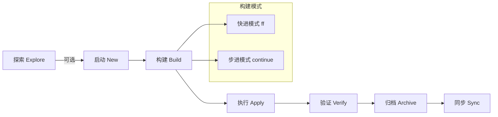

# OpenSpec 升级指南

## 版本切换

```shell
# 新老版本交替
npm i -g @fission-ai/openspec@v0.23.0
npm un -g @fission-ai/openspec
npm i -g @fission-ai/openspec@latest
npm ls -g
```

---

## 核心变化

OpenSpec 从传统的"阶段锁死"流程转变为 **基于动作（Action-based）** 的流式范式。

新的范式不再强制要求线性的"提案 → 应用 → 归档"步骤，而是提供了一组可随时调用的"动作"，AI 会根据当前产物（Artifacts）的状态自动推断下一步。

---

## 核心流程



| 阶段 | 说明 |
|------|------|
| 探索 (Explore) | 可选。在正式开始前，通过对话理清思路。 |
| 启动 (New) | 创建一个独立的"变更文件夹"（Change Folder），所有相关文档都隔离在此。 |
| 构建 (Build) | 生成规划文档。可选择"快进模式"一键全成，或"步进模式"逐个确认。 |
| 执行 (Apply) | AI 根据生成的任务列表自动编写代码，并动态更新文档。 |
| 验证 (Verify) | **[新增]** AI 自我审计，检查代码实现是否符合规格要求。 |
| 归档 (Archive) | 将变更合并到全局规格（Source of Truth）并清理工作区。 |
| 同步 (Sync) | 将"局部修改"变成"全局真相"，确保下一个任务能基于最新系统现状进行。 |

---

## 命令详解

| 命令 | 含义 | 建议使用场景 |
|------|------|-------------|
| `/opsx:explore` | 头脑风暴。AI 读取代码库、分析问题、绘制图表。 | 需求不明确、需要技术方案调研或重构分析时使用。不会创建任何文件，只在对话中进行。 |
| `/opsx:new <id>` | 启动变更。初始化 `openspec/changes/<id>/` 目录并生成元数据。 | 确定要动手写代码时，作为第一个正式命令。 |
| `/opsx:continue` | 步进构建。根据依赖关系，一次只创建一个产物。 | 复杂功能、高风险变更。每一步都可介入修改 AI 的规划。 |
| `/opsx:ff` | 快进构建（Fast-Forward）。一次性生成所有文档。 | 简单修复、常规功能。对 AI 较有信心时使用。 |
| `/opsx:apply` | 实施任务。AI 读取 tasks.md 开始逐项写代码。 | 文档通过评审后，正式进入编码阶段。 |
| `/opsx:verify` | 自动审计。从 CRITICAL、WARNING、SUGGESTION 三个维度检查实现质量。 | 提交 PR 前。防止 AI "货不对板"的最后一道防线。 |
| `/opsx:archive` | 归档变更。将此变更文件夹移动到 archive/。 | 任务完成、代码已合并后使用。 |
| `/opsx:bulk-archive` | 批量归档。一次性归档多个变更文件夹。 | 有多个已完成的变更需要统一归档时使用。 |
| `/opsx:sync` | 全局同步。将 Delta Specs 合并到全局规格中。 | 将"局部修改"变成"全局真相"的关键步骤。 |
| `/opsx:onboard` | 使用引导。交互式引导了解 OPSX 工作流。 | 首次使用或没使用过 0.x.0 版本时推荐尝试。 |

---

## 新旧版本对比

新版本（OPSX）的核心理念是 **"解耦"与"灵活"**。

| 维度 | 老版本 (`/openspec:*`) | 新版本 (`/opsx:*`) |
|------|------------------------|-------------------|
| 命令对应 | `/openspec:proposal` | `/opsx:new` |
| 构建逻辑 | 一次性生成所有内容，结构僵硬 | `/opsx:ff`（全成）或 `/opsx:continue`（逐个生成） |
| 实施逻辑 | `/openspec:apply` | `/opsx:apply`（增强自动推断和动态更新文档能力） |
| 归档逻辑 | `/openspec:archive` | `/opsx:archive` + `/opsx:sync`（强化规格合并概念） |
| 新增环节 | 无 | `/opsx:explore`（前置调研）和 `/opsx:verify`（质量审计） |
| 灵活性 | 阶段锁死。一旦开始 Apply，很难回头改 Proposal | 流式动作。AI 意识到文档与代码不一致时，可随时修正任何产物 |
| 目录结构 | 相对散乱 | 严格的 `changes/<id>/` 文件夹隔离，支持多个 feature 并行开发 |
