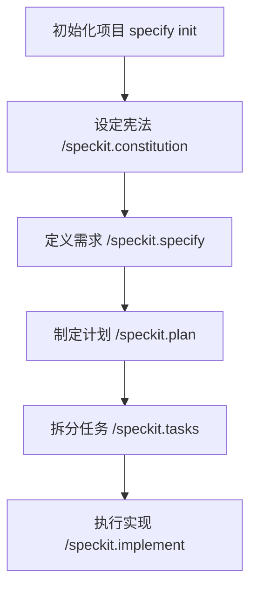
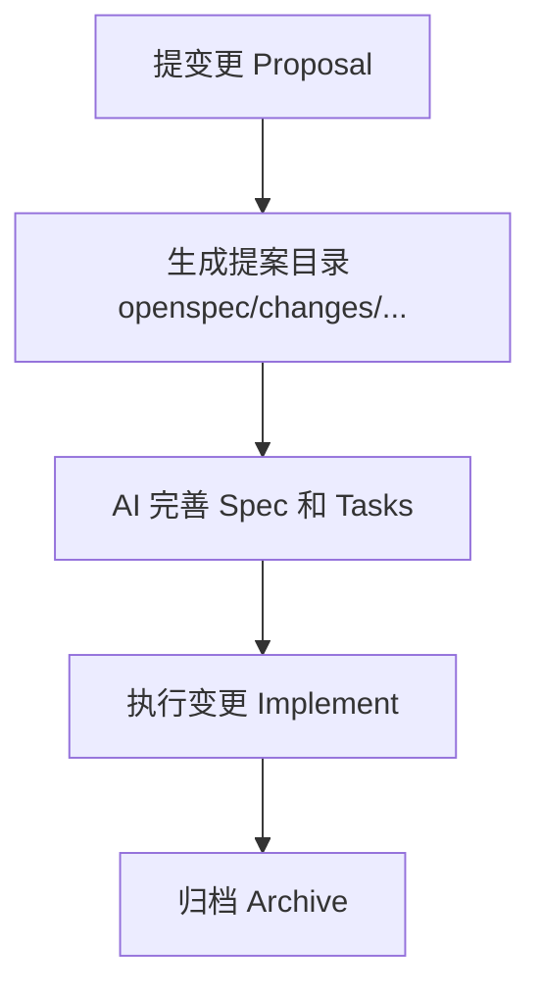

# spec-kit 与 OpenSpec 傻瓜式使用指南

本文档为您提供 **spec-kit** 和 **OpenSpec** 的傻瓜式安装与使用指南。这两个工具都是为了让 AI 辅助编程更加规范、高效，核心思想都是“编写规范文档 -> AI 理解 -> AI 执行”。

---

## 第一部分：spec-kit 使用指南

spec-kit 是 GitHub 官方推出的 Spec-Driven Development (SDD) 工具包，通过一系列结构化的 Slash 命令（如 `/speckit.specify`）引导 AI 完成开发。

### 1. 傻瓜式安装指南

**前提条件**：
- 您的电脑需要安装 Python 3.11+
- 推荐使用 `uv` 包管理器（如果没有安装 `uv`，即使是傻瓜式也得先装这个，Mac 上运行 `curl -LsSf https://astral.sh/uv/install.sh | sh`）

#### 安装命令
打开终端（Terminal），执行以下命令进行全局安装：

```bash
uv tool install specify-cli --from git+https://github.com/github/spec-kit.git
```

#### 验证安装
执行以下命令，如果看到版本号或帮助信息，说明安装成功：

```bash
specify check
```

---

### 2. 核心流程与 Demo 案例

spec-kit 的核心在于**“初始化 -> 立规矩 -> 提需求 -> 定方案 -> 拆任务 -> 写代码”**。

**Demo 案例**：我们要开发一个简单的“个人照片墙”网页。

#### 流程图


#### 执行顺序与命令

1.  **项目初始化**
    在你的项目文件夹下运行：
    ```bash
    # 比如在 my-photo-app 目录下
    specify init . --ai claude
    ```
    *解释：`.` 代表当前目录，`--ai claude` 告诉工具你使用的 AI 是 Claude（也可以是 cursor-agent, windsurf 等）。这会生成 `.specify` 文件夹。*

2.  **设定宪法 (Constitution)**
    *注意：接下来的步骤是在你的 AI 聊天窗口（如 Claude, Cursor Chat）中输入，而不是终端。*
    在 AI 聊天框输入：
    ```text
    /speckit.constitution 制定项目原则：代码必须简洁，使用原生 HTML/CSS/JS，不依赖复杂框架，注释清晰。
    ```

3.  **定义需求 (Specify)**
    在 AI 聊天框输入：
    ```text
    /speckit.specify 做一个照片墙应用。功能：1. 展示本地图片；2. 点击图片放大预览；3. 支持暗黑模式切换。
    ```

4.  **制定计划 (Plan)**
    在 AI 聊天框输入：
    ```text
    /speckit.plan 使用单页应用结构，CSS 使用 Flexbox 布局，图片数据暂时 mock 在 JS 数组中。
    ```

5.  **拆分任务 (Tasks)**
    在 AI 聊天框输入：
    ```text
    /speckit.tasks
    ```

6.  **开始实现 (Implement)**
    在 AI 聊天框输入：
    ```text
    /speckit.implement
    ```

---

### 3. 详细讲解与文件生成

spec-kit 会在项目中维护一个 `.specify` 目录，不仅给 AI 看，你也可以看。

| 命令 | 生成/修改的文件 | 关注点 | Demo 讲解 |
| :--- | :--- | :--- | :--- |
| **init** | `.specify/` 目录结构 | 这是一个隐藏目录，不要手动删。 | 初始化后，AI 就知道怎么读取这个目录下的记忆了。 |
| **/speckit.constitution** | `.specify/memory/constitution.md` | **项目宪法**。这是项目的最高原则，AI 之后写的代码都会遵守这些规则。 | 我们规定了“不依赖复杂框架”，后续 AI 就不会给你乱装 React 或 Vue。 |
| **/speckit.specify** | `.specify/spec.md` | **需求文档**。描述“做什么”和“为什么做”。 | AI 会把“照片墙”、“暗黑模式”记录在这里，作为后续开发的依据。 |
| **/speckit.plan** | `.specify/plan.md` | **技术方案**。描述“怎么做”。 | AI 会记录“Flexbox 布局”、“Mock 数据”等技术决策。 |
| **/speckit.tasks** | `.specify/tasks.md` | **任务清单**。 | AI 会自动列出任务，如：<br>1. 创建 index.html<br>2. 编写 styles.css<br>3. 实现 app.js<br>你需要检查任务是否合理。 |
| **/speckit.implement** | (项目源代码) | **实际代码**。 | AI 会根据 Tasks 里的条目，一个个去写代码。完成后会在任务清单里打钩。 |

---

<br>

## 第二部分：OpenSpec 使用指南

OpenSpec 是 Fission AI 推出的工具，它的理念是**“变更驱动”**（Change-Driven）。任何修改都是一个“Proposal（提案）”，包含它自己的 Spec 和 Tasks。

### 1. 傻瓜式安装指南

**前提条件**：
- 您的电脑需要安装 Node.js (20.19.0 及以上)

#### 安装命令
打开终端（Terminal），执行：

```bash
npm install -g @fission-ai/openspec@latest
```

#### 验证安装
```bash
openspec --version
```

#### 初始化
进入你的项目目录，运行：
```bash
openspec init
```
*解释：你需要选择你使用的 AI 工具（如 Cursor, Claude Code）。初始化后会生成 `openspec/` 目录和 `AGENTS.md`。*

---

### 2. 核心流程与 Demo 案例

OpenSpec 的核心流程是：**“提变更 -> 生成提案文件 -> 验证/修改 -> 执行 -> 归档”**。

**Demo 案例**：在上面的照片墙应用中，增加一个“给照片点赞”的功能。

#### 流程图


#### 执行顺序与命令

1.  **提出变更 (Proposal)**
    在 AI 聊天框中告诉 AI：
    ```text
    创建一分 OpenSpec 变更提案：增加图片点赞功能，每个图片下方显示心形图标和点赞数。
    (如果是支持 Slash 的工具，可用 /openspec:proposal 增加图片点赞功能)
    ```

    *结果：AI 会创建一个文件夹 `openspec/changes/add-like-feature/`，里面包含 `proposal.md`, `tasks.md` 等。*

2.  **查看与验证 (Review)**
    在终端查看：
    ```bash
    openspec list
    openspec show add-like-feature
    ```
    或者直接在 IDE 里看生成的文件。

3.  **完善规格 (Refine)**
    如果发现 AI 漏了东西（比如点赞要有动画），在聊天框告诉 AI：
    ```text
    更新 spec，点赞时需要有一个弹跳动画效果。
    ```
    *结果：AI 会更新 `openspec/changes/add-like-feature/specs/` 下的描述。*

4.  **执行实现 (Implement)**
    觉得没问题了，告诉 AI：
    ```text
    这个 spec 看起来不错，开始实现吧。
    (快捷指令：/openspec:apply add-like-feature)
    ```
    *结果：AI 开始写代码，并自动勾选 `tasks.md` 里的任务。*

5.  **归档 (Archive)**
    功能做完了，告诉 AI：
    ```text
    把这个变更归档。
    (快捷指令：/openspec:archive add-like-feature)
    ```
    *结果：`add-like-feature` 文件夹会被移到 `openspec/archive/`，并将变更合并到主 spec 中。*

---

### 3. 详细命令与文件讲解

OpenSpec 的所有工作都在 `openspec/` 目录下进行。

| 命令/动作 | 生成/修改的文件 | 关注点 | Demo 讲解 |
| :--- | :--- | :--- | :--- |
| **openspec init** | `openspec/` 根目录 | 基础结构。 | `openspec/project.md` 存放项目全局信息，类似 spec-kit 的 constitution。 |
| **创建 Proposal** | `openspec/changes/<变更名>/` | **变更文件夹**。这是 OpenSpec 最独特的地方。每次改动都是独立的。 | 比如 `openspec/changes/add-like-feature/`。 |
| **生成的三个核心文件** | 1. `proposal.md`<br>2. `tasks.md`<br>3. `specs/.../spec.md` (Delta) | 1. **Proposal**: 为什么做这个改动。<br>2. **Tasks**: 具体的待办事项清单。<br>3. **Spec Delta**: 这是一个“增量 Spec”，只描述这次改动带来的新需求。 | **Proposal**: 增加点赞交互。<br>**Tasks**: 1.修改 HTML 结构加图标; 2.CSS 加动画; 3.JS处理点击事件。<br>**Spec Delta**: 只有关于“点赞”的需求描述，不包含之前的“查看图片”需求。 |
| **openspec archive** | `openspec/archive/` | **归档**。 | 变更完成后，`add-like-feature` 里的 Spec 会被合并到主 Spec (`openspec/specs/`) 中，变成项目的永久记忆。 |

---

### 总结：选哪一个？

- **spec-kit**：适合**从零开始**构建项目，或者希望有一套完整的、自上而下的瀑布流（需求->计划->任务）开发体验。很有仪式感，适合把控大方向。
- **OpenSpec**：适合**日常迭代**，一个功能一个功能地加。它的“变更提案”模式非常像 Git 的 Branch/PR 思维，非常清晰地隔离了每一次改动。
