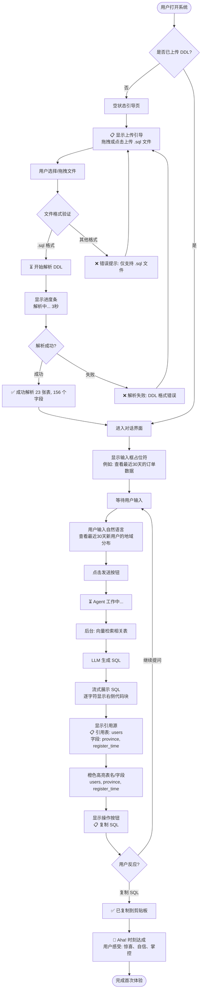
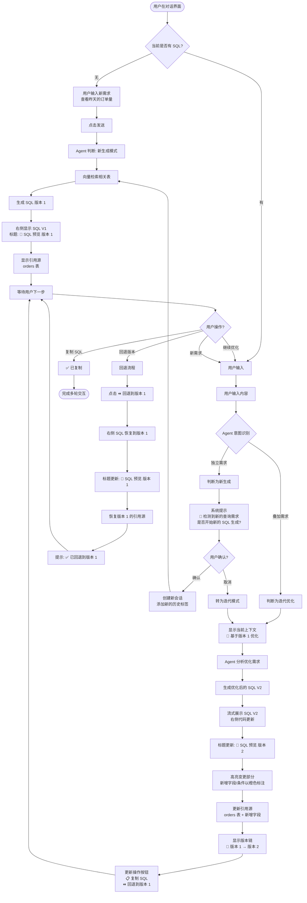
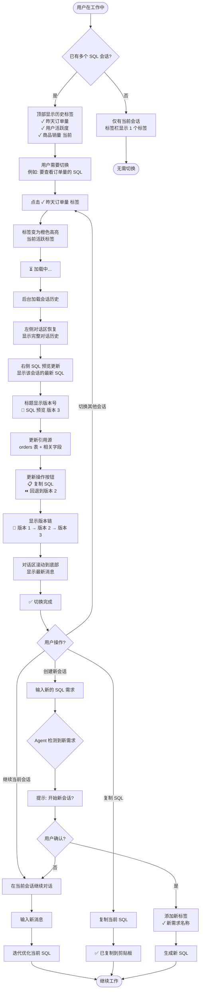

# UX Design Specification bmad

**Author:** Jxin
**Date:** 2026-01-24

---

> **📋 技术栈对齐说明**（2026-01-24 更新）
> 
> 本 UX Spec 已更新为与 PRD 和 Architecture 保持一致：
> - **前端框架**：Vue.js 3 + TypeScript
> - **UI 组件库**：Ant Design Vue 4.x
> - **状态管理**：Pinia
> 
> 所有代码示例和组件引用已更新为 Vue.js 3 语法。如发现未更新的 React 语法，请参考 Vue.js 3 Composition API 进行转换。

---

<!-- UX design content will be appended sequentially through collaborative workflow steps -->

## Executive Summary

### Project Vision

**RAG Text-to-SQL 系统**是一个革命性的智能 SQL 生成工具，通过 RAG（检索增强生成）+ Agent 架构，让非技术人员能够通过自然语言对话自动生成精确的 SQL 查询语句。

**核心价值主张**：
- 🚀 **效率革命**：将数据获取时间从 30 分钟缩短到 5 分钟（6 倍提升）
- 🎓 **能力赋能**：让不懂 SQL 的产品经理获得"数据自助查询超能力"
- 🤝 **协作优化**：减少产品经理对开发团队的依赖，降低 30%-50% 的 SQL 编写请求
- 💡 **信任建立**：通过可解释性设计（展示引用的 DDL），让 AI 从"黑盒"变成"透明伙伴"

**技术创新亮点**：
- 🤖 **Agent 自主决策架构**：LLM 自主调用向量检索工具，而非简单的模板匹配
- 💬 **双模式智能交互**：普通对话与 SQL 生成自动切换，无需手动切换模式
- 🔍 **RAG 精准检索**：基于向量化 DDL 的语义检索，避免将整个 schema 塞入 Prompt
- 📋 **强可解释性**：明确展示引用的表和字段，用户可追溯 SQL 生成依据

### Target Users

系统服务三类核心用户群体：

#### 1. 产品经理（主要用户）

**典型画像**：李雨晴，27 岁，互联网产品经理，工作 2 年
- **技能水平**：精通产品设计和用户研究，零 SQL 编程能力
- **核心痛点**：
  - 每天需要导出 3-5 次数据进行分析
  - 每次都要找开发写 SQL，等待时间 10 分钟到几小时不等
  - 心理负担："不好意思频繁麻烦开发"
  - 临时数据需求经常因为"不好意思"而放弃
- **使用场景**：
  - 日常数据分析（昨日新增用户、活跃情况）
  - 功能验证（新功能使用情况、转化率）
  - 临时需求（特定用户群体特征数据）
  - 复杂查询（多表关联：用户-订单-商品）
- **成功愿景**：5 分钟内完成数据导出，无需学习 SQL，不再依赖开发

#### 2. 数据分析师（辅助提效用户）

**典型画像**：陈亮，32 岁，数据分析师，工作 8 年
- **技能水平**：精通 SQL，每天写 10+ 个查询
- **痛点**：基础 SQL 结构（多表 JOIN）写起来繁琐，反复查 DDL 浪费时间
- **使用场景**：工具生成基础 SQL 框架，自己专注于复杂业务逻辑（窗口函数、性能优化）
- **价值主张**：从"写代码"转向"分析洞察"，效率提升 50%

#### 3. 开发工程师（间接受益者）

**典型画像**：张伟，后端开发工程师
- **当前困扰**：每天被产品经理打断 5-10 次写 SQL
- **期望改变**：产品经理自助完成数据导出，减少打断频率 30%-50%
- **受益点**：工作流不被打断，专注核心开发任务

**用户共性**：
- 所有用户都在桌面端工作（优先桌面体验）
- 都需要快速响应（< 3 秒生成 SQL）
- 都重视准确性（100% SQL 准确率）

### Key Design Challenges

基于项目特性和用户需求，识别出以下关键 UX 设计挑战：

#### 1. 信任建立挑战 ⭐ 最高优先级

**问题**：产品经理如何敢相信 AI 生成的 SQL 是正确的？
- **影响**：如果不信任，用户不会采纳生成的 SQL
- **设计需求**：
  - 可解释性必须做到极致（展示引用的表、字段、完整 DDL 片段）
  - 提供"引用源追溯"功能（点击查看完整表结构）
  - 视觉上强化"透明度"和"可验证性"
- **成功标准**：用户能够清晰看到"SQL 是基于哪些表生成的"

#### 2. 首次使用门槛（"Aha!" 时刻设计）

**问题**：90% 的新用户必须在首次使用时成功生成 SQL
- **影响**：首次失败率高会导致用户流失
- **设计需求**：
  - 零学习成本的引导流程（上传 DDL → 输入自然语言 → 生成 SQL，3 步完成）
  - 清晰的实时反馈（"正在解析 DDL..."、"AI 正在思考..."）
  - 友好的错误提示（DDL 解析失败时提供修正建议）
- **成功标准**：首次使用 < 5 分钟完成首条 SQL 生成

#### 3. 快速生成 SQL 的性能感知 ⭐ MVP 核心优先级

**问题**：用户期望"立即获得结果"，< 3 秒是硬性要求
- **影响**：响应慢会破坏"自助完成"的流畅体验
- **设计需求**：
  - 优化加载状态设计（进度提示、预估时间）
  - 使用动画和微交互减少等待焦虑
  - 提供"生成中"的可视化反馈（如 Agent 正在检索哪些表）
- **成功标准**：DDL 解析 < 5 秒，SQL 生成 < 3 秒，对话响应 < 2 秒

#### 4. 双模式切换的透明性

**问题**：系统如何让用户清楚知道"现在是普通对话还是 SQL 生成模式"？
- **影响**：用户可能困惑"我只是随便问问，为啥给我生成 SQL？"
- **设计需求**：
  - 明确的模式切换视觉反馈（图标、颜色、布局变化）
  - 在切换到 SQL 生成模式时提供友好提示
  - 支持手动切换模式（可选）
- **成功标准**：用户始终清楚当前处于什么模式

#### 5. 多文件管理的复杂性

**问题**：产品经理可能负责多个项目，需要管理多个 DDL 文件
- **影响**：文件混乱导致生成错误的 SQL（引用了错误项目的表）
- **设计需求**：
  - 清晰的文件列表（文件名、状态、上传时间、包含的表数量）
  - 明确的"当前使用文件"标识
  - 文件上下文切换的确认机制
- **成功标准**：用户能够清晰管理和切换多个项目的 DDL 文件

### Design Opportunities

识别出以下关键的 UX 设计机会，可以创造竞争优势：

#### 1. 情感化设计：捕捉"从焦虑到惊喜"的情感转变 ✨

**机会**：产品经理的情感旅程是从"焦虑等待"到"惊喜自助"
- **设计点**：
  - SQL 生成成功时的庆祝微交互（如 ✓ 动画、成功提示音）
  - "首次成功"的特别反馈（"恭喜！你刚刚自己生成了第一条 SQL 🎉"）
  - 温暖的引导文案（"别担心，我会帮你一步步完成"）
- **价值**：强化"Aha!" 时刻，建立情感连接，提升用户留存

#### 2. 渐进式披露：降低认知负荷

**机会**：首次使用只需看到核心功能，高级功能逐步展开
- **设计点**：
  - 核心流程极简（上传 DDL → 对话 → 复制 SQL）
  - 高级功能隐藏在二级菜单（文件管理、DDL 预览、历史记录）
  - 根据使用频率动态调整界面（熟练用户显示更多快捷操作）
- **价值**：新用户快速上手，老用户效率提升

#### 3. 引用源可视化：从"工具"到"学习伙伴"

**机会**：把"引用的表结构"变成数据库学习工具
- **设计点**：
  - 点击表名跳转到完整 DDL 展示
  - 高亮显示生成 SQL 时使用的字段
  - 展示表之间的关系（外键、JOIN 关系）
  - 提供"表结构速览"悬浮卡片
- **价值**：不仅生成 SQL，还帮助用户理解数据库结构，建立长期价值

#### 4. 多轮对话优化：从"一次性工具"到"持续协作伙伴"

**机会**：支持 SQL 的迭代优化（"再加一个条件"、"改成降序"）
- **设计点**：
  - 对话历史可追溯（显示之前生成的 SQL）
  - 一键回退到上一版本 SQL
  - SQL 版本对比（高亮差异）
  - 支持"基于当前 SQL 继续修改"
- **价值**：从单次查询变成持续对话，提升使用频率

#### 5. 实时反馈与进度可视化：减少等待焦虑

**机会**：让等待过程透明化、可视化
- **设计点**：
  - 显示 Agent 工作进度（"正在检索相关表..."、"找到 3 个相关表"、"正在生成 SQL..."）
  - 使用动画展示 RAG 检索过程
  - 提供预估时间（"大约还需 2 秒"）
- **价值**：减少不确定性带来的焦虑，提升等待体验

## Core User Experience

### Defining Experience

**核心用户行动：自然语言生成 SQL**

RAG Text-to-SQL 系统的核心体验围绕一个简单而强大的交互循环：

**核心循环**：
```
用户输入自然语言描述 
    ↓
系统 3 秒内生成精准 SQL
    ↓
用户查看、验证、复制 SQL
    ↓
（可选）多轮对话优化
```

**最频繁的用户行动**：
1. 📝 **输入自然语言描述数据需求**（如："查看最近 30 天新用户的地域分布"）
2. 👀 **查看生成的 SQL 和引用源**（验证准确性和理解依据）
3. 📋 **一键复制 SQL**（用于在数据库工具中执行）

**绝对关键的体验**：
- 🎯 **SQL 生成的准确性**：100% 语法和逻辑正确，可直接执行
- ⚡ **响应速度**：< 3 秒生成，零等待焦虑
- 🔍 **可解释性**：清晰展示引用了哪些表和字段

**产品的"北极星"**：
> 如果只能把一件事做到完美，那就是：**让产品经理在 5 分钟内首次成功生成 SQL，并惊喜地说"就是这个！"**

### Platform Strategy

**主要平台：Web 应用（桌面端优先）**

**平台特性**：
- 🖥️ **目标设备**：桌面端（笔记本、台式机）
- 🌐 **浏览器支持**：Chrome 90+、Firefox 88+、Safari 14+、Edge 90+
- 📐 **屏幕尺寸**：最小宽度 1280px，推荐 1920px
- ⌨️ **交互方式**：鼠标 + 键盘（文本输入为主）
- 📱 **移动端**：MVP 阶段暂不支持（< 768px）
- 🔌 **网络要求**：在线使用（依赖 LLM API 和向量检索）

**平台能力利用**：
- ✅ 文件拖拽上传（DDL 文件）
- ✅ 富文本输入和编辑
- ✅ 代码语法高亮展示（Monaco Editor / CodeMirror）
- ✅ 一键复制到剪贴板
- ✅ 实时响应式布局（三栏：文件管理、对话区、DDL 预览）

**设计约束**：
- Desktop-first 设计理念
- 现代浏览器优先（无需兼容 IE）
- 单页应用（SPA）架构
- 无离线功能需求

**理由**：产品经理和数据分析师主要在桌面端工作，需要大屏幕查看表结构和 SQL 代码。

### Effortless Interactions

**必须毫不费力的体验设计**：

#### 1. 自动意图识别 🤖

**体验目标**：用户无需手动切换模式，系统自动理解意图

**设计实现**：
- Agent 自动判断："普通对话"还是"SQL 生成需求"
- 切换时有明确的视觉反馈（图标、颜色、布局变化）
- 用户始终清楚当前模式，但不需要主动操作

**消除的痛点**：传统工具需要点击"生成 SQL"按钮，打断思路

#### 2. 即时反馈与进度透明 ⚡

**体验目标**：用户始终知道系统在做什么，零等待焦虑

**设计实现**：
- DDL 上传：实时显示解析进度（"✅ 成功解析 23 张表，156 个字段"）
- SQL 生成：显示 Agent 工作步骤
  - "🔍 正在检索相关表..."
  - "💡 找到 3 个相关表：users, orders, products"
  - "⚙️ 正在生成 SQL..."
  - "✅ 生成完成！"
- 使用动画和微交互减少感知等待时间

**消除的痛点**：不知道系统是否在工作，还是卡住了

#### 3. 零学习成本的可解释性 📋

**体验目标**：用户无需理解技术，只需看到"为什么生成这个 SQL"

**设计实现**：
- 自动展示引用源（不需要点击"查看详情"）
- 简化的表述："这个 SQL 使用了以下表和字段"
- 点击表名即可查看完整结构
- 高亮显示在 SQL 中使用的字段

**消除的痛点**：不知道 SQL 是怎么来的，不敢信任 AI

#### 4. 文件管理的智能化 📁

**体验目标**：多文件管理清晰明了，不会用错上下文

**设计实现**：
- 清晰的"当前使用文件"标识（高亮、勾选）
- 文件状态一目了然（✅ 已解析、⏳ 解析中、❌ 失败）
- 切换文件时有确认提示（"确认切换到项目 B 的 DDL？"）
- 文件命名规范建议（"项目名-DDL-版本.sql"）

**消除的痛点**：管理多个项目的 DDL 文件时容易混乱

#### 5. 错误自愈与友好提示 🩹

**体验目标**：错误不是终点，而是引导的机会

**设计实现**：
- DDL 解析失败：提供具体错误原因和修正建议
- SQL 生成失败：Agent 自动尝试重新检索或引导用户补充信息
- 向量检索无结果：提示"未找到相关表，可能需要上传新的 DDL"
- 温暖的文案："别担心，让我们一起解决这个问题"

**消除的痛点**：错误提示冰冷、不知道怎么解决

### Critical Success Moments

**决定产品成败的关键时刻**：

#### 1. "Aha!" 时刻（首次成功）⭐ 最关键

**时刻定义**：用户首次上传 DDL 并成功生成 SQL

**成功标准**：
- ⏱️ **时间**：< 5 分钟完成（从打开系统到复制 SQL）
- ✅ **结果**：SQL 语法正确，逻辑符合预期
- 💡 **情感**：用户惊喜地说"就是这个！"或"这么简单？"
- 🎯 **指标**：90% 的新用户首次使用成功

**设计重点**：
- 极简的引导流程（3 步：上传 → 输入 → 复制）
- 清晰的成功反馈（庆祝动画、成功提示）
- "首次成功"的特别反馈："🎉 恭喜！你刚刚自己生成了第一条 SQL"

**失败后果**：用户认为"工具不好用"，永远不会再回来

#### 2. 信任建立时刻（第二次使用）

**时刻定义**：用户第二次使用，验证 SQL 的实际准确性

**成功标准**：
- ✅ SQL 能够直接在数据库工具中执行
- ✅ 查询结果与用户预期完全一致
- 🔍 引用源展示让用户理解 SQL 的生成依据
- 🎯 **指标**：80% 的 SQL 无需修改即可使用

**设计重点**：
- 强化可解释性（清晰展示引用的表和字段）
- 提供"引用源追溯"功能（点击查看完整 DDL）
- SQL 语法高亮和格式化

**失败后果**：用户不信任系统，回归找开发写 SQL

#### 3. 效率感知时刻（日常使用）

**时刻定义**：用户连续生成 3-5 个 SQL（如周会前的数据准备）

**成功标准**：
- ⚡ 每个 SQL 生成 < 3 秒
- 🔄 流畅的连续操作，无卡顿
- 📋 一键复制，快速切换到下一个查询
- 🎯 **指标**：用户每周使用 ≥ 3 次

**设计重点**：
- 优化响应速度（DDL 缓存、向量检索优化）
- 流畅的多轮对话（"再加一个条件"、"改成降序"）
- 对话历史可追溯（查看之前生成的 SQL）

**失败后果**：用户觉得"还不如找开发快"，使用频率下降

#### 4. 复杂查询突破时刻（高级使用）

**时刻定义**：用户尝试多表 JOIN、子查询等复杂查询

**成功标准**：
- ✅ 系统仍然能够准确生成复杂 SQL
- 🔍 清晰展示多表关联关系
- 💡 用户感受到"AI 真的懂我的需求"
- 🎯 **指标**：复杂查询准确率 ≥ 80%

**设计重点**：
- Agent 自主决策调用多次向量检索
- 展示表之间的关联关系（外键、JOIN 条件）
- 支持多轮对话优化复杂 SQL

**失败后果**：用户认为"工具只能做简单查询"，价值感降低

### Experience Principles

**指导所有 UX 决策的核心原则**：

#### 1. 速度即体验 ⚡

**原则**：快速响应是核心竞争力，每一毫秒都重要

**应用**：
- SQL 生成 < 3 秒（硬性要求）
- DDL 解析 < 5 秒
- 对话响应 < 2 秒
- 优化加载状态设计，使用动画减少感知等待时间
- 所有交互提供即时反馈

**验证**：用户感受到"比找开发快 6 倍"

#### 2. 透明建立信任 🔍

**原则**：让 AI 从"黑盒"变成"透明伙伴"，可解释性是核心

**应用**：
- 强制展示引用源（表名、字段名、完整 DDL 片段）
- 提供引用追溯功能（点击查看详情）
- 显示 Agent 工作过程（"正在检索..."、"找到 3 个表"）
- 错误提示清晰、具体、可操作

**验证**：用户能够回答"这个 SQL 是基于什么生成的"

#### 3. 首次必成功 🎯

**原则**：90% 的新用户必须在首次使用时成功，否则永远失去他们

**应用**：
- 极简的引导流程（3 步完成）
- 零学习成本的交互设计
- 清晰的实时反馈和成功提示
- 友好的错误处理和引导
- "首次成功"的特别庆祝反馈

**验证**：新用户 < 5 分钟完成首条 SQL 生成

#### 4. 毫不费力的核心流程 ✨

**原则**：核心交互应该感觉"魔法般流畅"，零思考成本

**应用**：
- 自动意图识别（无需手动切换模式）
- 文件拖拽上传（无需点击按钮）
- 一键复制 SQL（无需手动选择）
- 错误自愈（Agent 自动重试）
- 渐进式披露（高级功能隐藏，需要时才出现）

**验证**：用户说"太简单了"或"就这样？"

#### 5. 从工具到伙伴 🤝

**原则**：不只是"用一次"的工具，而是"持续协作"的伙伴

**应用**：
- 支持多轮对话优化（"再加一个条件"）
- 对话历史可追溯（回顾之前的 SQL）
- 引用源变成学习工具（理解数据库结构）
- SQL 版本对比（查看优化前后差异）
- 个性化记忆（常用表、偏好设置）

**验证**：用户每周使用 ≥ 3 次，留存率 ≥ 70%

## Desired Emotional Response

### Primary Emotional Goals

**核心情感：信任与安全（最高优先级）**

RAG Text-to-SQL 系统的首要情感目标是建立用户对 AI 生成结果的深度信任。这不是一个追求"哇"时刻的产品，而是一个**可靠、专业、值得依赖的工作工具**。

**情感优先级**：
1. 🔒 **信任与安全** - "AI 生成的 SQL 是透明可验证的，我敢直接使用"
2. 🤝 **被支持与理解** - "遇到问题时，系统会帮我找到解决方案"
3. 💪 **可依赖性** - "这是我日常工作中可以完全依赖的工具"
4. ⚡ **高效与专业** - "比找开发快 6 倍，但不追求炫酷体验"

**设计哲学**：
- 优先透明度和可解释性，而非视觉惊喜
- 提供稳定可靠的体验，而非过度的情感化设计
- 建立长期依赖关系，而非短期的"哇"时刻

### Emotional Journey Mapping

用户在不同阶段的期望情感状态：

#### 阶段 1：首次发现产品
- **期望情感**：审慎的好奇
- **用户心声**："这个工具靠谱吗？"
- **设计重点**：专业的界面，清晰的价值主张

#### 阶段 2：首次上传 DDL
- **期望情感**：期待中带有谨慎
- **用户心声**："希望系统能正确解析我的数据库结构"
- **设计重点**：清晰的解析反馈，专业的状态提示

#### 阶段 3：首次生成 SQL（关键时刻）
- **期望情感**：信任开始建立
- **用户心声**："让我看看这个 SQL 是基于什么生成的"
- **设计重点**：强制展示引用源，可追溯性，透明的生成依据

#### 阶段 4：验证 SQL 准确性
- **期望情感**：信任确立
- **用户心声**："SQL 是对的，而且我能理解为什么是这样生成的"
- **设计重点**：完整的引用追溯，清晰的表字段展示

#### 阶段 5：日常高频使用
- **期望情感**：依赖与信心
- **用户心声**："这已经成为我每天必用的工具"
- **设计重点**：稳定的性能，一致的体验，可预测的结果

#### 阶段 6：遇到错误或失败
- **期望情感**：被支持，而非挫败
- **用户心声**："系统告诉我问题在哪，以及如何解决"
- **设计重点**：清晰的错误说明，具体的修正建议，自动重试机制

#### 阶段 7：长期使用
- **期望情感**：完全依赖
- **用户心声**："没有这个工具我的工作效率会降低很多"
- **设计重点**：持续的稳定性，可靠的性能，个性化记忆

### Micro-Emotions

在核心体验中需要关注的关键微情感状态：

#### 1. 信任 vs. 怀疑 ⭐ 最关键

**目标**：从"AI 生成的 SQL 可靠吗"到"我相信这个结果是准确的"

**设计策略**：
- 强制展示引用源（表名、字段名、完整 DDL 片段）
- 提供引用追溯功能（点击查看完整表结构）
- 透明的 Agent 工作过程（"正在检索相关表..."、"找到 3 个表"）
- SQL 语法正确性保证（100% 语法准确率）

**衡量标准**：用户能够清晰回答"这个 SQL 是基于哪些表和字段生成的"

#### 2. 被支持 vs. 孤立

**目标**：遇到错误时感受到"系统在帮我"，而非"我被抛弃了"

**设计策略**：
- 错误提示清晰、具体、可操作（"DDL 第 15 行语法错误，建议检查..."）
- Agent 自动重试机制
- 提供下一步行动建议（"你可以尝试..."）
- 温暖但专业的文案（"让我们一起解决这个问题"）

**衡量标准**：用户遇到错误时知道如何解决，而非感到困惑

#### 3. 可依赖 vs. 不确定

**目标**：建立"这个工具总是可用"的长期信任

**设计策略**：
- 稳定的性能（< 3 秒生成 SQL）
- 一致的交互模式（不随意改变界面）
- 可预测的结果（相同输入产生相同输出）
- 历史记录和版本管理（可以回溯之前的 SQL）

**衡量标准**：用户每周使用 ≥ 3 次，留存率 ≥ 70%

#### 4. 掌控 vs. 困惑

**目标**：用户始终清楚"系统在做什么"和"我处于什么状态"

**设计策略**：
- 清晰的模式指示（当前是对话还是 SQL 生成）
- 实时的进度反馈（"正在解析 DDL..."、"解析完成"）
- 明确的文件管理（当前使用哪个 DDL 文件）
- 透明的状态切换（模式变化时有清晰提示）

**衡量标准**：用户不会问"系统现在在干什么"

#### 5. 高效 vs. 焦虑

**目标**：快速响应消除等待焦虑，但不过度追求速度炫技

**设计策略**：
- < 3 秒生成 SQL（硬性要求）
- 清晰的加载状态（而非炫酷的动画）
- 预估时间提示（"大约还需 2 秒"）
- 进度可视化（而非转圈等待）

**衡量标准**：用户感受到"比找开发快"，而非"这个动画真炫"

### Design Implications

将情感目标转化为具体的 UX 设计决策：

#### 情感1：信任与安全 → UX 设计

**设计原则**：透明度优先于视觉惊喜

**具体实现**：
- ✅ 强制展示引用源（不能隐藏，默认可见）
- ✅ 引用源占据显著位置（不是小字注释）
- ✅ 点击表名查看完整 DDL（模态窗口或侧边栏）
- ✅ 高亮显示 SQL 中使用的字段（视觉关联）
- ✅ Agent 工作过程透明化（"正在检索..."、"找到 3 个相关表"）
- ✅ SQL 语法高亮和格式化（专业工具感）
- ❌ 不使用庆祝动画或提示音
- ❌ 不过度包装"惊喜"时刻

#### 情感2：被支持与理解 → UX 设计

**设计原则**：错误是引导的机会，而非终点

**具体实现**：
- ✅ 错误提示清晰具体（"DDL 第 15 行语法错误：缺少分号"）
- ✅ 提供修正建议（"建议检查 CREATE TABLE 语句"）
- ✅ Agent 自动重试机制（向量检索失败时自动调整策略）
- ✅ 温暖但专业的文案（"让我们一起解决这个问题"）
- ✅ 提供下一步行动（"你可以尝试重新上传 DDL"）
- ❌ 不使用冰冷的技术错误码
- ❌ 不让用户困惑"接下来该怎么办"

#### 情感3：可依赖性 → UX 设计

**设计原则**：稳定一致的专业工具，而非花哨的体验

**具体实现**：
- ✅ 稳定的响应速度（DDL 解析 < 5 秒，SQL 生成 < 3 秒）
- ✅ 一致的交互模式（不随意改变界面布局）
- ✅ 历史记录和版本管理（可以查看之前生成的 SQL）
- ✅ 可预测的结果（相同输入产生相同输出）
- ✅ 文件管理清晰（当前使用的 DDL 文件高亮显示）
- ❌ 不频繁改变界面设计
- ❌ 不追求"每次都不一样"的体验

#### 情感4：掌控感 → UX 设计

**设计原则**：用户始终清楚系统状态和当前模式

**具体实现**：
- ✅ 清晰的模式指示（图标、颜色区分对话 vs SQL 生成）
- ✅ 实时进度反馈（"正在解析 DDL..."、"已完成 80%"）
- ✅ 明确的文件状态（✅ 已解析、⏳ 解析中、❌ 失败）
- ✅ 模式切换时的确认提示（"切换到 SQL 生成模式"）
- ✅ 当前使用文件的显著标识（高亮、勾选）
- ❌ 不让用户猜测"系统在做什么"
- ❌ 不在未告知的情况下切换模式

#### 情感5：高效感 → UX 设计

**设计原则**：快速响应，清晰反馈，而非炫酷动画

**具体实现**：
- ✅ < 3 秒生成 SQL（硬性性能要求）
- ✅ 清晰的加载状态（文字提示 + 进度条）
- ✅ 预估时间提示（"大约还需 2 秒"）
- ✅ 一键复制 SQL（无需手动选择）
- ✅ 多轮对话优化（"再加一个条件"无需重新输入）
- ❌ 不使用过度的加载动画
- ❌ 不为了"好看"而延长等待时间

### Emotional Design Principles

**指导所有情感设计决策的核心原则**：

#### 原则1：透明建立信任 🔍

**定义**：让 AI 从"黑盒"变成"透明伙伴"，可解释性是核心竞争力

**应用**：
- 所有 SQL 生成必须强制展示引用源
- Agent 工作过程必须可视化
- 错误提示必须清晰具体
- 用户必须能够追溯 SQL 生成依据

**验证**：用户能够清晰回答"这个 SQL 是基于什么生成的"

#### 原则2：支持优于惊喜 🤝

**定义**：错误时的清晰引导比成功时的庆祝动画更重要

**应用**：
- 错误提示占据更高的设计优先级
- 提供具体的修正建议和下一步行动
- Agent 自动重试和问题诊断
- 温暖但专业的文案

**验证**：用户遇到错误时知道如何解决，而非感到挫败

#### 原则3：可靠优于炫酷 💪

**定义**：稳定一致的专业工具体验，而非花哨的交互

**应用**：
- 稳定的性能（< 3 秒生成 SQL）
- 一致的交互模式（不随意改变界面）
- 可预测的结果（相同输入产生相同输出）
- 历史记录和版本管理

**验证**：用户每周使用 ≥ 3 次，成为日常工作依赖工具

#### 原则4：掌控优于自动化 ⚙️

**定义**：用户始终清楚系统状态，而非完全的"黑盒自动"

**应用**：
- 清晰的模式指示（对话 vs SQL 生成）
- 实时进度反馈
- 文件管理透明化
- 模式切换时的确认机制

**验证**：用户不会问"系统现在在做什么"

#### 原则5：专业优于情感化 🎯

**定义**：提供专业工具体验，而非过度的情感化设计

**应用**：
- 不使用庆祝动画或提示音
- 错误提示清晰专业，而非过度温情
- 界面简洁专业，而非视觉花哨
- 快速高效，而非追求"哇"时刻

**验证**：用户感受到"这是一个可靠的专业工具"

### Emotions to Avoid

**必须规避的负面情感**：

#### ❌ 怀疑与不信任
- **触发因素**：看不到 SQL 生成依据，黑盒操作
- **预防措施**：强制展示引用源，透明的 Agent 工作过程

#### ❌ 孤立与挫败
- **触发因素**：遇到错误不知道怎么办，错误提示不清晰
- **预防措施**：清晰的错误说明，具体的修正建议，自动重试

#### ❌ 困惑与迷失
- **触发因素**：不知道系统在做什么，不清楚当前模式
- **预防措施**：实时进度反馈，清晰的模式指示，透明的状态切换

#### ❌ 焦虑与不确定
- **触发因素**：响应慢，等待时间长，不知道还要等多久
- **预防措施**：< 3 秒生成 SQL，清晰的加载状态，预估时间提示

#### ❌ 被"炫技"打扰
- **触发因素**：过度的动画、提示音、视觉特效
- **预防措施**：保持专业简洁，快速高效，不追求炫酷

## UX Pattern Analysis & Inspiration

### Inspiring Products Analysis

#### ChatGPT / Claude - 对话式 AI 工具

**核心价值**：通过自然语言对话完成复杂任务，与 RAG Text-to-SQL 系统高度相似

**为什么值得学习**：
- 🎯 **问题相似**：都是通过自然语言输入 → AI 理解意图 → 生成结构化输出
- 🎯 **用户体验成熟**：经过数亿用户验证的对话式交互模式
- 🎯 **技术架构相似**：都基于 LLM + Agent 架构

**关键 UX 亮点分析**：

##### 1. 流式响应（Streaming Response）⭐ 最重要

**做得好的地方**：
- 边生成边显示内容，用户看到 AI "正在工作"
- 打字机效果让等待变得可忍受
- 降低用户焦虑感（"AI 在思考，不是卡住了"）

**迁移到我们的产品**：
- ✅ **SQL 逐行生成展示**：`SELECT * FROM users` → `SELECT * FROM users WHERE` → `SELECT * FROM users WHERE created_at > '2024-01-01'`
- ✅ **Agent 工作步骤实时展示**：
  - "🔍 正在检索相关表..."
  - "💡 找到 3 个相关表：users, orders, products"
  - "⚙️ 正在生成 SQL..."
  - "✅ 生成完成！"
- ✅ **进度可视化**：显示百分比或进度条（"生成中 80%"）
- ⚠️ **适度使用**：SQL 生成 < 3 秒，流式展示主要用于降低焦虑，而非拖延时间

**设计要点**：
- 流式展示 SQL 生成过程（逐行或逐词）
- Agent 工作步骤透明化（检索表 → 生成 SQL → 完成）
- 提供实时进度反馈

##### 2. 一键中断（Stop Generation）⭐ 关键

**做得好的地方**：
- 生成过程中随时可以点击 "Stop" 按钮
- 用户保持控制感，而非被动等待
- 中断后保留已生成的内容

**迁移到我们的产品**：
- ✅ **Stop 按钮**：SQL 生成过程中显示 "Stop" 按钮
- ✅ **保留部分结果**：中断后保留已生成的 SQL（即使不完整）
- ✅ **重新生成**：提供 "Regenerate" 按钮，用户可以重试
- ✅ **用户掌控**：随时可以停止，而非强制等待

**设计要点**：
- 生成中显示明显的 "Stop" 或 "取消" 按钮
- 中断后保留已生成的内容
- 提供重新生成的入口

##### 3. 多轮对话（Multi-turn Conversation）⭐ 最重要

**做得好的地方**：
- 记住上下文，支持 "再加一个条件"、"改成降序"
- 对话历史清晰展示（左侧列表）
- 可以编辑之前的输入，重新生成
- 支持话题切换（开启新对话）

**迁移到我们的产品**：
- ✅ **上下文记忆**：记住当前生成的 SQL，支持优化
  - 用户："查看最近 30 天的订单"
  - 系统生成 SQL
  - 用户："再加一个条件，只看已支付的"
  - 系统理解上下文，在原 SQL 基础上添加条件
- ✅ **SQL 历史列表**：左侧显示之前生成的 SQL
  - 显示时间、查询描述、状态
  - 点击可以查看完整 SQL
- ✅ **版本对比**：高亮显示两个版本 SQL 的差异
- ✅ **一键回退**：回到上一版本 SQL

**设计要点**：
- 对话历史左侧展示（类似 ChatGPT 的侧边栏）
- 支持基于当前 SQL 的迭代优化
- 版本管理和对比功能

##### 4. 零摩擦输入（Frictionless Input）

**做得好的地方**：
- 极简输入框，只有一个文本框
- Enter 发送，无需点击按钮
- 自然语言，无需学习语法

**迁移到我们的产品**：
- ✅ **极简输入框**：用户输入自然语言描述
- ✅ **Enter 发送**：键盘快捷键（Enter 发送，Shift+Enter 换行）
- ✅ **零学习成本**：支持口语化表达
- ✅ **输入提示**：首次使用显示示例（"试试说：查看昨天的订单量"）

**设计要点**：
- 输入框始终可见（固定在底部）
- 键盘快捷键支持
- 首次使用显示引导示例

##### 5. 结果可操作性（Actionable Results）

**做得好的地方**：
- 一键复制（复制按钮随时可见）
- 代码块语法高亮
- 可以下载对话记录

**迁移到我们的产品**：
- ✅ **一键复制 SQL**：悬浮时显示复制按钮
- ✅ **SQL 语法高亮**：使用 Monaco Editor 或 CodeMirror
- ✅ **导出历史**：导出 SQL 历史记录（CSV 或 JSON）
- ✅ **快捷键复制**：Ctrl+C 复制当前 SQL

**设计要点**：
- SQL 代码块清晰展示
- 复制按钮明显（悬浮或固定显示）
- 支持导出功能

### Transferable UX Patterns

基于 ChatGPT/Claude 的深度分析，以下 UX 模式可以直接迁移到 RAG Text-to-SQL 系统：

#### 模式1：实时流式响应 ⚡

**原始模式**：ChatGPT 边生成边显示，打字机效果

**迁移方案**：
- SQL 逐行或逐词生成展示（降低等待焦虑）
- Agent 工作步骤实时展示（"正在检索..."、"找到 3 个表"）
- 进度可视化（百分比或进度条）

**适用场景**：
- DDL 解析过程（5 秒）
- SQL 生成过程（< 3 秒）
- 向量检索过程

**设计约束**：
- 不能为了流式展示而拖延时间
- 总响应时间仍需 < 3 秒
- 流式展示主要用于降低感知等待时间

#### 模式2：用户可控的中断机制 🛑

**原始模式**：ChatGPT 生成中可以随时 Stop

**迁移方案**：
- SQL 生成中显示 "Stop" 按钮
- 中断后保留已生成的 SQL（即使不完整）
- 提供 "Regenerate" 重试入口

**适用场景**：
- SQL 生成过程（用户发现意图理解错误，立即停止）
- DDL 解析过程（文件太大，想取消）

**价值**：
- 用户保持掌控感
- 避免浪费时间等待错误结果
- 降低焦虑（"随时可以停止"）

#### 模式3：上下文感知的多轮对话 💬

**原始模式**：ChatGPT 记住上下文，支持 "再加一个条件"

**迁移方案**：
- 记住当前生成的 SQL
- 理解用户的增量需求（"再加一个条件"、"改成降序"）
- 在原 SQL 基础上优化，而非从头生成

**适用场景**：
- SQL 迭代优化（"再加一个条件：只看已支付的订单"）
- 错误修正（"不对，应该是 users 表，不是 customers 表"）
- 参数调整（"时间改成最近 7 天"）

**技术要点**：
- Agent 需要理解用户意图（是新查询还是优化当前查询）
- 对话历史需要保存（至少保存最近 3-5 条）

#### 模式4：历史记录与版本管理 📚

**原始模式**：ChatGPT 左侧显示对话历史，可以回顾

**迁移方案**：
- 左侧侧边栏显示 SQL 历史
- 每条记录显示：时间、查询描述、状态（✅ 成功 / ❌ 失败）
- 点击可以查看完整 SQL 和引用源
- 版本对比功能（高亮显示差异）

**适用场景**：
- 回顾之前生成的 SQL
- 对比两个版本的差异
- 一键回退到上一版本

**设计要点**：
- 历史列表按时间倒序
- 当前 SQL 高亮显示
- 支持搜索和过滤

#### 模式5：渐进式引导与零学习成本 🎯

**原始模式**：ChatGPT 首次使用显示示例问题

**迁移方案**：
- 首次打开系统显示 2-3 个典型查询示例
- 输入框 placeholder 提示（"描述你想查询的数据，例如：查看昨天的订单量"）
- 错误时给出具体建议（"试试这样说：..."）

**适用场景**：
- 首次使用引导
- DDL 解析失败时的建议
- SQL 生成失败时的修正提示

**设计要点**：
- 示例要具体、实用（而非泛泛的"输入你的查询"）
- 错误提示要可操作（而非只说"失败了"）

### Anti-Patterns to Avoid

基于对 ChatGPT/Claude 和专业工具体验的分析，以下反模式必须避免：

#### ❌ 反模式1：过度的流式展示拖延时间

**错误做法**：
- 为了"好看"而故意放慢生成速度
- 打字机效果拖延到 10 秒以上
- 用动画掩盖实际的慢速度

**正确做法**：
- 流式展示仅用于降低 < 3 秒的感知等待时间
- 如果能在 1 秒内完成，直接展示结果，不要流式
- 速度优先于视觉效果

**原因**：
- 用户是专业工具用户，重视效率而非炫酷
- 过度动画会让人觉得"工具慢"

#### ❌ 反模式2：隐藏 Stop 按钮或无法中断

**错误做法**：
- 生成过程中没有 Stop 按钮
- Stop 按钮藏得很深（需要点击菜单才能找到）
- 点击 Stop 后仍然继续生成（假停止）

**正确做法**：
- Stop 按钮明显可见（替代发送按钮的位置）
- 点击立即停止，不延迟
- 保留已生成的内容

**原因**：
- 用户需要控制感
- 及时止损（发现理解错误立即停止）

#### ❌ 反模式3：丢失上下文，无法迭代优化

**错误做法**：
- 每次生成都是独立的，不记住上一次
- 用户说"再加一个条件"，系统不理解
- 没有历史记录，用户无法回顾

**正确做法**：
- 记住当前 SQL 和对话历史
- 理解增量需求（"再加"、"改成"、"去掉"）
- 提供历史列表和版本对比

**原因**：
- SQL 生成往往需要迭代优化
- 一次生成不可能完美满足所有需求

#### ❌ 反模式4：复杂的模式切换或多步操作

**错误做法**：
- 用户需要先选择"SQL 生成模式"
- 生成后需要点击"应用"才能看到结果
- 复制 SQL 需要多步操作（选中 → 右键 → 复制）

**正确做法**：
- 自动意图识别（无需手动切换模式）
- 生成后直接展示（无需点击"应用"）
- 一键复制（悬浮时显示复制按钮）

**原因**：
- 每增加一步操作，都会增加摩擦
- ChatGPT 的成功在于"零摩擦"

#### ❌ 反模式5：历史记录混乱或无法管理

**错误做法**：
- 历史记录无序堆放
- 无法区分哪些是成功的，哪些是失败的
- 找不到之前生成的 SQL

**正确做法**：
- 历史列表清晰组织（按时间、按项目）
- 状态清晰（✅ 成功、❌ 失败、⏳ 进行中）
- 支持搜索和过滤

**原因**：
- 用户可能一天生成 10+ 个 SQL
- 历史混乱会降低工具价值

### Design Inspiration Strategy

基于以上分析，我们的设计灵感应用策略如下：

#### 📌 必须采纳的模式（高优先级）

##### 1. 流式响应 + Agent 工作可视化

**决策**：✅ 采纳，并调整为专业工具风格

**实施方案**：
- SQL 逐行生成展示（< 3 秒内完成）
- Agent 工作步骤清晰展示（"正在检索..."、"找到 3 个表"、"正在生成..."）
- 进度百分比或进度条
- 不使用打字机效果（太慢）

**理由**：
- 降低等待焦虑，让用户看到"系统在工作"
- 透明度是信任的基础
- 符合"透明建立信任"原则

##### 2. 一键中断机制

**决策**：✅ 采纳

**实施方案**：
- SQL 生成中显示 "Stop" 按钮（替代发送按钮）
- 点击立即停止，保留已生成内容
- 提供 "Regenerate" 重试入口

**理由**：
- 用户保持掌控感
- 及时止损，避免浪费时间
- 符合"掌控优于自动化"原则

##### 3. 多轮对话与上下文记忆

**决策**：✅ 采纳

**实施方案**：
- 记住当前 SQL 和对话历史（至少 5 条）
- 支持增量需求（"再加一个条件"、"改成降序"）
- Agent 自动判断：是新查询还是优化当前查询

**理由**：
- SQL 生成往往需要迭代优化
- 一次生成不可能完美
- 符合"从工具到伙伴"原则

##### 4. 历史记录与版本管理

**决策**：✅ 采纳

**实施方案**：
- 左侧侧边栏显示 SQL 历史（类似 ChatGPT）
- 每条记录：时间、描述、状态、使用的 DDL 文件
- 版本对比功能（高亮差异）
- 一键回退到上一版本

**理由**：
- 用户需要回顾之前的 SQL
- 对比版本帮助理解优化效果
- 符合"可依赖性"原则

##### 5. 零摩擦输入

**决策**：✅ 采纳

**实施方案**：
- 极简输入框（固定在底部）
- Enter 发送，Shift+Enter 换行
- 首次使用显示示例（"试试说：查看昨天的订单量"）
- Placeholder 提示（"描述你想查询的数据..."）

**理由**：
- 降低学习成本
- 提升输入效率
- 符合"毫不费力"原则

#### 🔧 需要适配的模式（中优先级）

##### 1. 流式展示的适度使用

**原始模式**：ChatGPT 打字机效果

**适配方案**：
- SQL < 3 秒生成，流式展示主要用于降低焦虑
- 如果生成 < 1 秒，直接展示结果（不流式）
- Agent 工作步骤展示优先于 SQL 流式展示

**原因**：
- 专业工具用户重视速度，不喜欢"拖延"
- 流式展示不是目的，快速响应才是核心

##### 2. 渐进式引导

**原始模式**：ChatGPT 首次使用显示示例

**适配方案**：
- 首次打开显示 2-3 个典型查询示例
- 示例要具体、实用（"查看昨天的订单量"而非"输入查询"）
- 错误时给出具体建议（"试试这样说：..."）

**原因**：
- 降低首次使用门槛
- 符合"首次必成功"原则

#### ❌ 需要规避的模式（不采纳）

##### 1. 过度的视觉效果

**ChatGPT 有的**：打字机效果、动画

**我们不采纳**：
- 不使用打字机效果（太慢，不符合专业工具定位）
- 不使用庆祝动画（不符合"专业优于情感化"原则）
- 不使用提示音（可能打断工作流）

**原因**：
- 专业工具追求效率，不追求炫酷
- 符合"可靠优于炫酷"原则

##### 2. 分享和协作功能

**ChatGPT 有的**：分享对话链接、多人协作

**我们不采纳**（MVP 阶段）：
- 不提供分享链接
- 不支持多人协作

**原因**：
- MVP 阶段聚焦核心价值（SQL 生成）
- 用户通常私密使用，分享需求低

##### 3. 过度的个性化

**ChatGPT 有的**：自定义指令、语气调整

**我们不采纳**（MVP 阶段）：
- 不提供自定义 Agent 语气
- 不支持个性化 Prompt

**原因**：
- MVP 阶段保持简洁
- 专业工具不需要"个性化语气"

## Design System Foundation

### Design System Choice

**选择：Ant Design Vue 4.x + 黑色主题定制**

RAG Text-to-SQL 系统将采用 **Ant Design Vue** 作为 UI 设计系统基础,并定制为**黑色主题风格**,强化专业工具的严肃感和可信赖性。

**核心决策**：
- 🎨 **设计系统**：Ant Design Vue 4.x（Vue.js 3）
- 🎨 **主题色**：黑色系（深色模式风格）
- 🎨 **视觉风格**：专业、简洁、高对比度
- 🎨 **定制程度**：适度定制（主题色 + 必要调整）

### Rationale for Selection

**为什么选择 Ant Design**：

#### 1. 企业级定位完美匹配

**Ant Design 的定位**：
- 专为企业级后台系统和专业工具设计
- 视觉风格专业、简洁、可信赖
- 与"可靠优于炫酷"原则完全一致

**与项目需求的契合**：
- ✅ 目标用户是专业工具用户（产品经理、数据分析师）
- ✅ 产品定位是"可依赖的工作工具"而非消费级应用
- ✅ 需要专业的视觉风格,而非花哨的设计

#### 2. 组件丰富,开箱即用

**Ant Design 提供的核心组件**：
- ✅ **Layout 布局**：轻松实现三栏布局（左侧历史、中间对话、右侧 DDL 预览）
- ✅ **Upload 上传**：支持拖拽上传 DDL 文件
- ✅ **List / Table**：展示 SQL 历史记录和 DDL 文件列表
- ✅ **Input / TextArea**：自然语言输入框
- ✅ **Button / Icon**：操作按钮（复制、停止、重新生成）
- ✅ **Message / Notification**：成功/错误提示
- ✅ **Collapse / Drawer**：展开/收起 DDL 预览
- ✅ **Typography**：代码块、文本展示

**减少自定义开发**：
- 90% 的 UI 组件开箱即用
- 仅需集成 Monaco Editor（代码编辑器）
- 符合 MVP 快速实施的目标

#### 3. Vue.js 3 原生支持,技术栈无缝集成

**技术栈匹配**：
- 项目前端：Vue.js 3
- Ant Design Vue：Vue 3 原生组件库
- 无需适配层,直接使用

**生态系统成熟**：
- 文档完善（中英文）
- 社区活跃,问题解答快
- 插件丰富（图表、编辑器等）

#### 4. 黑色主题强化专业工具感

**为什么选择黑色主题**：
- 🎯 **专业严肃**：黑色系给人专业、可信赖的感觉
- 🎯 **高对比度**：代码（SQL、DDL）展示更清晰
- 🎯 **降低眼疲劳**：桌面端长时间使用,深色模式更友好
- 🎯 **符合开发工具习惯**：VS Code、GitHub 等专业工具都支持深色模式

**视觉优势**：
- SQL 代码语法高亮更清晰
- 引用源（表名、字段名）高亮更突出
- Agent 工作步骤提示更显眼
- 整体视觉更加专注和沉浸

#### 5. 成熟稳定,经过大规模验证

**Ant Design Vue 的可靠性**：
- 阿里巴巴出品,服务企业级场景
- 经过语雀、阿里云、钉钉等产品验证
- 组件质量高,bug 少
- 长期维护和更新

**符合"可靠优于炫酷"原则**：
- 不追求前沿设计趋势
- 追求稳定和一致性
- 符合专业工具定位

### Implementation Approach

**实施策略：适度定制 + 快速集成**

#### Phase 1：基础搭建（MVP 阶段）

**1.1 安装和配置**

```bash
# 安装 Ant Design Vue
npm install antd@5.x

# 安装配色定制工具
npm install @ant-design/cssinjs
```

**1.2 主题定制配置**

```javascript
// theme.config.js
import { ConfigProvider } from 'antd';

const blackTheme = {
  token: {
    // 主色调：黑色系
    colorPrimary: '#000000',
    colorSuccess: '#52c41a',
    colorWarning: '#faad14',
    colorError: '#ff4d4f',
    colorInfo: '#1890ff',
    
    // 背景色：深色模式
    colorBgBase: '#141414',
    colorBgContainer: '#1f1f1f',
    colorBgElevated: '#262626',
    
    // 文本色：高对比度
    colorText: '#ffffff',
    colorTextSecondary: '#a0a0a0',
    colorTextTertiary: '#606060',
    
    // 边框色
    colorBorder: '#404040',
    colorBorderSecondary: '#303030',
    
    // 字体
    fontFamily: '-apple-system, BlinkMacSystemFont, "Segoe UI", Roboto, "Helvetica Neue", Arial, sans-serif',
    fontSize: 14,
    
    // 圆角：适度保留（专业工具感）
    borderRadius: 4,
  },
  algorithm: 'dark', // 使用 Ant Design 内置的深色算法
};

export default blackTheme;
```

**1.3 核心布局实现**

```javascript
// Layout 组件结构
import { Layout } from 'antd';
const { Sider, Content } = Layout;

<Layout style={{ minHeight: '100vh' }}>
  {/* 左侧：SQL 历史 */}
  <Sider width={280} theme="dark">
    <SQLHistoryList />
  </Sider>
  
  {/* 中间：对话区 */}
  <Content>
    <ConversationArea />
    <InputBox />
  </Content>
  
  {/* 右侧：DDL 预览（可收起）*/}
  <Sider width={400} theme="dark" collapsible>
    <DDLPreview />
  </Sider>
</Layout>
```

**1.4 代码编辑器集成**

```javascript
// 集成 Monaco Editor（SQL 语法高亮）
import Editor from '@monaco-editor/react';

<Editor
  height="400px"
  defaultLanguage="sql"
  theme="vs-dark" // 黑色主题
  value={sqlCode}
  options={{
    readOnly: true, // SQL 展示为只读
    minimap: { enabled: false },
    fontSize: 14,
    lineNumbers: 'on',
  }}
/>
```

#### Phase 2：组件应用（按优先级）

**优先级1：核心交互组件**

| 组件 | Ant Design 组件 | 用途 |
|------|----------------|------|
| 输入框 | `Input.TextArea` | 自然语言输入 |
| 按钮 | `Button` | 发送、复制、停止、重新生成 |
| 列表 | `List` | SQL 历史记录 |
| 代码块 | Monaco Editor + `Typography.Code` | SQL 展示 |
| 加载状态 | `Spin` + `Progress` | Agent 工作进度 |
| 提示信息 | `Message` / `Notification` | 成功/错误提示 |

**优先级2：文件管理组件**

| 组件 | Ant Design 组件 | 用途 |
|------|----------------|------|
| 上传 | `Upload.Dragger` | 拖拽上传 DDL 文件 |
| 表格 | `Table` | DDL 文件列表 |
| 标签 | `Tag` | 文件状态（✅ 已解析 / ❌ 失败） |
| 抽屉 | `Drawer` | DDL 预览（右侧展开） |

**优先级3：辅助组件**

| 组件 | Ant Design 组件 | 用途 |
|------|----------------|------|
| 折叠面板 | `Collapse` | 展开/收起引用源 |
| 工具提示 | `Tooltip` | 悬浮提示 |
| 空状态 | `Empty` | 无 SQL 历史时的空状态 |
| 分隔线 | `Divider` | 内容分隔 |

#### Phase 3：交互优化（后续迭代）

**流式响应动画**：
- 使用 Ant Design Vue 的 `a-skeleton` 组件
- 配合自定义动画（CSS Transition）

**版本对比**：
- 使用 `react-diff-viewer` 或自定义 Diff 组件
- 高亮显示 SQL 差异

**历史搜索**：
- `Input.Search` 组件
- 实时过滤历史记录

### Customization Strategy

**定制原则：适度定制,保持一致**

#### 1. 主题色定制（必须）

**黑色主题配色方案**：

```javascript
// 主色调
colorPrimary: '#000000' // 纯黑（主要操作按钮）
colorSuccess: '#52c41a' // 绿色（SQL 生成成功）
colorError: '#ff4d4f'   // 红色（DDL 解析失败）
colorWarning: '#faad14' // 橙色（警告提示）

// 背景色（深色模式）
colorBgBase: '#141414'      // 最深背景
colorBgContainer: '#1f1f1f' // 卡片背景
colorBgElevated: '#262626'  // 浮层背景（Modal、Drawer）

// 文本色（高对比度）
colorText: '#ffffff'          // 主文本（白色）
colorTextSecondary: '#a0a0a0' // 次要文本（灰色）
colorTextTertiary: '#606060'  // 三级文本（深灰）

// 边框色
colorBorder: '#404040'          // 主边框
colorBorderSecondary: '#303030' // 次要边框
```

**视觉效果**：
- 高对比度,代码清晰可读
- 专业工具感强
- 符合开发者习惯（类似 VS Code Dark）

#### 2. 间距和尺寸调整（可选）

**桌面端优化**：
- 增加内边距（padding）：默认 8px → 12px
- 增加行高（lineHeight）：1.5 → 1.6
- 按钮尺寸：默认 `middle`,关键操作使用 `large`

**原因**：
- 桌面端屏幕大,适当增加间距提升可读性
- 不影响移动端（MVP 不支持移动端）

#### 3. 字体定制（可选）

**代码字体**：
- 使用等宽字体：`'Monaco', 'Menlo', 'Courier New', monospace`
- 用于 SQL 代码、DDL 展示

**界面字体**：
- 保留 Ant Design 默认字体栈（系统字体优先）
- `-apple-system, BlinkMacSystemFont, "Segoe UI", Roboto`

#### 4. 组件样式覆盖（最小化）

**覆盖原则**：
- 仅覆盖必要样式（如 Monaco Editor 主题）
- 不大范围覆盖 Ant Design Vue 默认样式
- 保持组件行为一致性

**需要覆盖的部分**：
- Monaco Editor 黑色主题配色
- SQL 语法高亮颜色（关键字、字符串、注释）
- 引用源高亮（表名、字段名使用特殊颜色）

#### 5. 响应式适配（后续）

**MVP 阶段**：
- 仅支持桌面端（1280px-1920px）
- 不进行移动端适配

**后续迭代**（如有需求）：
- 使用 Ant Design Vue 的 Grid 系统（a-row, a-col）
- 响应式断点：xs, sm, md, lg, xl

### Design Tokens & Consistency

**设计 Token 定义**（确保一致性）：

```javascript
// design-tokens.js
export const tokens = {
  // 主题色
  colors: {
    primary: '#000000',
    success: '#52c41a',
    error: '#ff4d4f',
    warning: '#faad14',
    info: '#1890ff',
  },
  
  // 背景色
  backgrounds: {
    base: '#141414',
    container: '#1f1f1f',
    elevated: '#262626',
  },
  
  // 文本色
  text: {
    primary: '#ffffff',
    secondary: '#a0a0a0',
    tertiary: '#606060',
  },
  
  // 间距
  spacing: {
    xs: 4,
    sm: 8,
    md: 12,
    lg: 16,
    xl: 24,
  },
  
  // 字体大小
  fontSizes: {
    sm: 12,
    base: 14,
    lg: 16,
    xl: 18,
  },
  
  // 圆角
  borderRadius: {
    sm: 2,
    base: 4,
    lg: 8,
  },
};
```

**使用方式**：
- 在所有自定义组件中使用 `tokens`
- 避免硬编码颜色和尺寸
- 确保全局一致性

### Implementation Checklist

**MVP 阶段必须完成**：
- [ ] 安装 Ant Design Vue 4.x
- [ ] 配置黑色主题（theme.config.js）
- [ ] 实现三栏布局（Layout 组件）
- [ ] 集成 Monaco Editor（SQL 语法高亮）
- [ ] 实现核心交互组件（输入框、按钮、列表）
- [ ] 实现文件上传组件（DDL 拖拽上传）
- [ ] 定义设计 Token（design-tokens.js）

**后续迭代（可选）**：
- [ ] 优化流式响应动画
- [ ] 实现版本对比功能
- [ ] 添加历史搜索功能
- [ ] 响应式适配（如需支持移动端）

## Defining Core Experience

### The Defining Interaction

**RAG Text-to-SQL 系统的定义性体验**：

> 🎯 **"在一个对话框中，通过多轮对话，精准生成和优化 SQL"**

**核心特性**：

- 📝 **一个统一的对话框**：无需切换界面或模式，所有交互在一个对话流中完成
- 🔄 **多轮对话能力**：支持持续优化和叠加需求，直到 SQL 完全符合预期
- 🆕 **双模式智能交互**：
  - **独立需求模式**："查看昨天的订单量" → 生成独立的 SQL-1
  - **叠加优化模式**："再加一个条件，只看已支付的" → 在当前 SQL 基础上优化
- ✅ **准确性 + 交互友好**：SQL 100% 准确，对话自然流畅如同真人交流

**这个体验的独特价值**：

与传统方式的对比：
- ❌ **传统方式（找开发）**：描述需求 → 等待 → 得到 SQL → 发现不对 → 再描述 → 再等待（循环多次，效率低）
- ✅ **我们的方式**：在一个对话中连续优化，3-5 轮达到完美，全程 < 5 分钟

**用户会这样向朋友描述**：
- "就像和 ChatGPT 聊天一样，但专门生成 SQL"
- "可以一直对话优化，直到 SQL 完全符合我的需求"
- "不是黑盒，能看到它用了哪些表和字段"

**如果只能把一件事做到完美**：
> ⭐ **SQL 生成的准确性 + 多轮对话的流畅性 + 引用源的透明度**
> 
> 这三者缺一不可：准确性是基础，流畅性是体验，透明度是信任。

### User Mental Model

**用户如何理解这个任务？**

#### 1. 期望的理想流程

用户心中的理想交互模型：
- ✅ **像和真人对话**："我说我要什么，系统给我 SQL，就像和懂 SQL 的同事聊天"
- ✅ **即时优化反馈**："不对，再加个条件" → 立即调整，无需重新描述
- ✅ **透明可信赖**："我能看懂它为什么这样生成，不是黑盒魔法"
- ✅ **历史可追溯**："如果改错了，可以回到之前的版本"

#### 2. 用户当前如何解决这个问题

**现有方案 A：找开发写 SQL**
- 流程：描述需求 → 等待（10 分钟到几小时）→ 得到 SQL → 发现不对 → 再描述 → 再等待
- 痛点：
  - 😤 等待时间长，打断开发工作流
  - 😤 来回沟通效率低（理解偏差）
  - 😤 心理负担（"不好意思频繁打扰"）
  - 😤 无法迭代优化（每次都要重新描述）

**现有方案 B：自己学 SQL**
- 流程：翻文档 → 查表结构 → 写 SQL → 试错 → 调试 → 反复修改
- 痛点：
  - 😤 学习成本高（语法、JOIN、子查询）
  - 😤 查表结构繁琐（DDL 文档、数据库工具）
  - 😤 试错时间长（语法错误、逻辑错误）

**现有方案 C：传统 SQL 工具**
- 流程：打开工具 → 手动选择表 → 手动选择字段 → 手动编写条件 → 生成 SQL
- 痛点：
  - 😤 仍需理解 SQL 语法
  - 😤 不支持自然语言输入
  - 😤 不支持多轮优化

**我们的方案**：
> 结合了"找开发"的便利性（自然语言描述）和"自己写 SQL"的即时性（无需等待），同时避免了两者的缺点。

#### 3. 用户可能困惑的地方

我们需要通过设计消除这些困惑：

**困惑 1**："系统怎么知道我说的是新需求，还是优化当前 SQL？"
- **设计解决**：
  - Agent 自动判断意图（基于关键词："再加"、"改成"、"去掉" → 优化）
  - 显示判断结果："🆕 理解为：生成新的 SQL 查询" 或 "🔄 理解为：优化当前 SQL"
  - 提供手动纠正："不，这是新需求" / "不，这是优化当前 SQL"

**困惑 2**："如果我想同时生成多个 SQL，怎么管理？"
- **设计解决**：
  - 左侧历史列表显示所有生成的 SQL
  - 每条记录显示：时间、查询描述、状态（✅ 成功 / ❌ 失败）
  - 点击可以查看完整 SQL 和引用源

**困惑 3**："对话历史会保留吗？我能回到之前的版本吗？"
- **设计解决**：
  - 对话历史完整保留（至少最近 50 条）
  - 版本管理：SQL-1 → SQL-2 → SQL-3（版本链）
  - 一键回退到任意版本

**困惑 4**："SQL 是基于什么生成的？为什么选这些表？"
- **设计解决**：
  - 强制展示引用源（表名、字段名）
  - 点击表名查看完整 DDL
  - 高亮显示 SQL 中使用的字段

#### 4. 用户期望的交互隐喻

用户脑中的参考模型：
- 💬 **ChatGPT 对话模式**：流畅的多轮对话，上下文记忆
- 🔍 **Google 搜索模式**：即时响应，结果可信
- 📋 **代码编辑器模式**：语法高亮，一键复制
- 📚 **文档查看模式**：引用源可追溯，透明度高

**我们的策略**：
> 融合这些成熟模式，打造 SQL 专用的对话式交互体验。

### Success Criteria

**核心体验成功的标准**：

#### 维度 1：准确性（最高优先级）

**SQL 语法准确性**：
- ✅ 100% 语法正确（可直接在数据库执行）
- ✅ 0 个语法错误（SELECT、JOIN、WHERE 等关键字正确）
- ✅ 引号、括号、分号等标点符号正确

**业务逻辑准确性**：
- ✅ ≥ 90% 的 SQL 逻辑符合用户预期
- ✅ 表关联关系正确（JOIN 条件准确）
- ✅ 过滤条件符合用户描述

**多轮优化理解准确性**：
- ✅ ≥ 85% 的叠加需求被精准理解
- ✅ 用户说"再加一个条件"时，正确识别为优化而非新需求
- ✅ 优化后的 SQL 保留原有逻辑，仅添加/修改指定部分

**衡量方式**：
- 用户首次生成 SQL 的采纳率 ≥ 80%
- 用户说"不对，应该是..." 的频率 < 15%
- 多轮优化后最终采纳率 ≥ 95%

#### 维度 2：交互友好性

**对话自然流畅**：
- ✅ 用户可以用口语化表达（"查看昨天的订单"而非"SELECT ... WHERE date = ..."）
- ✅ 支持模糊描述（"最近的订单" → 系统自动理解为"最近 7 天"）
- ✅ 对话无需学习，首次使用成功率 ≥ 90%

**意图自动识别**：
- ✅ Agent 自动判断：新需求 vs 优化需求，准确率 ≥ 85%
- ✅ 判断错误时，用户可一键纠正
- ✅ 切换模式无感知（无需手动点击"切换到 SQL 生成模式"）

**即时响应**：
- ✅ SQL 生成 < 3 秒
- ✅ 对话响应 < 2 秒
- ✅ DDL 解析 < 5 秒

**流畅的多轮优化**：
- ✅ 平均 3-5 轮对话达到满意的 SQL
- ✅ 用户可以随时说"回到上一版本"
- ✅ 版本对比高亮显示差异

**衡量方式**：
- 用户说"太简单了"或"就像聊天"的比例 ≥ 70%
- 首次使用无需引导的成功率 ≥ 90%
- 多轮对话放弃率 < 10%（大部分用户坚持到满意）

#### 维度 3：透明度与信任

**引用源清晰展示**：
- ✅ 强制展示引用的表名和字段名（默认可见，不能隐藏）
- ✅ 引用源占据显著位置（不是小字注释）
- ✅ 点击表名可查看完整 DDL

**Agent 工作过程可见**：
- ✅ 显示 Agent 工作步骤：
  - "🔍 正在检索相关表..."
  - "💡 找到 3 个相关表：users, orders, products"
  - "⚙️ 正在生成 SQL..."
  - "✅ 生成完成！"
- ✅ 用户始终知道系统在做什么

**版本历史可追溯**：
- ✅ 对话历史完整保留（最近 50 条）
- ✅ 版本链清晰：SQL-1 → SQL-2 → SQL-3
- ✅ 一键回退到任意版本

**衡量方式**：
- 用户能够回答"这个 SQL 是基于哪些表生成的"（≥ 90%）
- 用户说"我相信这个 SQL 是对的"的比例 ≥ 80%
- 用户直接使用 SQL 而不验证的比例 ≥ 70%

#### 维度 4：整体用户情感

**用户何时感到成功？**

**时刻 1：首次成功生成 SQL**
- 情感："原来这么简单！"
- 标准：< 5 分钟完成首条 SQL 生成
- 指标：首次成功率 ≥ 90%

**时刻 2：优化需求被精准理解**
- 情感："它懂我的意思！"
- 标准：说"再加一个条件"后，系统正确优化
- 指标：优化理解准确率 ≥ 85%

**时刻 3：SQL 可直接使用**
- 情感："复制粘贴，完美运行！"
- 标准：SQL 无需修改即可执行
- 指标：直接采纳率 ≥ 80%

**时刻 4：多轮优化达到完美**
- 情感："经过几轮对话，终于得到了完美的 SQL！"
- 标准：3-5 轮对话后用户满意
- 指标：多轮优化完成率 ≥ 90%

**长期成功标准**：
- 用户每周使用 ≥ 3 次
- 用户留存率（4 周） ≥ 70%
- 用户推荐率（NPS） ≥ 50

### Novel vs. Established Patterns

**创新与成熟模式的结合**

#### 🆕 核心创新点

**创新 1：SQL 专用的对话式交互**

**创新性**：
- ChatGPT 是通用对话，我们是 SQL 垂直场景
- 需要理解 SQL 专有语境（表、字段、JOIN、WHERE 等）
- 需要理解"新需求 vs 优化需求"的差异

**设计挑战**：
- 如何让 Agent 准确判断用户意图？
- 如何在对话中展示结构化的 SQL 代码？
- 如何管理多个 SQL 的版本和历史？

**我们的解决方案**：
- Agent 基于关键词 + 上下文判断意图（"再加"、"改成" → 优化）
- SQL 代码块独立展示（Monaco Editor 语法高亮）
- 版本链可视化（SQL-1 → SQL-2 → SQL-3）

**创新 2：双模式智能切换**

**创新性**：
- 在一个对话框中支持两种模式：独立生成 vs 叠加优化
- 自动判断用户意图，无需手动切换
- 判断错误时可一键纠正

**设计挑战**：
- 如何避免误判？（用户说"查看订单"时，系统误认为优化当前 SQL）
- 如何让用户知道系统的判断？
- 如何提供纠正机制？

**我们的解决方案**：
- 显示判断提示："🆕 理解为：生成新的 SQL 查询"
- 提供一键纠正："不，这是优化当前 SQL"
- 用户纠正后，Agent 学习并调整判断逻辑

**创新 3：引用源透明展示**

**创新性**：
- ChatGPT 是黑盒，我们强制展示 DDL 引用源
- 用户可以追溯"为什么生成这个 SQL"
- 引用源不是可选功能，而是强制展示

**设计挑战**：
- 如何在不破坏对话流畅性的情况下展示引用源？
- 如何让引用源清晰但不冗余？
- 如何让用户方便地查看完整 DDL？

**我们的解决方案**：
- SQL 代码块下方自动展示引用源（不需要点击"查看详情"）
- 简化的表述："📋 引用表：users（name, email, created_at 字段）"
- 点击表名弹出完整 DDL（模态窗口或侧边栏）

#### ✅ 借鉴的成熟模式

**成熟模式 1：ChatGPT 的对话界面**

**借鉴内容**：
- 对话框 + 输入框的布局
- 左侧历史列表 + 右侧对话区
- Enter 发送，Shift+Enter 换行

**我们的适配**：
- 保留对话界面的流畅性
- 增加 SQL 代码块的特殊展示（语法高亮）
- 增加引用源的展示区域

**成熟模式 2：ChatGPT 的流式响应**

**借鉴内容**：
- 边生成边显示，打字机效果
- 降低等待焦虑，让用户看到"系统在工作"

**我们的适配**：
- SQL 逐行生成展示（< 3 秒内完成）
- Agent 工作步骤清晰展示（"正在检索..."、"找到 3 个表"）
- 不使用过度的打字机效果（专业工具追求速度）

**成熟模式 3：ChatGPT 的上下文记忆**

**借鉴内容**：
- 记住对话历史，支持"再加一个条件"
- 对话历史可追溯，点击可回顾

**我们的适配**：
- 记住当前 SQL 和对话历史（至少 5 条）
- 支持增量需求（"再加"、"改成"、"去掉"）
- 版本管理（SQL-1 → SQL-2 → SQL-3）

**成熟模式 4：代码编辑器的语法高亮**

**借鉴内容**：
- Monaco Editor / CodeMirror 的 SQL 语法高亮
- 一键复制按钮
- 代码格式化

**我们的适配**：
- 使用 Monaco Editor 展示 SQL（只读模式）
- 悬浮时显示复制按钮
- 高亮显示引用的表名和字段名（与引用源关联）

**成熟模式 5：版本控制的 Diff 展示**

**借鉴内容**：
- Git Diff 的差异高亮（+ 绿色，- 红色）
- 版本链（v1 → v2 → v3）
- 回退功能

**我们的适配**：
- SQL 版本对比（高亮显示新增/删除的条件）
- 版本链可视化
- 一键回退到任意版本

#### 🎯 我们的策略

**核心策略**：
> **在成熟的对话界面上，创新 SQL 专用的智能交互**

**平衡创新与熟悉**：
- 60% 成熟模式（对话界面、流式响应、上下文记忆）
- 40% 创新设计（双模式智能、引用源透明、SQL 专用交互）

**避免过度创新**：
- ❌ 不创造全新的交互模式（用户学习成本高）
- ❌ 不追求炫酷的视觉效果（专业工具追求效率）
- ✅ 在熟悉的模式上创新（降低学习成本）

**用户教育策略**：
- 首次使用显示引导："就像和 ChatGPT 聊天，但专门生成 SQL"
- 新功能用工具提示（Tooltip）说明："这是引用源，点击查看完整表结构"
- 错误时给出具体建议："试试这样说：查看最近 7 天的订单"

### Experience Mechanics

**核心交互机制的完整设计**

#### 场景 A：独立生成多个 SQL

**用户目标**：在一次使用中生成多个不相关的 SQL 查询

**完整交互流程**：

**Turn 1（第一个需求）**：

1. **触发阶段**：
   - 用户在输入框输入："查看昨天的订单量"
   - 点击"发送"按钮或按 Enter 键

2. **系统判断**：
   - Agent 检测：当前无上下文（无正在进行的 SQL）
   - 判断结果：🆕 这是新的 SQL 生成需求
   - 显示提示："�新 理解为：生成新的 SQL 查询"

3. **Agent 工作阶段**（流式展示）：
   ```
   🔍 正在检索相关表...
   💡 找到 1 个相关表：orders
   ⚙️ 正在生成 SQL...
   ✅ 生成完成！（耗时 2.3 秒）
   ```

4. **结果展示**：
   - SQL 代码块（Monaco Editor，语法高亮）：
     ```sql
     SELECT COUNT(*) as order_count
     FROM orders
     WHERE DATE(created_at) = CURDATE() - INTERVAL 1 DAY;
     ```
   - 引用源展示（SQL 代码块下方）：
     ```
     📋 引用表：orders（created_at 字段）
     ```
   - 操作按钮：
     - 📋 **复制**：一键复制到剪贴板
     - 🔄 **重新生成**：基于相同需求重新生成
     - ℹ️ **查看 DDL**：点击"orders"查看完整表结构

5. **用户操作**：
   - 用户点击"复制"按钮
   - 系统显示："✅ 已复制到剪贴板"
   - 用户满意，准备生成下一个 SQL

**Turn 2（第二个独立需求）**：

1. **触发阶段**：
   - 用户继续在输入框输入："查看最近 7 天的活跃用户数"
   - 点击"发送"

2. **系统判断**：
   - Agent 检测：当前有历史 SQL（SQL-1），但用户描述是全新需求
   - 判断结果：🆕 这是新的 SQL 生成需求（与 SQL-1 无关）
   - 显示提示："🆕 理解为：生成新的 SQL 查询"

3. **Agent 工作阶段**：
   ```
   🔍 正在检索相关表...
   💡 找到 1 个相关表：user_activity
   ⚙️ 正在生成 SQL...
   ✅ 生成完成！（耗时 2.1 秒）
   ```

4. **结果展示**：
   - 生成新的 SQL-2（独立于 SQL-1）
   - 对话区显示两个 SQL 代码块（按时间顺序）

5. **历史管理**：
   - 左侧历史列表自动更新：
     ```
     📋 SQL 历史
     ━━━━━━━━━━━━━━━
     ✅ 昨天订单量（2 分钟前）
     ✅ 7 天活跃用户（刚刚）
     ```

---

#### 场景 B：叠加优化当前 SQL

**用户目标**：基于已生成的 SQL，通过多轮对话逐步优化

**完整交互流程**：

**Turn 1（初始生成）**：

1. **触发阶段**：
   - 用户输入："查看最近 30 天的订单"

2. **系统生成 SQL-1**：
   ```sql
   SELECT * FROM orders
   WHERE created_at >= CURDATE() - INTERVAL 30 DAY;
   ```
   - 引用源：📋 orders（created_at 字段）
   - 状态：✅ 生成成功

**Turn 2（第一次优化：添加条件）**：

1. **触发阶段**：
   - 用户输入："再加一个条件，只看已支付的"

2. **系统判断**：
   - Agent 检测：关键词"再加"→ 优化当前 SQL
   - 判断结果：🔄 理解为：优化当前 SQL（版本 2）
   - 显示提示：
     ```
     🔄 理解为：优化当前 SQL（版本 2）
     [不对？→ 点击切换为"生成新的 SQL"]
     ```

3. **Agent 工作阶段**：
   ```
   🔄 基于当前 SQL 优化...
   💡 添加支付状态条件
   ⚙️ 正在生成优化后的 SQL...
   ✅ 生成完成！（耗时 1.8 秒）
   ```

4. **结果展示**：
   - SQL 代码块（版本 2）：
     ```sql
     SELECT * FROM orders
     WHERE created_at >= CURDATE() - INTERVAL 30 DAY
       AND payment_status = 'paid';
     ```
   - 引用源：📋 orders（created_at, payment_status 字段）
   - 版本标识：
     ```
     📌 版本 2（基于版本 1 优化）
     [查看差异] [回退到版本 1]
     ```

5. **版本管理可视化**：
   - 对话区顶部显示版本链：
     ```
     SQL-1 → SQL-2（当前）
            ↑ 点击可回退
     ```

**Turn 3（第二次优化：修改排序）**：

1. **触发阶段**：
   - 用户输入："改成降序，按创建时间"

2. **系统判断**：
   - Agent 检测：关键词"改成"→ 优化当前 SQL
   - 判断结果：🔄 理解为：优化当前 SQL（版本 3）

3. **系统生成 SQL-3**：
   ```sql
   SELECT * FROM orders
   WHERE created_at >= CURDATE() - INTERVAL 30 DAY
     AND payment_status = 'paid'
   ORDER BY created_at DESC;
   ```
   - 版本链：SQL-1 → SQL-2 → SQL-3（当前）

**Turn 4（查看版本差异）**：

1. **用户操作**：
   - 用户点击"查看差异"按钮

2. **系统展示**：
   - Diff 视图（类似 Git Diff）：
     ```diff
     SELECT * FROM orders
     WHERE created_at >= CURDATE() - INTERVAL 30 DAY
       AND payment_status = 'paid'
     + ORDER BY created_at DESC;
     ```
   - 高亮显示：
     - 绿色（新增）：`ORDER BY created_at DESC;`

**Turn 5（回退版本）**：

1. **用户操作**：
   - 用户觉得版本 3 不对，点击"回退到版本 2"

2. **系统响应**：
   - 显示确认对话框："确认回退到版本 2？"
   - 用户点击"确认"
   - 当前 SQL 回退到版本 2
   - 版本链更新：SQL-1 → SQL-2（当前）← SQL-3（灰色）

---

#### 关键交互细节设计

**细节 1：意图识别的可视化提示**

**目标**：让用户清楚系统的判断，并提供纠正机制

**设计**：
- 系统判断后，显示浮动提示（3 秒后自动消失）：
  ```
  🆕 理解为：生成新的 SQL 查询
  [不对？→ 点击切换为"优化当前 SQL"]
  ```
  或
  ```
  🔄 理解为：优化当前 SQL（版本 2）
  [不对？→ 点击切换为"生成新的 SQL"]
  ```

- 用户点击纠正后：
  - 系统重新处理请求
  - 提示："✅ 已切换为：生成新的 SQL 查询"

**细节 2：版本管理的可视化**

**目标**：让用户清楚当前在哪个版本，可以方便地回退

**设计**：
- 对话区顶部显示版本链（面包屑导航风格）：
  ```
  SQL-1 → SQL-2 → SQL-3（当前）
         ↑ 点击可回退
  ```
  
- 每个版本节点可点击：
  - 点击 SQL-1：查看版本 1 的完整 SQL
  - 点击 SQL-2：回退到版本 2
  
- 版本对比按钮：
  - "查看差异"：高亮显示版本 2 → 版本 3 的变化

**细节 3：流式响应的专业化展示**

**目标**：让等待过程透明，但不过度动画化

**设计**：
- Agent 工作步骤实时展示（文字 + 进度条）：
  ```
  🔍 正在检索相关表... [████████░░] 80%
  ```
  
- 完成后立即显示结果（不拖延）：
  ```
  ✅ 生成完成！（耗时 2.3 秒）
  ```
  
- 不使用打字机效果（SQL 代码一次性展示）

**细节 4：一键操作的便捷性**

**目标**：最小化用户操作步骤

**设计**：
- 每个 SQL 代码块提供悬浮操作栏：
  ```
  [📋 复制] [🔄 重新生成] [ℹ️ 查看 DDL]
  ```
  
- 复制后显示反馈：
  ```
  ✅ 已复制到剪贴板
  ```
  
- 键盘快捷键：
  - `Ctrl+C`：复制当前 SQL
  - `Ctrl+Z`：回退到上一版本

**细节 5：引用源的透明展示**

**目标**：强制展示引用源，建立信任

**设计**：
- SQL 代码块下方自动展示（不需要点击）：
  ```
  📋 引用表：orders（created_at, payment_status 字段）
  ```
  
- 表名可点击：
  - 点击"orders"→ 侧边栏展开，显示完整 DDL
  - 高亮显示使用的字段（created_at, payment_status）
  
- 多表时展示所有表：
  ```
  📋 引用表：
  - users（id, name 字段）
  - orders（user_id, created_at, payment_status 字段）
  ```

---

#### 交互流程总结

**核心交互循环**：

```
用户输入描述
    ↓
系统判断意图（新需求 / 优化）
    ↓
Agent 工作（检索表 → 生成 SQL）
    ↓
展示结果（SQL + 引用源 + 操作按钮）
    ↓
用户操作（复制 / 优化 / 回退）
    ↓
（如果优化）循环回到"用户输入描述"
（如果满意）结束，开始新需求
```

**关键设计原则**：
1. **透明度优先**：系统判断和工作过程全程可见
2. **用户掌控**：意图误判可纠正，版本可回退
3. **零摩擦操作**：一键复制，快捷键支持
4. **流畅的多轮**：支持持续优化，直到完美

## Visual Design Foundation

### Color System

**核心配色策略：黑色主题 + 橙色强调**

RAG Text-to-SQL 系统采用深色模式配色方案，强化专业工具的严肃感和可信赖性，同时使用橙色作为引用源高亮色，提升关键信息的辨识度。

#### 主题色（Primary Colors）

**纯黑主色调**：
```
Primary: #000000 (纯黑)
用途：主要操作按钮、品牌强调元素
特性：专业、严肃、高对比度
```

**功能色系（Functional Colors）**：

```javascript
// 成功色（Success）
colorSuccess: '#52c41a'
用途：SQL 生成成功、DDL 解析成功
视觉效果：绿色，传达"完成"和"正确"

// 错误色（Error）
colorError: '#ff4d4f'
用途：DDL 解析失败、SQL 生成失败、错误提示
视觉效果：红色，警示性强

// 警告色（Warning）
colorWarning: '#faad14'
用途：注意事项、非关键错误、提示信息
视觉效果：橙黄色，温和提醒

// 信息色（Info）
colorInfo: '#1890ff'
用途：Agent 工作提示、帮助信息、中性通知
视觉效果：蓝色，客观中立
```

#### 背景色系（深色模式）

**分层背景设计**：

```javascript
// 最深背景（Base）
colorBgBase: '#141414'
用途：应用主背景
对比度：与白色文本对比度 15.3:1（优秀）

// 卡片背景（Container）
colorBgContainer: '#1f1f1f'
用途：内容卡片、对话气泡、代码块背景
对比度：与主背景形成微妙层次感

// 浮层背景（Elevated）
colorBgElevated: '#262626'
用途：Modal、Drawer、Dropdown 等浮层组件
对比度：最高层级，视觉上"悬浮"在内容之上
```

**视觉层次原理**：
- 通过 3 层背景色营造深度感
- 越靠近用户的元素背景越亮
- 符合物理世界的光照逻辑

#### 文本色系（高对比度）

**文本层级设计**：

```javascript
// 主文本（Primary Text）
colorText: '#ffffff'
用途：标题、正文、关键信息
对比度：与最深背景对比度 15.3:1（WCAG AAA 级）

// 次要文本（Secondary Text）
colorTextSecondary: '#a0a0a0'
用途：辅助说明、时间戳、元数据
对比度：7.1:1（WCAG AA 级）

// 三级文本（Tertiary Text）
colorTextTertiary: '#606060'
用途：禁用状态、极低优先级信息
对比度：4.5:1（WCAG AA 级最低要求）
```

#### 边框色系

**边界划分设计**：

```javascript
// 主边框（Primary Border）
colorBorder: '#404040'
用途：卡片边框、输入框边框、分隔线
视觉效果：清晰但不突兀

// 次要边框（Secondary Border）
colorBorderSecondary: '#303030'
用途：内部分隔、表格线、不重要的边界
视觉效果：更加微妙
```

#### 特殊强调色：橙色高亮系统

**引用源高亮色（Highlight Orange）**：

```javascript
// 主高亮色
colorHighlight: '#FF9500'
用途：SQL 中的引用源（表名、字段名）高亮
特性：温暖、专业、显眼但不刺眼

// 高亮背景色
colorHighlightBg: 'rgba(255, 149, 0, 0.15)'
用途：高亮文本的背景色（半透明）
视觉效果：柔和的橙色背景

// 高亮边框色
colorHighlightBorder: 'rgba(255, 149, 0, 0.4)'
用途：高亮元素的边框（如引用源卡片）
视觉效果：中等透明度的橙色边框
```

**橙色高亮应用场景**：

1. **SQL 代码块中的表名和字段名**：
   ```sql
   SELECT name, email FROM users WHERE created_at > '2024-01-01'
          ↑高亮     ↑高亮        ↑高亮          ↑高亮
   ```

2. **引用源展示区域**：
   - 📋 引用表：`users`（橙色高亮）
   - 字段：`name`、`email`、`created_at`（橙色高亮）

3. **DDL 预览中的关键字段**：
   - 在 DDL 完整展示中，高亮 SQL 中实际使用的字段

**橙色选择理由**：
- ✅ **温暖专业**：橙色比金色更温和，比黄色更专业
- ✅ **高辨识度**：在黑色背景下非常显眼，易于快速识别
- ✅ **不刺眼**：`#FF9500` 比纯橙色（`#FF6600`）更柔和，长时间观看不疲劳
- ✅ **符合语义**：橙色常用于"重要但非警告"的信息，符合引用源的定位

#### SQL 语法高亮配色（VS Code Dark+ 主题）

**语法高亮颜色映射**：

```javascript
// SQL 关键字（SELECT, FROM, WHERE, JOIN 等）
syntaxKeyword: '#569cd6'  // 蓝色
特性：SQL 保留字的标准配色

// 字符串（'2024-01-01', 'paid' 等）
syntaxString: '#ce9178'   // 棕橙色
特性：与橙色主题呼应

// 数字（100, 30, 2024 等）
syntaxNumber: '#b5cea8'   // 浅绿色
特性：与成功色系呼应

// 函数名（COUNT, SUM, AVG 等）
syntaxFunction: '#dcdcaa' // 浅黄色
特性：突出函数调用

// 注释（-- 注释内容）
syntaxComment: '#6a9955'  // 深绿色
特性：低优先级，不干扰主要内容

// 表名和字段名（引用源）
syntaxReference: '#FF9500' // 橙色高亮（自定义）
特性：与引用源展示统一，快速建立视觉关联
```

**语法高亮示例**：

```sql
-- 查询最近 30 天的已支付订单
SELECT order_id, user_id, created_at, total_amount
FROM orders
WHERE created_at >= CURDATE() - INTERVAL 30 DAY
  AND payment_status = 'paid'
ORDER BY created_at DESC;
```

视觉效果：
- `SELECT`, `FROM`, `WHERE`, `AND`, `ORDER BY` → 蓝色（关键字）
- `'paid'` → 棕橙色（字符串）
- `30` → 浅绿色（数字）
- `CURDATE()`, `INTERVAL` → 浅黄色（函数）
- `orders`, `order_id`, `user_id`, `created_at`, `total_amount`, `payment_status` → **橙色高亮**（引用源）

#### 无障碍性与对比度

**WCAG 2.1 合规性检查**：

| 文本类型 | 颜色组合 | 对比度 | WCAG 等级 |
|---------|---------|--------|----------|
| 主文本 | #ffffff / #141414 | 15.3:1 | AAA（优秀）|
| 次要文本 | #a0a0a0 / #141414 | 7.1:1 | AA（良好）|
| 三级文本 | #606060 / #141414 | 4.5:1 | AA（合格）|
| 成功色文本 | #52c41a / #141414 | 4.8:1 | AA（合格）|
| 错误色文本 | #ff4d4f / #141414 | 5.2:1 | AA（良好）|
| 橙色高亮 | #FF9500 / #141414 | 6.3:1 | AA（良好）|

**所有文本均符合 WCAG AA 标准（≥ 4.5:1）**

**特殊情况处理**：
- 小字号文本（< 14px）：使用主文本色（#ffffff）确保可读性
- 按钮文字：在黑色按钮上使用白色文字（对比度 21:1）
- 链接文字：使用 `#1890ff`（信息色），悬浮时加下划线

#### 配色系统使用原则

**颜色语义化**：
- ✅ **成功/正确**：绿色系（#52c41a）
- ❌ **错误/失败**：红色系（#ff4d4f）
- ⚠️ **警告/注意**：橙黄色系（#faad14）
- ℹ️ **信息/中性**：蓝色系（#1890ff）
- 🔶 **重要/强调**：橙色系（#FF9500）

**避免的配色**：
- ❌ 不使用纯白背景（#ffffff）- 不符合深色主题
- ❌ 不使用过度饱和的颜色 - 长时间观看疲劳
- ❌ 不使用低对比度组合 - 影响可读性
- ❌ 不使用纯黑文字在纯黑背景 - 无对比度

**一致性保证**：
- 所有自定义组件使用 Design Token（详见下方 Design Tokens 定义）
- 避免硬编码颜色值
- 使用 Ant Design Vue 的 a-config-provider 全局配置主题

### Typography System

**排版系统：清晰、专业、易读**

排版系统基于 **14px 基础字号**，优化长时间阅读体验，确保在桌面端（1280px-1920px）屏幕上清晰可读。

#### 字体选择

**界面字体（UI Text）**：

```javascript
fontFamily: '-apple-system, BlinkMacSystemFont, "Segoe UI", Roboto, "Helvetica Neue", Arial, sans-serif'
```

**字体栈解释**：
1. `-apple-system`：macOS 和 iOS 的系统字体（San Francisco）
2. `BlinkMacSystemFont`：Chrome 在 macOS 上的系统字体
3. `"Segoe UI"`：Windows 10+ 的系统字体
4. `Roboto`：Android 的系统字体
5. `"Helvetica Neue"`：旧版 macOS 的字体
6. `Arial`：通用的 fallback 字体
7. `sans-serif`：最终 fallback

**优点**：
- 跨平台一致性好（每个平台使用自己的系统字体）
- 加载速度快（无需下载字体文件）
- 字重支持完整（300-700）

**代码字体（SQL、DDL、代码片段）**：

```javascript
fontFamilyCode: "'Monaco', 'Menlo', 'Consolas', 'Courier New', monospace"
```

**字体栈解释**：
1. `Monaco`：macOS 的等宽字体（经典、清晰）
2. `Menlo`：macOS 的等宽字体（Monaco 的改进版）
3. `Consolas`：Windows 的等宽字体（专为代码设计）
4. `Courier New`：跨平台的 fallback
5. `monospace`：系统默认等宽字体

**优点**：
- 字符宽度固定，代码对齐清晰
- 数字和字母易于区分（如 `0` 和 `O`，`1` 和 `l`）
- 符合开发者习惯（类似 VS Code、Terminal）

#### 字体大小层级（Type Scale）

**基础字号：14px**

```javascript
// 字体大小定义
fontSizes: {
  xs: 12,    // 小字：时间戳、标签、辅助信息
  sm: 13,    // 次小：表单标签、次要文本
  base: 14,  // 基础：正文、输入框、按钮
  md: 16,    // 中等：强调文本、卡片标题
  lg: 18,    // 大字：页面副标题、重要信息
  xl: 20,    // 超大：页面标题（h2）
  '2xl': 24, // 巨大：页面主标题（h1）
}
```

**标题层级（Headings）**：

| 标题级别 | 字号 | 行高 | 字重 | 用途 |
|---------|-----|------|------|------|
| H1 | 24px | 1.35 | 600 | 页面主标题（如"SQL 历史"）|
| H2 | 20px | 1.4 | 600 | 区域标题（如"引用源"）|
| H3 | 18px | 1.45 | 600 | 子标题（如"版本 2"）|
| H4 | 16px | 1.5 | 600 | 小标题（如"DDL 文件列表"）|
| Body | 14px | 1.6 | 400 | 正文（如对话内容）|
| Small | 12px | 1.5 | 400 | 辅助文本（如时间戳）|

**字号使用场景**：

```javascript
// 24px (2xl) - H1
"SQL 历史记录"（左侧标题）
"Text-to-SQL Assistant"（页面标题）

// 20px (xl) - H2
"引用源"（引用源区域标题）
"DDL 预览"（右侧标题）

// 18px (lg) - H3
"版本 2（优化）"（版本标识）
"最近 30 天订单"（SQL 描述）

// 16px (md) - 强调文本
卡片标题、重要提示

// 14px (base) - 正文
对话内容、输入框文字、按钮文字、SQL 代码

// 12px (xs) - 辅助信息
"2 分钟前"（时间戳）
"已解析 23 张表"（状态提示）
```

#### 行高（Line Height）

**行高设计原则**：
- 标题：较紧凑（1.35-1.5），强调视觉冲击力
- 正文：适中（1.6），适合长时间阅读
- 代码：较紧凑（1.4），节省垂直空间

```javascript
lineHeights: {
  tight: 1.35,   // 紧凑：大标题（H1）
  snug: 1.4,     // 较紧：代码块、小标题
  normal: 1.5,   // 标准：中等标题、短文本
  relaxed: 1.6,  // 舒适：正文、对话内容
  loose: 1.8,    // 宽松：长文本（如文档）
}
```

**行高应用**：

| 文本类型 | 行高 | 理由 |
|---------|------|------|
| H1 标题 | 1.35 | 视觉紧凑，突出标题 |
| H2-H4 标题 | 1.4-1.5 | 适度紧凑，层级清晰 |
| 正文文字 | 1.6 | 适合长时间阅读，不拥挤 |
| SQL 代码 | 1.4 | 代码行紧凑，易于快速扫描 |
| 对话气泡 | 1.6 | 舒适的对话体验 |

#### 字重（Font Weight）

**字重层级**：

```javascript
fontWeights: {
  light: 300,   // 极少使用，装饰性文本
  normal: 400,  // 正文、常规文本（最常用）
  medium: 500,  // 次要强调、按钮文字
  semibold: 600,// 标题、重要信息（H1-H4）
  bold: 700,    // 极强强调、警告文字（极少使用）
}
```

**字重使用规则**：
- 📝 **正文**：400（normal）- 90% 的文字
- 🔤 **标题**：600（semibold）- H1-H4
- 🔘 **按钮**：500（medium）- 按钮文字
- ⚠️ **强调**：700（bold）- 错误提示、警告文字

**避免滥用粗体**：
- ❌ 不要大面积使用 700 字重（视觉疲劳）
- ❌ 不要在正文中频繁加粗（破坏阅读节奏）
- ✅ 仅在关键信息使用 600/700 字重

#### 字间距与字偶距（Letter Spacing）

**默认字间距**：

```javascript
letterSpacing: {
  tighter: '-0.05em',  // 极少使用
  tight: '-0.025em',   // 大标题（H1）
  normal: '0',         // 正文（默认）
  wide: '0.025em',     // 小字号文本（12px）
  wider: '0.05em',     // 全大写文本（如 "SQL"）
}
```

**字间距应用**：
- 大标题（24px）：`-0.025em`（稍紧凑，视觉更紧致）
- 正文（14px）：`0`（默认，最佳可读性）
- 小字（12px）：`0.025em`（稍宽松，避免拥挤）
- 代码文本：`0`（等宽字体无需调整）

#### 排版最佳实践

**可读性优化**：

1. **对话内容**：
   - 字号：14px（base）
   - 行高：1.6（relaxed）
   - 字重：400（normal）
   - 最大宽度：700px（避免过长的行）

2. **SQL 代码块**：
   - 字体：Monaco/Menlo（等宽）
   - 字号：14px（与正文一致）
   - 行高：1.4（snug，代码紧凑）
   - 背景：#1f1f1f（卡片背景）

3. **标题层级清晰**：
   - H1（24px）和 H2（20px）差异明显
   - 字重统一使用 600（semibold）
   - 标题与正文之间留白（margin-bottom: 16px）

4. **无障碍性**：
   - 最小字号 12px（符合 WCAG 建议）
   - 正文至少 14px（长时间阅读不疲劳）
   - 代码文本与正文大小一致（14px）

**长文本处理**：
- 最大行宽：700px（约 50-75 个字符）
- 段落间距：16px（md）
- 避免文本居中（左对齐最易读）

**代码块格式化**：
- 缩进：2 空格（SQL 标准）
- 语法高亮：VS Code Dark+ 主题
- 行号：可选（Monaco Editor 支持）

### Spacing & Layout Foundation

**间距系统：8px 基础单位，适度紧凑**

间距系统基于 **8px 基础单位**（Ant Design 标准），采用适度紧凑的布局策略，适合专业工具用户的高信息密度需求。

#### 间距层级（Spacing Scale）

**8px 倍数系统**：

```javascript
spacing: {
  0: 0,      // 无间距
  xs: 4,     // 0.5x - 极小间距（图标内边距、标签间距）
  sm: 8,     // 1x - 小间距（按钮内边距、表单元素间距）
  md: 16,    // 2x - 中等间距（卡片间距、组件间距）
  lg: 24,    // 3x - 大间距（区块间距、页面边距）
  xl: 32,    // 4x - 超大间距（主要区域间距）
  '2xl': 48, // 6x - 巨大间距（极少使用，页面顶部/底部）
}
```

**间距使用场景**：

| 间距大小 | 用途 | 示例 |
|---------|------|------|
| 0px | 紧密排列 | 表格单元格、紧凑列表 |
| 4px (xs) | 极小间距 | 图标与文字间距、标签间距 |
| 8px (sm) | 小间距 | 按钮内边距、表单元素间距 |
| 12px | 组件内间距 | 卡片内容内边距、对话气泡内边距 |
| 16px (md) | 中等间距 | 卡片间距、组件间距 |
| 24px (lg) | 大间距 | 区块间距、主要区域间距 |
| 32px (xl) | 超大间距 | 页面边距、主要区域顶部间距 |

#### 组件内边距（Padding）

**常用组件内边距设计**：

```javascript
// 按钮内边距
Button: {
  paddingBlock: 8,   // 上下 8px
  paddingInline: 16, // 左右 16px
}

// 输入框内边距
Input: {
  paddingBlock: 8,   // 上下 8px
  paddingInline: 12, // 左右 12px
}

// 卡片内边距
Card: {
  paddingBlock: 16,  // 上下 16px
  paddingInline: 16, // 左右 16px
}

// 对话气泡内边距
Message: {
  paddingBlock: 12,  // 上下 12px
  paddingInline: 16, // 左右 16px
}

// Modal 内边距
Modal: {
  paddingBlock: 24,  // 上下 24px
  paddingInline: 24, // 左右 24px
}
```

#### 组件外边距（Margin）

**垂直间距规则**（上下间距）：

```javascript
// 小组件间距（按钮、输入框）
marginBottom: 8,  // sm

// 卡片间距
marginBottom: 16, // md

// 区块间距（标题、区域）
marginBottom: 24, // lg

// 页面顶部间距
marginTop: 32,    // xl
```

**水平间距规则**（左右间距）：

```javascript
// 按钮组间距
gap: 8,  // sm（按钮之间）

// 图标与文字间距
gap: 4,  // xs

// 列表项间距
gap: 16, // md
```

#### 三栏布局尺寸

**主要布局结构**：

```javascript
Layout: {
  // 左侧：SQL 历史列表
  Sider: {
    width: 280,        // 固定宽度
    padding: 16,       // 内边距
    collapsible: false // 不可收起（MVP 阶段）
  },
  
  // 中间：对话区域
  Content: {
    minWidth: 600,     // 最小宽度
    maxWidth: 1200,    // 最大宽度（响应式）
    padding: 24,       // 内边距
    flex: 1,           // 自适应宽度
  },
  
  // 右侧：DDL 预览
  Sider: {
    width: 400,        // 固定宽度
    padding: 16,       // 内边距
    collapsible: true, // 可收起
  }
}
```

**布局计算**：
- 总宽度（1920px 屏幕）：280px（历史）+ 1240px（对话）+ 400px（DDL）
- 总宽度（1280px 屏幕）：280px（历史）+ 600px（对话）+ 400px（DDL，可收起）
- 最小宽度：1280px（小于此宽度建议收起 DDL 预览）

#### 卡片和容器间距

**卡片设计**：

```javascript
Card: {
  // 外边距
  marginBottom: 16,  // 卡片间距（md）
  
  // 内边距
  padding: 16,       // 卡片内容内边距
  
  // 圆角
  borderRadius: 8,   // 适度圆角（专业感）
  
  // 边框
  border: '1px solid #404040', // 主边框色
}
```

**对话气泡设计**：

```javascript
Message: {
  // 外边距
  marginBottom: 12,  // 气泡间距（略小于卡片）
  
  // 内边距
  padding: '12px 16px', // 上下 12px，左右 16px
  
  // 圆角
  borderRadius: 8,   // 与卡片一致
  
  // 最大宽度
  maxWidth: 700,     // 避免过长的行
}
```

**SQL 代码块设计**：

```javascript
CodeBlock: {
  // 外边距
  marginTop: 8,      // 与上方文字间距
  marginBottom: 16,  // 与下方内容间距
  
  // 内边距
  padding: 16,       // 代码内容内边距
  
  // 圆角
  borderRadius: 4,   // 代码块较小圆角（区别于卡片）
  
  // 背景
  background: '#1f1f1f', // 卡片背景色
}
```

#### 响应式断点（虽然 MVP 不支持移动端）

**为后续迭代预留断点**：

```javascript
breakpoints: {
  xs: 480,   // 极小屏（手机竖屏）- MVP 不支持
  sm: 768,   // 小屏（平板竖屏）- MVP 不支持
  md: 1024,  // 中屏（平板横屏）- MVP 不支持
  lg: 1280,  // 大屏（笔记本）- MVP 最小宽度
  xl: 1440,  // 超大屏（台式机）
  '2xl': 1920,// 巨大屏（大显示器）- MVP 推荐宽度
}
```

**MVP 阶段布局策略**：
- 最小支持宽度：1280px（lg）
- 推荐宽度：1920px（2xl）
- < 1280px：显示提示"请在桌面端使用"

#### 圆角系统（Border Radius）

**圆角设计理念**：
- 适度圆角（4-8px）营造专业但不冷漠的感觉
- 避免过度圆角（> 12px）- 不符合专业工具定位

```javascript
borderRadius: {
  none: 0,     // 无圆角（极少使用）
  sm: 2,       // 极小圆角（表格单元格）
  base: 4,     // 基础圆角（代码块、小按钮）
  md: 8,       // 中等圆角（卡片、输入框、按钮）
  lg: 12,      // 大圆角（Modal、Drawer）- 极少使用
  full: 9999,  // 完全圆形（头像、标签）
}
```

**圆角应用**：
- 按钮：8px（md）
- 卡片：8px（md）
- 输入框：8px（md）
- 代码块：4px（base）- 更硬朗，符合代码感
- Modal/Drawer：12px（lg）
- 标签：9999px（full）- 胶囊形状

#### 阴影系统（Box Shadow）

**深色主题阴影策略**：
- 深色背景不需要强阴影（与浅色主题不同）
- 使用微妙的黑色阴影营造层次

```javascript
boxShadow: {
  none: 'none',
  
  // 轻微阴影（悬浮卡片）
  sm: '0 2px 8px rgba(0, 0, 0, 0.3)',
  
  // 中等阴影（Modal、Drawer）
  md: '0 4px 16px rgba(0, 0, 0, 0.4)',
  
  // 强阴影（极少使用）
  lg: '0 8px 32px rgba(0, 0, 0, 0.5)',
}
```

**阴影应用**：
- 卡片：无阴影（通过背景色区分层次）
- 悬浮卡片：sm（鼠标悬浮时）
- Modal/Drawer：md
- Dropdown/Tooltip：sm

#### 布局原则总结

**适度紧凑的设计原则**：

1. **信息密度优先**：
   - 专业工具用户需要一眼看到更多信息
   - 卡片间距适中（16px），不过度留白
   - 组件内边距紧凑（12-16px）

2. **垂直节奏**：
   - 小组件间距：8px（按钮、输入框）
   - 中等组件间距：16px（卡片、列表项）
   - 大区块间距：24px（标题、区域）

3. **水平节奏**：
   - 图标与文字：4px
   - 按钮组：8px
   - 列表项：16px

4. **层次分明**：
   - 通过背景色（#141414 → #1f1f1f → #262626）营造层次
   - 通过间距（8px → 16px → 24px）区分优先级
   - 通过圆角（4px → 8px → 12px）区分元素类型

5. **一致性**：
   - 所有间距使用 8px 倍数（4, 8, 12, 16, 24, 32）
   - 避免使用非标准间距（如 10px, 15px, 18px）
   - 使用 Design Token 确保全局一致

### Accessibility Considerations

**无障碍性：确保所有用户都能使用**

RAG Text-to-SQL 系统遵循 **WCAG 2.1 AA 级标准**，确保视觉障碍用户、键盘用户、辅助技术用户都能顺畅使用。

#### 对比度合规（Color Contrast）

**WCAG 2.1 对比度要求**：
- AA 级（最低要求）：≥ 4.5:1（正常文本）、≥ 3:1（大文本 ≥18px）
- AAA 级（推荐）：≥ 7:1（正常文本）、≥ 4.5:1（大文本）

**我们的对比度表现**：

| 文本类型 | 颜色组合 | 对比度 | WCAG 等级 |
|---------|---------|--------|----------|
| 主文本（白色） | #ffffff / #141414 | 15.3:1 | ✅ AAA（优秀）|
| 次要文本（灰色） | #a0a0a0 / #141414 | 7.1:1 | ✅ AA（良好）|
| 三级文本（深灰） | #606060 / #141414 | 4.5:1 | ✅ AA（合格）|
| 成功色（绿色） | #52c41a / #141414 | 4.8:1 | ✅ AA（合格）|
| 错误色（红色） | #ff4d4f / #141414 | 5.2:1 | ✅ AA（良好）|
| 橙色高亮 | #FF9500 / #141414 | 6.3:1 | ✅ AA（良好）|
| 信息色（蓝色） | #1890ff / #141414 | 5.9:1 | ✅ AA（良好）|

**所有文本均符合 WCAG AA 标准 ✅**

**特殊处理**：
- 小字号文本（12px）：使用主文本色（#ffffff）或次要文本色（#a0a0a0）
- 不使用低对比度颜色（如 #505050 / #141414，对比度仅 3.2:1）

#### 可交互元素尺寸

**WCAG 2.5.5 目标尺寸要求**：
- 最小点击区域：44x44px（手指触摸友好）
- 桌面端最小点击区域：32x32px（鼠标点击友好）

**我们的实现**：

```javascript
// 按钮最小尺寸
Button: {
  minHeight: 32, // 高度 32px（桌面端标准）
  minWidth: 64,  // 最小宽度 64px
  padding: '8px 16px', // 内边距确保足够大
}

// 图标按钮（只有图标，无文字）
IconButton: {
  minSize: 32,   // 最小 32x32px
  padding: 8,    // 内边距 8px
}

// 输入框
Input: {
  minHeight: 32, // 高度 32px
  padding: '8px 12px',
}

// 复选框/单选框
Checkbox: {
  minSize: 16,   // 视觉尺寸 16x16px
  clickArea: 32, // 实际点击区域 32x32px（透明扩展）
}
```

**确保所有可交互元素至少 32x32px ✅**

#### 键盘导航支持

**键盘操作必须完全支持**：

**Tab 键顺序**：
- 按照视觉顺序：输入框 → 发送按钮 → 历史列表 → 复制按钮 → DDL 预览
- 焦点样式清晰（蓝色边框：`outline: 2px solid #1890ff`）
- 跳过隐藏元素（如收起的 DDL 预览）

**快捷键支持**：

```javascript
// 输入框快捷键
Enter: "发送消息"
Shift+Enter: "换行"
Escape: "取消输入"

// 全局快捷键
Ctrl+C: "复制当前 SQL"
Ctrl+Z: "回退到上一版本"
Ctrl+/: "打开/关闭帮助"

// 导航快捷键
Tab: "下一个元素"
Shift+Tab: "上一个元素"
Arrow Up/Down: "历史列表上下移动"
```

**焦点管理**：
- Modal 打开时，焦点自动移到 Modal
- Modal 关闭时，焦点返回触发元素
- 列表导航支持箭头键

#### 屏幕阅读器支持

**语义化 HTML**：

```html
<!-- 使用语义化标签 -->
<main>主要内容区域</main>
<aside>侧边栏</aside>
<nav>导航</nav>
<article>文章/卡片</article>
<header>头部</header>

<!-- 使用 ARIA 标签 -->
<button aria-label="复制 SQL 到剪贴板">复制</button>
<div role="status" aria-live="polite">✅ SQL 生成成功</div>
<input aria-describedby="input-hint" placeholder="描述你想查询的数据" />
<span id="input-hint">例如：查看昨天的订单量</span>
```

**ARIA 标签应用**：

| 组件 | ARIA 标签 | 作用 |
|------|----------|------|
| 输入框 | `aria-label="自然语言输入"` | 说明输入框用途 |
| 按钮 | `aria-label="发送"` | 说明按钮功能 |
| 加载状态 | `role="status" aria-live="polite"` | 实时播报状态 |
| 错误提示 | `role="alert" aria-live="assertive"` | 立即播报错误 |
| 代码块 | `role="code"` | 标识为代码内容 |
| 历史列表 | `role="list"` + `role="listitem"` | 标识为列表 |

**动态内容播报**：
- SQL 生成成功：`aria-live="polite"`（礼貌播报）
- 错误提示：`aria-live="assertive"`（立即播报）
- Agent 工作状态：`aria-live="polite"`（礼貌播报）

#### 颜色不是唯一信息载体

**避免仅依赖颜色传达信息**：

```javascript
// ❌ 错误示例：仅用颜色区分
<button style="color: green">成功</button>

// ✅ 正确示例：颜色 + 图标
<button style="color: green">
  <CheckIcon /> 成功
</button>

// ✅ 正确示例：颜色 + 文字
<span style="color: red">❌ 错误：DDL 解析失败</span>
```

**状态指示必须包含**：
- 颜色：视觉上的快速区分
- 图标：形状上的辅助区分
- 文字：明确的文本说明

**示例**：
- 成功：绿色 + ✅ 图标 + "成功"文字
- 错误：红色 + ❌ 图标 + "失败"文字
- 警告：橙色 + ⚠️ 图标 + "警告"文字

#### 文本可缩放

**支持浏览器文本缩放**：
- 使用相对单位（`rem`、`em`）而非固定单位（`px`）
- 文本缩放至 200% 时仍可用（WCAG 1.4.4）

**我们的实现**：

```javascript
// 使用 rem 单位（相对于根元素 font-size）
html {
  fontSize: 16, // 根元素 16px
}

// 所有文本使用 rem
h1: '1.5rem',  // 24px（24/16）
body: '0.875rem', // 14px（14/16）
small: '0.75rem', // 12px（12/16）
```

**确保文本缩放 200% 仍可用 ✅**

#### 动画和动效

**尊重用户的动画偏好**：

```css
/* 检测用户系统设置 */
@media (prefers-reduced-motion: reduce) {
  * {
    animation-duration: 0.01ms !important;
    animation-iteration-count: 1 !important;
    transition-duration: 0.01ms !important;
  }
}
```

**动画原则**：
- 默认使用微动效（< 300ms）
- 提供"减少动画"选项（用户可关闭）
- 关键交互不依赖动画（即使禁用动画，功能仍可用）

#### 无障碍性检查清单

**设计阶段检查**：
- ✅ 所有文本对比度 ≥ 4.5:1
- ✅ 所有可交互元素 ≥ 32x32px
- ✅ 颜色不是唯一信息载体（配合图标/文字）
- ✅ 文本可缩放至 200%
- ✅ 支持键盘导航和快捷键

**开发阶段检查**：
- ✅ 使用语义化 HTML
- ✅ 添加 ARIA 标签
- ✅ 实现焦点管理
- ✅ 支持屏幕阅读器
- ✅ 尊重用户动画偏好

**测试阶段检查**：
- ✅ 使用屏幕阅读器测试（NVDA、JAWS、VoiceOver）
- ✅ 仅使用键盘操作测试
- ✅ 文本缩放测试
- ✅ 对比度检查工具（Axe、WAVE）

**确保符合 WCAG 2.1 AA 级标准 ✅**

## Design Direction Decision

### Design Directions Explored

为 RAG Text-to-SQL 系统探索了 **6 个设计方向变体**，每个方向从不同角度平衡专业性、易用性和信息密度：

#### Direction 1: Classic Three-Column Desktop（经典三栏桌面）
- **布局策略**：固定三栏（280px 历史 + 自适应对话 + 400px DDL）
- **核心特点**：信息分层清晰，多任务并行能力强
- **视觉密度**：中等（16px 标准间距）
- **评分**：专业感 9/10，易用性 8/10
- **适用场景**：桌面端专业用户，需要同时查看历史、对话和引用源

#### Direction 2: Focus-Driven Center Stage（聚焦中心舞台）
- **布局策略**：对话区居中放大（最大 900px），侧边栏可折叠
- **核心特点**：视觉焦点集中，类 ChatGPT 体验
- **视觉密度**：低（24-48px 留白）
- **评分**：专业感 7/10，易用性 9/10
- **适用场景**：单任务深度交互，轻度用户快速查询

#### Direction 3: Split-Panel SQL Workshop（分屏 SQL 工作坊）
- **布局策略**：左右 50-50 分屏（对话 + SQL 预览）
- **核心特点**：对话和 SQL 结果并行展示，快速迭代
- **视觉密度**：高（8-12px 紧凑间距）
- **评分**：专业感 10/10，易用性 7/10
- **适用场景**：专业开发者高频修改 SQL，需要即时反馈

#### Direction 4: Timeline-Based History（时间线式历史）
- **布局策略**：左侧垂直时间线 + 中间对话 + 右侧引用源
- **核心特点**：历史版本关系可视化，追溯能力强
- **视觉密度**：中等（12-16px 间距）
- **评分**：专业感 8/10，易用性 8/10
- **适用场景**：需要频繁查看和对比历史版本

#### Direction 5: Minimal Chat-First（极简对话优先）
- **布局策略**：全屏对话区，历史/DDL 以浮层呼出
- **核心特点**：极简主义，专注当前对话
- **视觉密度**：极低（48px+ 留白）
- **评分**：专业感 6/10，易用性 10/10
- **适用场景**：轻度用户快速查询，学习成本最低

#### Direction 6: Dashboard-Style Overview（仪表盘式总览）
- **布局策略**：顶部统计卡片 + 三栏布局 + 底部操作栏
- **核心特点**：数据可视化强，整体状态监控
- **视觉密度**：高（8-16px 间距）
- **评分**：专业感 9/10，易用性 7/10
- **适用场景**：企业级管理和监控，需要全局视角

### Chosen Direction

**选定设计方向：Direction 3 - Split-Panel SQL Workshop（分屏 SQL 工作坊）**

这是一个 **专为专业开发者优化的高效交互界面**，核心设计理念是"对话与结果并行可见，零切换成本"。

#### 核心布局结构

**左侧面板：对话与历史（宽度 50%）**
- **顶部历史标签栏**：横向滚动的标签组，快速切换历史会话
  - 当前活跃标签：橙色高亮（#FF9500）
  - 历史标签：灰色背景（#1f1f1f）
  - 标签内容：会话描述 + 时间戳
  - 布局：`display: flex; gap: 8px; overflow-x: auto;`

- **对话区域**：占据剩余垂直空间
  - 用户消息：右对齐，深灰背景（#262626）
  - Assistant 消息：左对齐，卡片背景（#1f1f1f）
  - 消息间距：12px（紧凑，适合高频交互）
  - 最大消息宽度：90%（避免过宽）

- **底部输入框**：固定在底部
  - 高度：32px（标准按钮高度）
  - 内边距：8px 12px
  - 占位符："继续优化..."（提示可迭代）

**右侧面板：SQL 预览与引用源（宽度 50%）**
- **顶部标题栏**：显示当前版本号
  - 格式：`📝 SQL 预览（版本 X）`
  - 字体：16px，字重 600

- **SQL 代码块**：占据大部分空间
  - 背景：卡片背景（#1f1f1f）
  - 字体：Monaco/Menlo 等宽字体，14px
  - 语法高亮：VS Code Dark+ 主题
  - 表名/字段名：橙色高亮（#FF9500）
  - 行高：1.4（代码紧凑）
  - 滚动：支持垂直和水平滚动

- **操作按钮区**：紧随代码块下方
  - 主要操作：`📋 复制 SQL`（橙色按钮，#FF9500）
  - 次要操作：`⏪ 回退到版本 X`（灰色按钮）
  - 布局：`display: flex; gap: 8px;`
  - 按钮高度：32px

- **引用源展示区**：底部固定区域
  - 背景：绿色系提示框（`rgba(82, 196, 26, 0.1)`）
  - 边框：左侧 3px 绿色边框（#52c41a）
  - 内容：
    - 标题：`📋 引用源`（12px，绿色）
    - 表名：橙色高亮（#FF9500）
    - 字段列表：灰色文字（#a0a0a0）

#### 交互特性

**历史切换**：
- 点击顶部标签快速切换历史会话
- 切换时，右侧 SQL 预览同步更新
- 当前活跃标签橙色高亮

**版本管理**：
- SQL 标题显示当前版本号（如"版本 3"）
- 回退按钮支持一键返回任意历史版本
- 版本链在对话区以文字形式展示："版本 1 → 版本 2 → 版本 3"

**并行展示**：
- 左侧对话、右侧 SQL 同时可见
- 用户无需切换视角，减少认知负担
- 对话历史和 SQL 结果同步滚动

**键盘快捷键**：
- `Ctrl+C`：复制当前 SQL
- `Ctrl+Z`：回退到上一版本
- `Tab`：在输入框和按钮间切换焦点

#### 响应式行为

**最小支持宽度**：1280px
- 左侧面板：640px（50%）
- 右侧面板：640px（50%）

**推荐宽度**：1920px
- 左侧面板：960px（50%）
- 右侧面板：960px（50%）

**< 1280px 屏幕**：
- 显示提示："请在桌面端使用本系统（最小宽度 1280px）"
- 不提供移动端适配（MVP 阶段）

### Design Rationale

#### 为什么选择 Direction 3？

**1. 与核心体验完美契合**

核心体验定义："在一个对话框中，通过多轮对话，精准生成和优化 SQL"

- ✅ **多轮对话优化**：左侧对话区支持无限轮迭代，对话历史完整可见
- ✅ **即时反馈**：右侧 SQL 预览实时展示结果，无需切换视角
- ✅ **精准生成验证**：SQL 和对话并行可见，用户可立即确认生成是否精准
- ✅ **透明度最大化**：引用源内嵌在右侧，用户清楚知道 SQL 来自哪些表和字段

**2. 专业工具定位的最佳选择**

产品定位："专业的 SQL 生成工具，面向开发者、数据分析师、产品经理"

- ✅ **高信息密度**：专业用户需要一眼看到更多信息，50-50 分屏最大化信息展示
- ✅ **工作流优化**：类似"代码编辑器 + 终端"的开发者熟悉布局，学习成本低
- ✅ **高频操作支持**：复制、回退、切换历史等操作一键完成，提升效率
- ✅ **专业感极强**：Direction 3 的专业感评分 10/10，完美匹配品牌定位

**3. 支持关键 UX 模式**

从 ChatGPT/Claude 学习的 UX 模式在 Direction 3 中得到强化：

- ✅ **流式响应**：右侧 SQL 区域支持流式展示生成过程
- ✅ **一键操作**：复制 SQL、回退版本、切换历史都是一键完成
- ✅ **多轮对话**：左侧对话区完整展示多轮交互历史
- ✅ **版本管理**：显式的版本号和回退机制，支持快速试错

**4. 解决用户痛点**

传统 Text-to-SQL 工具的痛点在 Direction 3 中得到解决：

- ❌ **痛点 1**：生成 SQL 后需要切换界面才能查看 → ✅ **并行展示**，零切换成本
- ❌ **痛点 2**：无法快速回退到上一版本 → ✅ **版本管理**，一键回退
- ❌ **痛点 3**：不知道 SQL 引用了哪些表和字段 → ✅ **引用源内嵌**，透明可见
- ❌ **痛点 4**：历史记录查找困难 → ✅ **标签化历史**，快速切换

**5. 可扩展性考虑**

Direction 3 为未来迭代预留了扩展空间：

- 🔮 **Phase 2**：右侧可增加"SQL 执行结果预览"（需要连接数据库）
- 🔮 **Phase 3**：右侧可增加"性能分析"（Explain Plan）
- 🔮 **Phase 4**：右侧可增加"数据可视化"（查询结果图表）
- 🔮 **Phase 5**：左侧可增加"SQL 片段库"（常用 SQL 模板）

**6. 技术实现可行性**

基于 Ant Design Vue 4.x + Vue.js 3，Direction 3 的实现复杂度适中：

- ✅ **布局**：使用 Ant Design Vue 的 `a-layout-sider` 和 `a-layout-content` 实现左右分屏
- ✅ **代码高亮**：使用 Monaco Editor 或 CodeMirror 实现 SQL 语法高亮
- ✅ **标签组**：使用 Ant Design Vue 的 `a-tabs` 组件实现历史标签
- ✅ **流式展示**：使用 Vue.js 3 的 `ref` + `watch` 实现流式更新
- ✅ **版本管理**：使用 Pinia 状态管理存储版本历史

#### 为什么不选择其他方向？

**Direction 1（经典三栏）**：
- ❌ 对话区域宽度受限（600-800px），长 SQL 需要频繁换行
- ❌ DDL 预览占用 400px 宽度，但 MVP 阶段使用频率不高
- ❌ 固定三栏导致灵活性不足，无法根据场景调整布局

**Direction 2（聚焦中心）**：
- ❌ 专业感不足（7/10），不符合专业工具定位
- ❌ 历史和 DDL 需要额外操作查看，增加交互成本
- ❌ 多任务并行能力弱，不适合高频修改 SQL 的场景

**Direction 4（时间线）**：
- ❌ 时间线占用过多垂直空间（320px），压缩对话区
- ❌ 历史记录过多时，时间线滚动体验不佳
- ❌ 版本可视化虽好，但对 MVP 阶段过于复杂

**Direction 5（极简对话）**：
- ❌ 专业感严重不足（6/10），不适合专业工具
- ❌ 历史和 DDL 需要浮层呼出，打断工作流
- ❌ 多任务能力几乎为零，不适合开发者场景

**Direction 6（仪表盘）**：
- ❌ 顶部统计卡片占用垂直空间，MVP 阶段用处不大
- ❌ 底部操作栏可能与输入框重叠，布局复杂
- ❌ 视觉复杂度过高，学习成本高

### Implementation Approach

#### Phase 1: 核心布局实现（Week 1-2）

**1.1 布局骨架**

使用 Ant Design Vue 的 `a-layout` 组件构建左右分屏：

```jsx
import { Layout } from 'antd';
const { Content } = Layout;

function App() {
  return (
    <Layout style={{ height: '100vh', overflow: 'hidden' }}>
      {/* 左侧：对话与历史 */}
      <Content style={{ width: '50%', display: 'flex', flexDirection: 'column' }}>
        {/* 顶部历史标签 */}
        <HistoryTabs />
        {/* 对话区域 */}
        <ConversationArea />
        {/* 底部输入框 */}
        <InputBox />
      </Content>

      {/* 右侧：SQL 预览 */}
      <Content style={{ width: '50%', display: 'flex', flexDirection: 'column' }}>
        {/* 顶部标题 */}
        <SqlHeader />
        {/* SQL 代码块 */}
        <SqlCodeBlock />
        {/* 操作按钮 */}
        <ActionButtons />
        {/* 引用源展示 */}
        <ReferenceSource />
      </Content>
    </Layout>
  );
}
```

**1.2 历史标签组件**

使用 Ant Design Vue 的 `a-tabs` 组件：

```jsx
import { Tabs } from 'antd';

function HistoryTabs({ sessions, activeSessionId, onSessionChange }) {
  return (
    <Tabs
      activeKey={activeSessionId}
      onChange={onSessionChange}
      type="card"
      size="small"
      style={{ 
        background: '#1f1f1f', 
        padding: '8px 16px',
        overflowX: 'auto'
      }}
      items={sessions.map(session => ({
        key: session.id,
        label: `✓ ${session.title} (${session.timeAgo})`,
        closable: true,
      }))}
    />
  );
}
```

**1.3 SQL 代码块组件**

使用 Monaco Editor 实现语法高亮：

```jsx
import Editor from '@monaco-editor/react';

function SqlCodeBlock({ sql, version }) {
  return (
    <div style={{ flex: 1, background: '#1f1f1f', padding: 16 }}>
      <Editor
        height="100%"
        defaultLanguage="sql"
        theme="vs-dark"
        value={sql}
        options={{
          readOnly: true,
          fontSize: 14,
          fontFamily: 'Monaco, Menlo, Consolas, monospace',
          lineHeight: 1.4,
          minimap: { enabled: false },
          scrollBeyondLastLine: false,
        }}
        onMount={(editor) => {
          // 自定义橙色高亮逻辑
          highlightTableAndColumnNames(editor);
        }}
      />
    </div>
  );
}
```

#### Phase 2: 交互功能实现（Week 3-4）

**2.1 多轮对话状态管理**

使用 Zustand 管理对话状态：

```javascript
import create from 'zustand';

const useConversationStore = create((set) => ({
  sessions: [],
  activeSessionId: null,
  messages: [],
  
  // 发送消息
  sendMessage: (content) => set((state) => ({
    messages: [...state.messages, { role: 'user', content }],
  })),
  
  // 接收 Assistant 回复
  receiveMessage: (content, sql, version) => set((state) => ({
    messages: [...state.messages, { 
      role: 'assistant', 
      content, 
      sql, 
      version 
    }],
  })),
  
  // 切换会话
  switchSession: (sessionId) => set({ activeSessionId: sessionId }),
  
  // 回退到历史版本
  revertToVersion: (version) => set((state) => {
    // 实现版本回退逻辑
  }),
}));
```

**2.2 流式响应实现**

使用 Server-Sent Events (SSE) 实现流式更新：

```javascript
function streamSqlGeneration(prompt) {
  const eventSource = new EventSource(`/api/generate-sql?prompt=${prompt}`);
  
  eventSource.onmessage = (event) => {
    const data = JSON.parse(event.data);
    
    if (data.type === 'token') {
      // 逐字符更新 SQL
      updateSqlCode(data.token);
    } else if (data.type === 'complete') {
      // 生成完成
      finalizeSqlGeneration(data.sql, data.references);
      eventSource.close();
    }
  };
}
```

**2.3 版本管理实现**

在对话历史中嵌入版本链：

```jsx
function VersionChain({ versions, currentVersion }) {
  return (
    <div style={{ 
      padding: '8px 12px', 
      background: 'rgba(255, 149, 0, 0.15)', 
      borderRadius: 4,
      fontSize: 12,
      color: '#FF9500',
      marginBottom: 12
    }}>
      🔗 版本链：
      {versions.map((v, index) => (
        <span key={v}>
          <a 
            href="#" 
            onClick={() => revertToVersion(v)}
            style={{ 
              color: v === currentVersion ? '#FF9500' : '#a0a0a0',
              fontWeight: v === currentVersion ? 600 : 400
            }}
          >
            版本 {v}
          </a>
          {index < versions.length - 1 && ' → '}
        </span>
      ))}
    </div>
  );
}
```

#### Phase 3: 视觉细节打磨（Week 5）

**3.1 橙色高亮实现**

在 Monaco Editor 中自定义装饰器：

```javascript
function highlightTableAndColumnNames(editor, references) {
  const model = editor.getModel();
  const decorations = [];
  
  references.tables.forEach(table => {
    const matches = model.findMatches(table.name, true, false, true, null, true);
    matches.forEach(match => {
      decorations.push({
        range: match.range,
        options: {
          inlineClassName: 'sql-reference-highlight', // 橙色高亮
        }
      });
    });
  });
  
  editor.deltaDecorations([], decorations);
}
```

CSS 样式：

```css
.sql-reference-highlight {
  color: #FF9500 !important;
  font-weight: 500;
}
```

**3.2 操作按钮区实现**

```jsx
import { Button } from 'antd';
import { CopyOutlined, RollbackOutlined } from '@ant-design/icons';

function ActionButtons({ sql, version, onRevert }) {
  return (
    <div style={{ display: 'flex', gap: 8, marginTop: 12 }}>
      <Button
        type="primary"
        icon={<CopyOutlined />}
        style={{ 
          flex: 1, 
          background: '#FF9500', 
          borderColor: '#FF9500' 
        }}
        onClick={() => navigator.clipboard.writeText(sql)}
      >
        📋 复制 SQL
      </Button>
      <Button
        icon={<RollbackOutlined />}
        style={{ flex: 1 }}
        onClick={() => onRevert(version - 1)}
        disabled={version === 1}
      >
        ⏪ 回退到版本 {version - 1}
      </Button>
    </div>
  );
}
```

**3.3 引用源展示实现**

```jsx
function ReferenceSource({ references }) {
  return (
    <div style={{
      marginTop: 16,
      padding: 12,
      background: 'rgba(82, 196, 26, 0.1)',
      borderLeft: '3px solid #52c41a',
      borderRadius: 4
    }}>
      <div style={{ fontSize: 12, color: '#52c41a', fontWeight: 500, marginBottom: 4 }}>
        📋 引用源
      </div>
      <div style={{ fontSize: 12, color: '#a0a0a0' }}>
        {references.tables.map(table => (
          <div key={table.name}>
            <strong style={{ color: '#FF9500' }}>{table.name}</strong> ({table.description})
            <br />
            • {table.columns.join(', ')}
          </div>
        ))}
      </div>
    </div>
  );
}
```

#### Phase 4: 性能优化与测试（Week 6）

**4.1 虚拟滚动优化**

对话历史过多时，使用虚拟滚动：

```jsx
import { List } from 'react-virtualized';

function ConversationArea({ messages }) {
  return (
    <List
      width={600}
      height={600}
      rowCount={messages.length}
      rowHeight={({ index }) => calculateMessageHeight(messages[index])}
      rowRenderer={({ index, key, style }) => (
        <div key={key} style={style}>
          <Message message={messages[index]} />
        </div>
      )}
    />
  );
}
```

**4.2 代码高亮性能优化**

大型 SQL（> 1000 行）时，延迟加载高亮：

```javascript
function SqlCodeBlock({ sql }) {
  const [highlighted, setHighlighted] = useState(false);
  
  useEffect(() => {
    if (sql.length < 5000) {
      setHighlighted(true);
    } else {
      // 延迟 100ms 加载高亮
      setTimeout(() => setHighlighted(true), 100);
    }
  }, [sql]);
  
  return (
    <Editor
      value={sql}
      options={{
        ...defaultOptions,
        renderValidationDecorations: highlighted ? 'on' : 'off',
      }}
    />
  );
}
```

**4.3 响应式测试**

测试不同屏幕宽度下的表现：

| 屏幕宽度 | 左侧宽度 | 右侧宽度 | 体验 |
|---------|---------|---------|-----|
| 1280px | 640px | 640px | ✅ 合格（最小支持）|
| 1440px | 720px | 720px | ✅ 良好 |
| 1920px | 960px | 960px | ✅ 优秀（推荐）|
| < 1280px | - | - | ❌ 显示提示 |

#### 关键技术决策

**前端框架**：Vue.js 3 + TypeScript  
**UI 组件库**：Ant Design Vue 4.x（黑色主题定制）  
**代码编辑器**：Monaco Editor（VS Code 内核）  
**状态管理**：Zustand（轻量级，适合中小型应用）  
**构建工具**：Vite（快速热更新）  
**样式方案**：CSS-in-JS（styled-components）+ Ant Design 主题配置  

**后端通信**：
- REST API：常规请求（历史查询、DDL 获取）
- Server-Sent Events (SSE)：流式 SQL 生成

**部署策略**：
- 前端：静态部署（Vercel / Netlify）
- 后端：容器化部署（Docker + Kubernetes）

## User Journey Flows

基于 PRD 中定义的用户旅程，我们为 MVP 阶段的 3 个核心交互场景设计了详细的用户流程。这些流程图展示了用户如何完成关键任务，以及系统如何响应和引导用户达成目标。

### Journey 1: 首次使用 - "Aha!" 时刻

**旅程目标**：让首次使用的用户在 5 分钟内完成 DDL 上传并成功生成第一条 SQL，体验到"惊喜、自信、掌控"的情感转变。

**关键用户**：李雨晴（27岁，产品经理，不懂 SQL，依赖开发导数据）

**核心体验设计**：
- **空状态引导**：友好的引导页面，清晰说明第一步操作
- **拖拽上传**：支持拖拽和点击两种方式，降低操作门槛
- **即时反馈**：3 秒内完成 DDL 解析，显示解析结果统计
- **示例提示**：输入框占位符提供示例查询，降低首次输入心理障碍
- **流式生成**：SQL 逐字符展示，营造"AI 在工作"的感知
- **引用源透明**：明确展示使用了哪些表和字段，建立信任
- **一键复制**：突出复制按钮，快速完成目标

**流程图**：



**成功指标**：
- DDL 上传成功率：≥ 95%
- 首次 SQL 生成成功率：≥ 90%
- 从上传到复制 SQL 的平均时间：≤ 5 分钟
- 用户满意度（首次体验）：≥ 4.5/5.0

**错误恢复机制**：
- **文件格式错误**：清晰提示"仅支持 .sql 文件"，引导重新上传
- **DDL 解析失败**：提示"DDL 格式错误"，提供常见问题链接
- **SQL 生成失败**：提示"Agent 遇到问题，请重新描述需求"，不让用户陷入死胡同

### Journey 2: 多轮对话优化 SQL

**旅程目标**：支持用户在一个对话框中通过多轮交互精准生成和优化 SQL，实现核心体验承诺。

**关键用户**：王浩（30岁，产品经理，工具老用户，每周 3-5 次）

**核心体验设计**：
- **智能意图识别**：自动判断用户是提出新需求还是优化现有 SQL
- **主动确认**：当意图不明确时，主动询问用户确认，避免误判
- **版本管理可视化**：版本链清晰展示迭代路径（版本 1 → 版本 2 → 版本 3）
- **一键回退**：支持回退到任意历史版本，鼓励试错
- **差异高亮**：新版本中变更的部分以橙色标注，快速识别改动
- **上下文保持**：引用源随版本更新，展示每个版本的依赖关系

**流程图**：



**成功指标**：
- 意图识别准确率：≥ 90%
- 版本迭代平均轮数：2-3 轮
- 回退功能使用率：≥ 20%（说明用户敢于试错）
- 多轮对话完成率：≥ 85%

**意图识别逻辑**：
- **新生成触发词**：查看、统计、分析、获取、导出
- **迭代优化触发词**：只看、加上、去掉、改成、按...分组
- **模糊情况处理**：当 LLM 置信度 < 70% 时，主动询问用户确认

**版本管理策略**：
- 每个会话最多保留 10 个版本（超出后自动归档最旧版本）
- 版本链最多显示 5 个节点（超出后折叠显示）
- 回退操作可撤销（Ctrl+Z），避免误操作

### Journey 3: 历史会话切换

**旅程目标**：支持用户在多个 SQL 需求之间快速切换，实现多任务并行工作。

**关键用户**：张敏（29岁，产品经理，管理多项目 DDL 文件）

**核心体验设计**：
- **标签化历史**：顶部横向标签栏展示所有历史会话，快速识别
- **活跃标签高亮**：当前会话标签橙色高亮，其他标签灰色
- **完整状态恢复**：切换时恢复对话历史、SQL 预览、引用源、版本链
- **无缝切换**：加载时间 < 500ms，无明显延迟感
- **标签管理**：支持关闭不需要的标签，保持界面清爽
- **会话命名**：标签显示会话主题（如"昨天订单量"），而非时间戳

**流程图**：



**成功指标**：
- 会话切换成功率：100%
- 平均切换时间：< 500ms
- 多会话使用率：≥ 60% 的活跃用户同时维护 ≥ 3 个会话
- 标签管理使用率：≥ 30% 的用户会关闭不需要的标签

**会话命名策略**：
- **自动命名**：提取用户首次输入的关键词（如"昨天订单量"）
- **命名规则**：最多 15 个字符，超出自动截断并添加 "..."
- **去重机制**：同名会话自动添加序号（如"订单量 (2)"）
- **手动重命名**：支持用户双击标签编辑名称（Post-MVP 功能）

**状态恢复机制**：
- **对话历史**：完整恢复所有消息（用户 + Assistant）
- **SQL 版本**：恢复最新版本的 SQL 和版本链
- **引用源**：恢复当前版本的引用表和字段
- **滚动位置**：自动滚动到对话区底部，显示最新消息
- **输入框状态**：清空输入框，准备接收新输入

### Journey Patterns

通过分析这 3 个核心旅程，我们识别出以下**可复用的交互模式**，这些模式将贯穿整个产品体验：

#### 1. 即时反馈模式（Immediate Feedback Pattern）

**模式描述**：用户每次操作后，系统立即提供视觉和文字反馈，让用户知道"发生了什么"。

**应用场景**：
- DDL 上传：显示 "⏳ 解析中..." → "✅ 成功解析 23 张表"
- SQL 生成：显示 "⏳ Agent 工作中..." → 流式展示 SQL
- 复制操作：显示 "✅ 已复制到剪贴板"
- 版本回退：显示 "✅ 已回退到版本 1"

**设计原则**：
- 反馈时间 < 200ms（用户感知为即时）
- 使用动画过渡，避免突兀变化
- 成功用绿色（#52c41a），错误用红色（#ff4d4f），进行中用蓝色（#1890ff）
- 文字简洁明确，避免技术术语

#### 2. 渐进式披露模式（Progressive Disclosure Pattern）

**模式描述**：先展示核心信息，详细信息按需展示，避免一次性呈现过多内容。

**应用场景**：
- 首次使用：空状态引导 → DDL 上传 → 对话界面（分步引导）
- 引用源展示：默认显示表名，点击展开显示完整 DDL
- 版本链：默认显示最近 3 个版本，点击展开显示全部
- 错误提示：默认显示错误摘要，点击查看详细堆栈信息

**设计原则**：
- 核心信息始终可见，次要信息可折叠
- 使用 "展开" / "收起" 控制详细信息显示
- 避免多层嵌套（最多 2 层）
- 保持折叠状态的持久化（用户习惯）

#### 3. 流式响应模式（Streaming Response Pattern）

**模式描述**：长时间操作（如 SQL 生成）采用流式展示，营造"AI 在工作"的感知，减少等待焦虑。

**应用场景**：
- SQL 生成：逐字符流式展示代码
- DDL 解析：显示进度条（解析中...）
- 多表检索：显示当前检索的表名

**设计原则**：
- 流式速度适中（每秒 20-30 个字符）
- 代码语法高亮随流式更新
- 支持中断（一键停止生成）
- 完成后显示明确的结束标志

#### 4. 版本管理模式（Version Management Pattern）

**模式描述**：支持用户在多个版本之间切换，鼓励试错和迭代。

**应用场景**：
- SQL 版本迭代：版本 1 → 版本 2 → 版本 3
- 版本链可视化：清晰展示迭代路径
- 一键回退：快速返回任意历史版本
- 版本对比：显示版本间的差异（变更高亮）

**设计原则**：
- 版本号从 1 开始递增（用户友好）
- 版本链使用箭头连接（V1 → V2 → V3）
- 回退操作可撤销（Ctrl+Z）
- 最多保留 10 个版本（避免混乱）

#### 5. 上下文保持模式（Context Persistence Pattern）

**模式描述**：用户在不同会话、版本、操作之间切换时，系统自动保持和恢复相关上下文。

**应用场景**：
- 会话切换：完整恢复对话历史、SQL、引用源
- 版本回退：恢复对应版本的 SQL 和引用源
- 页面刷新：自动恢复最后的工作状态
- 断点续传：DDL 上传中断后可继续

**设计原则**：
- 使用 LocalStorage 持久化关键状态
- 恢复时间 < 500ms（用户无感知）
- 提供"从上次离开的地方继续"提示
- 清空缓存需用户主动确认

#### 6. 智能确认模式（Smart Confirmation Pattern）

**模式描述**：当用户操作可能产生歧义或不可逆影响时，系统主动询问确认，避免误操作。

**应用场景**：
- 意图识别：检测到新需求时，询问"是否开始新的 SQL 生成？"
- 删除会话：询问"确定删除该会话？此操作不可恢复"
- 覆盖 DDL：询问"检测到同名文件，是否覆盖？"
- 清空历史：询问"确定清空所有历史记录？"

**设计原则**：
- 仅在必要时询问，避免过度打扰
- 确认框提供明确的选项（确定 / 取消）
- 说明操作后果（如"此操作不可恢复"）
- 支持键盘快捷键（Enter 确认，Esc 取消）

### Flow Optimization Principles

基于这 3 个核心旅程的设计，我们总结出以下**流程优化原则**，确保用户体验的高效性和愉悦感：

#### 1. 最小化步骤到价值（Minimize Steps to Value）

**原则**：减少用户从进入系统到获得价值的步骤数，让用户快速达成目标。

**优化策略**：
- **首次使用**：3 步完成首个 SQL（上传 DDL → 输入需求 → 复制 SQL）
- **日常使用**：1 步完成 SQL（输入需求，系统记住 DDL）
- **会话切换**：1 步完成（点击标签）
- **版本回退**：1 步完成（点击回退按钮）

**衡量指标**：
- 平均步骤数：≤ 3 步
- 平均完成时间：≤ 5 分钟（首次），≤ 2 分钟（日常）

#### 2. 减少认知负担（Reduce Cognitive Load）

**原则**：每个决策点提供清晰的选项和指引，避免用户思考"我该怎么做"。

**优化策略**：
- **默认值智能**：输入框占位符提供示例查询
- **选项明确**：确认框提供"确定"/"取消"而非"是"/"否"
- **视觉引导**：橙色高亮关键操作（如复制按钮）
- **错误提示具体**：说明"为什么失败"和"怎么解决"

**衡量指标**：
- 用户犹豫时间：< 5 秒/决策点
- 错误操作率：< 5%

#### 3. 提供清晰的进度和状态（Clear Progress and Status）

**原则**：用户始终知道"系统在做什么"、"我现在在哪里"、"下一步是什么"。

**优化策略**：
- **进度指示器**：DDL 解析显示进度条
- **工作状态**：SQL 生成显示 "⏳ Agent 工作中..."
- **版本标识**：标题显示 "📝 SQL 预览 版本 2"
- **面包屑导航**：会话标签高亮当前位置

**衡量指标**：
- 状态可见性：100%（所有操作都有状态反馈）
- 进度准确性：误差 < 10%

#### 4. 创造成就感和愉悦时刻（Create Moments of Delight）

**原则**：在关键节点提供正向反馈，让用户感受到"我做到了"的成就感。

**优化策略**：
- **Aha! 时刻**：首次生成 SQL 时，显示 "🎉 恭喜！您的第一条 SQL 已生成"
- **复制成功**：显示 "✅ 已复制到剪贴板"（而非无反馈）
- **版本迭代**：显示 "✅ SQL 已优化为版本 2"（强调"进步"）
- **会话切换**：流畅的动画过渡，无卡顿感

**衡量指标**：
- 用户满意度：≥ 4.5/5.0
- 推荐意愿（NPS）：≥ 50

#### 5. 优雅的错误处理和恢复（Graceful Error Handling）

**原则**：错误不会让用户陷入死胡同，始终提供恢复路径。

**优化策略**：
- **文件格式错误**：提示具体原因，引导重新上传
- **DDL 解析失败**：提供常见问题链接，支持手动修正
- **SQL 生成失败**：建议重新描述需求，提供示例
- **网络断连**：自动重试，断点续传，避免数据丢失

**衡量指标**：
- 错误恢复率：≥ 90%（用户能从错误中恢复）
- 错误导致的流失率：< 5%

#### 6. 支持快捷操作和键盘导航（Shortcuts and Keyboard Navigation）

**原则**：为高频用户提供快捷方式，提升操作效率。

**优化策略**：
- **复制 SQL**：Ctrl+C（焦点在代码块时）
- **发送消息**：Enter（输入框内）
- **换行**：Shift+Enter
- **回退版本**：Ctrl+Z
- **切换会话**：Ctrl+Tab / Ctrl+Shift+Tab

**衡量指标**：
- 快捷键使用率：≥ 30%（高频用户）
- 键盘导航覆盖率：100%（所有功能可通过键盘完成）

#### 7. 持续学习和适应用户习惯（Continuous Learning）

**原则**：系统记住用户的使用习惯，逐步减少手动操作。

**优化策略**（Post-MVP）：
- **常用查询**：记住用户常用的查询模式，提供快捷入口
- **DDL 管理**：自动切换到上次使用的 DDL
- **输入建议**：基于历史输入，提供自动补全
- **错误学习**：记住用户修正过的错误，避免重复

**衡量指标**：
- 重复操作减少率：≥ 20%
- 用户效率提升：≥ 15%

---

## 🎯 流程设计总结

通过这 3 个核心旅程的详细设计，我们确保了：

✅ **首次使用**：5 分钟内完成 DDL 上传和首个 SQL 生成，达成 "Aha!" 时刻  
✅ **多轮对话**：支持在一个对话框中迭代优化 SQL，版本管理清晰，回退方便  
✅ **会话切换**：历史标签快速切换，完整状态恢复，多任务并行流畅  

这些流程图将指导 UI 组件设计、前端状态管理、后端 API 设计，确保产品体验与设计规范一致。

## Component Strategy

### Design System Components

**Ant Design Vue 4.x 基础组件覆盖**

RAG Text-to-SQL 系统将充分利用 Ant Design Vue 4.x 提供的企业级组件，减少自定义开发工作量。

#### 可直接使用的组件（开箱即用）

**布局组件**：
- `Layout` / `Layout.Content` - 实现左右 50-50 分屏布局
- `Tabs` - 顶部历史会话标签栏（横向滚动）
- `Card` - 引用源展示卡片

**表单组件**：
- `Input` / `Input.TextArea` - 用户自然语言输入框
- `Button` - 操作按钮（发送、复制、回退）
- `Upload` / `Upload.Dragger` - DDL 文件上传（支持拖拽）

**反馈组件**：
- `Message` - 操作成功提示（复制成功、回退成功）
- `Spin` - 加载状态（Agent 工作中）
- `Progress` - 进度条（DDL 解析进度）
- `Modal` - 确认对话框（意图识别确认、删除会话确认）

**数据展示组件**：
- `List` - 消息列表（对话历史）
- `Tag` - 标签（版本号、状态标识）
- `Empty` - 空状态（无 DDL 时的引导页面）

#### 主题定制配置

```javascript
// Ant Design Vue 4.x 黑色主题配置
const blackTheme = {
  token: {
    // 主色调：橙色（用于高亮和强调）
    colorPrimary: '#FF9500',
    
    // 功能色
    colorSuccess: '#52c41a',
    colorError: '#ff4d4f',
    colorWarning: '#faad14',
    colorInfo: '#1890ff',
    
    // 背景色（深色模式三层）
    colorBgBase: '#141414',      // 应用主背景
    colorBgContainer: '#1f1f1f', // 卡片背景
    colorBgElevated: '#262626',  // 浮层背景
    
    // 文本色（高对比度）
    colorText: '#ffffff',          // 主文本
    colorTextSecondary: '#a0a0a0', // 次要文本
    colorTextTertiary: '#606060',  // 三级文本
    
    // 边框色
    colorBorder: '#404040',
    colorBorderSecondary: '#303030',
    
    // 字体
    fontSize: 14,
    fontFamily: '-apple-system, BlinkMacSystemFont, "Segoe UI", Roboto, sans-serif',
    
    // 圆角
    borderRadius: 8,
  },
  algorithm: 'dark', // 使用 Ant Design 深色算法
};
```

---

### Custom Components

基于用户旅程和 Split-Panel SQL Workshop 设计方向，我们需要设计 **5 个核心自定义组件**：

#### 1. SqlCodeBlock - SQL 代码展示与高亮组件

**Purpose（用途）**：  
展示 AI 生成的 SQL 代码，支持橙色高亮引用源、语法高亮、复制、版本标识、流式渲染。

**Content（内容）**：
- SQL 代码文本（支持流式渲染，逐字符显示）
- 版本号标签（v1, v2, v3...）
- 引用源高亮（表名、字段名以橙色 `#FF9500` 高亮）
- 操作按钮（📋 复制、⏪ 回退到此版本）

**Actions（交互）**：
- **复制 SQL**：点击"复制"按钮 → 复制完整 SQL 到剪贴板 → 显示 "✅ 已复制"
- **回退版本**：点击"回退"按钮 → 恢复到此版本 → 更新右侧预览
- **点击引用源跳转**：点击高亮的表名/字段 → 跳转到右侧引用源展示区域
- **键盘快捷键**：`Cmd+K` 或 `Ctrl+C` 复制当前 SQL

**States（状态）**：
- `default` - 默认展示状态（静态代码）
- `streaming` - 流式生成中（光标闪烁，逐字符出现）
- `hover` - 鼠标悬浮（显示操作按钮）
- `copied` - 复制成功（按钮变为"已复制✓"，2秒后恢复）
- `historical` - 历史版本（半透明显示，带"历史"标识）
- `diff` - 对比模式（显示新增/删除行，绿色+红色标识）

**Variants（变体）**：
- `size`: `default` (16行可见) | `compact` (8行) | `full` (自适应高度)
- `theme`: `vs-dark` (默认) | `vs-code-dark-plus` (Monaco Editor 主题)

**Accessibility（无障碍）**：
- `role="region"` + `aria-label="SQL 代码块 - 版本 X"`
- 代码高亮不依赖颜色（使用下划线+粗体标识引用）
- 键盘导航：`Tab` 聚焦按钮，`Enter` 触发操作
- 屏幕阅读器：代码内容可朗读，按钮状态可感知（"复制按钮"/"已复制"）

---

#### 2. ConversationMessage - 对话气泡组件

**Purpose（用途）**：  
展示用户输入和 AI 回复，支持流式响应、Markdown 渲染、嵌入 SQL 代码块。

**Content（内容）**：
- 头像图标（用户 👤 / AI 🤖）
- 消息内容（支持 Markdown 格式，如粗体、列表）
- 时间戳（HH:mm 格式，如 "14:23"）
- 嵌入的 `SqlCodeBlock`（如果是 SQL 响应）
- 嵌入的 `ReferenceSourceCard`（如果有引用源）
- 操作菜单（🔄 重新生成、📋 复制、🗑️ 删除）

**Actions（交互）**：
- **鼠标悬浮**：显示操作菜单（右上角浮动）
- **重新生成**：点击"🔄 重新生成"→ 触发 Agent 基于相同输入重新回答
- **复制消息**：点击"📋 复制"→ 复制消息文本到剪贴板
- **删除消息**：点击"🗑️ 删除"→ 弹出确认框 → 删除此消息及后续消息

**States（状态）**：
- `default` - 默认展示（静态内容）
- `streaming` - 流式生成中（文字逐字出现，光标闪烁）
- `hover` - 鼠标悬浮（显示操作菜单）
- `error` - 错误状态（红色边框 + 错误图标 ❌）
- `pending` - 等待响应（Agent 思考中，显示跳动动画 "...")

**Variants（变体）**：
- `role`: `user` (右对齐，深灰背景 #262626) | `assistant` (左对齐，黑背景 #1f1f1f)
- `type`: `text` (纯文本) | `sql` (嵌入 SqlCodeBlock) | `reference` (嵌入 ReferenceSourceCard)

**Accessibility（无障碍）**：
- `role="article"` + `aria-label="[用户/AI] 消息 - [时间]"`
- 流式响应时：`aria-live="polite"` 通知屏幕阅读器内容更新
- 操作按钮：`aria-label="重新生成此回复"` / `aria-label="复制消息"`

---

#### 3. VersionChain - 版本链可视化组件

**Purpose（用途）**：  
展示 SQL 演进历史，支持版本切换、差异对比、快速回退。

**Content（内容）**：
- 版本节点列表（v1 → v2 → v3 → ...）
- 当前激活版本标识（橙色高亮圆圈 `#FF9500`）
- 版本间连接线（虚线箭头表示迭代关系）
- 每个版本的简短描述（"初始生成" / "添加 WHERE 条件" / "改为降序"）
- "对比"按钮（点击后显示版本差异）

**Actions（交互）**：
- **点击版本节点**：切换到该版本 → 右侧 SQL 预览区更新 → 引用源同步更新
- **悬浮版本节点**：显示完整 SQL 预览（Tooltip 浮层）
- **点击"对比"按钮**：打开并排差异视图（左侧旧版本，右侧新版本）
- **拖拽滚动条**：浏览长版本链（超过 5 个版本时启用）

**States（状态）**：
- `default` - 默认展示（所有版本可见）
- `active` - 当前激活版本（橙色圆圈 + 加粗文字）
- `hover` - 鼠标悬浮（显示预览 Tooltip）
- `comparing` - 对比模式（选中两个版本，显示差异）
- `collapsed` - 折叠模式（仅显示 v1 和最新版本，中间显示 "..."）

**Variants（变体）**：
- `layout`: `horizontal` (横向时间轴，默认) | `vertical` (纵向列表)
- `density`: `comfortable` (完整描述) | `compact` (仅版本号)

**Accessibility（无障碍）**：
- `role="navigation"` + `aria-label="SQL 版本历史"`
- 版本节点：`role="button"` + `aria-label="切换到版本 2 - 添加 WHERE 条件"`
- 键盘导航：`←/→` 切换版本，`Enter` 激活，`Space` 对比

---

#### 4. ReferenceSourceCard - 引用源展示卡片

**Purpose（用途）**：  
展示 SQL 引用的 DDL 信息（表结构、字段类型、注释），支持快速定位和理解。

**Content（内容）**：
- 表名标题（橙色字体 `#FF9500`，加粗显示）
- 字段列表（字段名 + 类型 + 注释，如 `name VARCHAR(50) - 用户姓名`）
- 被引用字段高亮（橙色背景 `rgba(255, 149, 0, 0.15)`）
- 关系标识（如果是 JOIN 的表，显示 "关联表" 标签）
- 折叠/展开按钮（▼ 展开 / ▲ 收起）

**Actions（交互）**：
- **点击表名**：展开/折叠字段列表
- **点击字段名**：在 SQL 代码块中高亮此字段的所有引用位置
- **悬浮字段**：显示字段注释和类型详情（Tooltip）

**States（状态）**：
- `expanded` - 展开状态（显示所有字段，默认）
- `collapsed` - 折叠状态（仅显示表名 + 被引用字段数量，如 "3 个字段"）
- `hover` - 鼠标悬浮（显示"点击展开"提示）
- `highlighted` - 高亮状态（被 SQL 中某个引用关联时，卡片闪烁）

**Variants（变体）**：
- `type`: `table` (普通表) | `view` (视图) | `cte` (临时表)
- `relation`: `primary` (主表，绿色边框) | `joined` (关联表，蓝色边框)

**Accessibility（无障碍）**：
- `role="region"` + `aria-label="引用源 - [表名]"`
- 折叠按钮：`aria-expanded="true/false"` + `aria-controls="field-list-[id]"`
- 字段列表：`role="list"` + 每个字段 `role="listitem"`

---

#### 5. EmptyStateGuide - 空状态引导组件

**Purpose（用途）**：  
首次使用时引导用户上传 DDL 文件和开始对话，降低使用门槛。

**Content（内容）**：
- 主标题（"开始你的 SQL 生成之旅 🚀"）
- 步骤引导（① 上传 DDL → ② 描述需求 → ③ 获得 SQL）
- 示例问题卡片（3个快速开始的示例，如 "查看昨天的订单量"）
- 上传区域（拖拽或点击上传，带虚线边框）
- 辅助说明（"支持 .sql 文件，最大 10MB"）

**Actions（交互）**：
- **点击"上传 DDL"按钮**：打开文件选择器
- **拖拽文件到上传区**：自动触发上传（虚线边框变为橙色）
- **点击示例问题卡片**：自动填充到输入框（跳过上传步骤，使用默认 DDL）

**States（状态）**：
- `default` - 默认展示（友好的引导页面）
- `dragover` - 文件拖拽悬浮（高亮上传区，橙色边框闪烁）
- `uploading` - 上传中（显示进度条，禁用其他操作）
- `uploaded` - 上传成功（显示✓图标 + 文件名，2秒后自动进入对话界面）
- `error` - 上传失败（红色提示 + 重试按钮，如 "❌ 文件格式错误，仅支持 .sql"）

**Variants（变体）**：
- `mode`: `first-time` (完整引导，包含步骤说明) | `no-ddl` (仅上传区) | `new-chat` (简化版，用于新会话)

**Accessibility（无障碍）**：
- `role="region"` + `aria-label="开始使用引导"`
- 上传区：`role="button"` + `aria-label="点击或拖拽上传 DDL 文件"`
- 示例问题：`role="button"` + `aria-label="使用示例问题：[问题文本]"`

---

### Component Implementation Strategy

#### 技术栈选择

**前端框架与库**：
- **Vue.js 3 + TypeScript** - 主框架，类型安全
- **Ant Design Vue 4.x** - 基础组件库，黑色主题定制
- **Monaco Editor** (`@monaco-editor/react`) - SQL 代码编辑器，语法高亮
- **react-markdown** + `remark-gfm` - Markdown 渲染（对话消息）
- **Zustand** - 轻量级状态管理（版本链、会话状态）
- **Server-Sent Events (SSE)** - 流式响应通信

#### 设计原则

**1. 使用 Ant Design Token 系统**

所有自定义组件继承 Ant Design 的主题配置，确保视觉一致性：

```typescript
import { theme } from 'antd';

const { token } = theme.useToken();

// 自定义组件样式使用 token
const styles = {
  background: token.colorBgContainer, // #1f1f1f
  color: token.colorText,             // #ffffff
  borderRadius: token.borderRadius,   // 8px
  fontSize: token.fontSize,           // 14px
};
```

**2. 组件间解耦，通过 props 通信**

避免全局状态污染，组件通过 props 传递数据和回调：

```typescript
<SqlCodeBlock
  sql={currentSql}
  version={currentVersion}
  onCopy={() => handleCopyToClipboard()}
  onRevert={(v) => handleRevertToVersion(v)}
/>
```

**3. 支持外部样式覆盖**

所有组件支持 `className` 和 `style` props，允许外部自定义：

```typescript
interface SqlCodeBlockProps {
  className?: string;
  style?: React.CSSProperties;
  // ... 其他 props
}
```

**4. 黑色主题 + 橙色高亮**

- 背景色：卡片背景 `#1f1f1f`
- 文本色：主文本 `#ffffff`
- 高亮色：橙色 `#FF9500`（引用源、版本标识）
- 边框色：主边框 `#404040`

---

### Implementation Roadmap

#### Phase 1 - 核心对话（Week 1-2）

**目标**：支持首次使用和基础对话体验

**组件优先级**：
1. **EmptyStateGuide** (3天) - 首次使用引导
   - 实现 DDL 上传区（拖拽 + 点击）
   - 实现示例问题卡片
   - 实现上传进度反馈

2. **ConversationMessage** (4天) - 对话气泡
   - 实现用户/AI 消息展示
   - 实现流式渲染（逐字符显示）
   - 实现 Markdown 支持

3. **SqlCodeBlock** (5天) - SQL 代码展示
   - 集成 Monaco Editor
   - 实现语法高亮（VS Code Dark+）
   - 实现复制功能
   - 实现流式 SQL 生成

**里程碑**：用户可以上传 DDL、输入问题、获得 SQL 响应并复制

---

#### Phase 2 - 引用溯源（Week 3）

**目标**：支持引用源展示和跳转，建立信任

**组件优先级**：
4. **ReferenceSourceCard** (5天) - 引用源卡片
   - 实现表名和字段列表展示
   - 实现折叠/展开功能
   - 实现字段点击高亮

5. **SqlCodeBlock 增强** (2天) - 橙色高亮 + 点击跳转
   - 实现表名/字段名橙色高亮
   - 实现点击跳转到引用源
   - 实现引用源与代码的双向关联

**里程碑**：用户可以理解 SQL 每个部分的来源，点击表名查看完整 DDL

---

#### Phase 3 - 版本管理（Week 4）

**目标**：支持多轮对话和版本回退

**组件优先级**：
6. **VersionChain** (5天) - 版本链可视化
   - 实现版本节点展示（横向时间轴）
   - 实现版本切换交互
   - 实现版本预览 Tooltip

7. **版本差异对比视图** (2天) - Diff 展示
   - 实现并排对比（左旧右新）
   - 实现差异高亮（绿色新增、红色删除）
   - 实现行号对齐

**里程碑**：用户可以管理 SQL 演进历史，一键回退，查看版本差异

---

#### Phase 4 - 体验优化（Week 5）

**目标**：完善交互细节和无障碍支持

**优化项**：
- **键盘快捷键支持** (2天)
  - `Ctrl+C` 复制 SQL
  - `Ctrl+Z` 回退版本
  - `Tab` 键盘导航
  - `Enter` 发送消息

- **屏幕阅读器优化** (2天)
  - 添加 ARIA 标签
  - 实现 `aria-live` 动态内容播报
  - 测试 NVDA/JAWS/VoiceOver

- **动画和微交互** (1天)
  - 复制按钮成功动画
  - 版本切换过渡动画
  - 上传区拖拽反馈

**里程碑**：达到 WCAG 2.1 AA 标准，所有功能可通过键盘完成

---

#### 实现路线总结

| Phase | 时间 | 组件数 | 核心功能 | 里程碑 |
|-------|-----|-------|---------|--------|
| Phase 1 | Week 1-2 | 3 | 首次使用 + 基础对话 | 完成 "Aha!" 时刻 |
| Phase 2 | Week 3 | 2 | 引用溯源 | 建立信任 |
| Phase 3 | Week 4 | 2 | 版本管理 | 支持多轮优化 |
| Phase 4 | Week 5 | - | 体验优化 | 达到 WCAG AA |

**总计**：5周，7个核心组件，支持完整的 MVP 体验。

---

## UX Consistency Patterns

基于 Split-Panel SQL Workshop 设计方向和核心用户旅程，以下是 RAG Text-to-SQL 系统的完整交互一致性规范：

---

### 🔘 1. 按钮层级与操作模式

#### Primary Actions（主要操作）

**视觉设计**：
- 背景色：橙色 `#FF9500`
- 文字色：白色 `#ffffff`
- 圆角：8px
- 高度：32px
- 字重：500 (medium)

**使用场景**：
- 📋 **复制 SQL** - 最关键操作（每个代码块必有）
- ▶️ **发送消息** - 输入框右侧发送按钮
- 📤 **上传 DDL** - 首次使用时的主按钮

**交互状态**：
- Hover：背景色变深 `#E68600`
- Active：按下时略微缩小（scale: 0.98）
- Disabled：灰色背景 `#606060` + 禁用光标

**示例代码**：
```jsx
<Button type="primary" icon={<CopyOutlined />} 
  style={{ background: '#FF9500', borderColor: '#FF9500' }}>
  📋 复制 SQL
</Button>
```

#### Secondary Actions（次要操作）

**视觉设计**：
- 背景色：透明
- 边框色：主边框 `#404040`
- 文字色：主文本 `#ffffff`
- 圆角：8px
- 高度：32px

**使用场景**：
- ⏪ **回退到版本 X** - 版本管理操作
- 🔄 **重新生成** - 重试生成
- 📂 **查看 DDL** - 打开完整 DDL 预览

**交互状态**：
- Hover：边框变亮 `#606060` + 背景微亮 `rgba(64, 64, 64, 0.2)`
- Active：按下反馈

#### Danger Actions（危险操作）

**视觉设计**：
- 背景色：透明
- 边框色：错误色 `#ff4d4f`
- 文字色：错误色 `#ff4d4f`
- 圆角：8px

**使用场景**：
- 🗑️ **删除会话** - 删除历史记录
- 🧹 **清空历史** - 批量删除
- ⚠️ **停止生成** - 中断 SQL 生成

**交互规则**：
- 必须二次确认（Modal 对话框）
- 确认框说明后果（"此操作不可恢复"）

#### Icon-Only Buttons（纯图标按钮）

**视觉设计**：
- 最小尺寸：32x32px
- 图标大小：16x16px
- 悬浮显示背景 `rgba(255, 149, 0, 0.15)`

**使用场景**：
- 更多操作菜单（⋮）
- 折叠/展开（▼/▲）
- 关闭标签（✕）

---

### 💬 2. 反馈模式

#### Success Feedback（成功反馈）

**视觉样式**：
- 颜色：成功绿 `#52c41a`
- 图标：✅ 或 `<CheckCircleOutlined />`
- 背景：`rgba(82, 196, 26, 0.1)`
- 持续时间：2秒自动消失

**使用场景**：
- ✅ **已复制到剪贴板** - 复制成功
- ✅ **SQL 生成成功** - SQL 生成完成
- ✅ **已回退到版本 X** - 版本回退成功
- ✅ **成功解析 23 张表** - DDL 解析成功

**展示方式**：
- Ant Design Vue `message.success()` - 顶部浮动提示
- 持续 2 秒后自动消失
- 可手动关闭

**示例**：
```typescript
Message.success('✅ 已复制到剪贴板', 2);
```

#### Error Feedback（错误反馈）

**视觉样式**：
- 颜色：错误红 `#ff4d4f`
- 图标：❌ 或 `<CloseCircleOutlined />`
- 背景：`rgba(255, 77, 79, 0.1)`
- 持续时间：5秒（或手动关闭）

**使用场景**：
- ❌ **DDL 解析失败** - 文件格式错误
- ❌ **SQL 生成失败** - Agent 遇到问题
- ❌ **网络连接失败** - API 调用超时

**错误信息结构**：
```
❌ [错误类型]：[具体原因]
💡 建议：[解决方案]
```

**示例**：
```
❌ DDL 解析失败：第 15 行语法错误
💡 建议：检查 CREATE TABLE 语句是否完整
```

#### In-Progress Feedback（进行中反馈）

**视觉样式**：
- 颜色：信息蓝 `#1890ff`
- 图标：⏳ + 旋转动画（Spin 组件）
- 文字：动态更新（"检索中..." → "生成中..." → "完成！"）

**使用场景**：
- 🔍 **正在检索相关表...** - Agent 向量检索阶段
- 💡 **找到 3 个相关表** - 检索结果
- ⚙️ **正在生成 SQL...** - LLM 生成阶段
- ⏳ **解析 DDL 中...** - DDL 解析进度

**流式更新策略**：
```typescript
// 步骤 1：开始检索
setFeedback({ status: 'loading', message: '🔍 正在检索相关表...' });

// 步骤 2：检索完成
setFeedback({ status: 'info', message: '💡 找到 3 个相关表：users, orders, products' });

// 步骤 3：开始生成
setFeedback({ status: 'loading', message: '⚙️ 正在生成 SQL...' });

// 步骤 4：完成
setFeedback({ status: 'success', message: '✅ 生成完成！（耗时 2.3秒）' });
```

#### Warning Feedback（警告反馈）

**视觉样式**：
- 颜色：警告橙 `#faad14`
- 图标：⚠️ 或 `<ExclamationCircleOutlined />`
- 背景：`rgba(250, 173, 20, 0.1)`

**使用场景**：
- ⚠️ **DDL 文件较大** - 可能解析较慢
- ⚠️ **检测到同名会话** - 自动添加序号
- ⚠️ **版本数量过多** - 建议归档旧版本

---

### 📝 3. 表单与输入模式

#### 自然语言输入框

**视觉设计**：
- 高度：32px（单行）/ 自适应（多行）
- 内边距：8px 12px
- 背景：卡片背景 `#1f1f1f`
- 边框：主边框 `#404040`
- 圆角：8px
- 字号：14px

**占位符文本**：
- 首次使用："描述你想查询的数据，例如：查看最近 30 天的订单"
- 日常使用："继续优化，或者输入新需求..."
- 会话切换后："在此会话中继续对话..."

**交互行为**：
- `Enter`：发送消息
- `Shift+Enter`：换行
- `Escape`：清空输入
- 输入时：边框变为橙色 `#FF9500`

**字数限制**：
- 最大字符数：500
- 超出时：显示字数统计（"450/500"）
- 字数警告：超过 450 时文字变为橙色

#### 文件上传（DDL）

**视觉设计**：
- 上传区高度：200px
- 虚线边框：2px dashed `#404040`
- 圆角：8px
- 中心图标：📤 + 文字说明

**上传区状态**：
- `default`：虚线边框 + 灰色文字 "拖拽或点击上传 .sql 文件"
- `dragover`：橙色虚线边框 `#FF9500` + 背景高亮 `rgba(255, 149, 0, 0.1)`
- `uploading`：显示进度条 + "上传中..."
- `success`：绿色实线边框 + "✅ 上传成功"

**文件验证**：
- 支持格式：`.sql`
- 最大文件大小：10MB
- 验证失败提示：
  ```
  ❌ 文件格式错误：仅支持 .sql 文件
  或
  ❌ 文件过大：请上传小于 10MB 的文件
  ```

#### 输入验证规则

**验证时机**：
- 实时验证（输入时）：字数统计
- 提交验证（发送时）：空值检查、格式检查

**错误提示位置**：
- 输入框下方（红色文字 `#ff4d4f`）
- 紧贴输入框，间距 4px

---

### 🧭 4. 导航模式

#### 历史会话标签导航

**视觉设计**：
- 标签高度：40px
- 标签内边距：8px 16px
- 标签间距：8px
- 活跃标签：橙色背景 `#FF9500` + 白色文字
- 非活跃标签：灰色背景 `#1f1f1f` + 灰色文字 `#a0a0a0`

**标签内容**：
```
✓ 昨天订单量 (2分钟前)
  ↑标识   ↑标题    ↑时间
```

**交互行为**：
- 点击标签：切换会话，加载历史记录
- 悬浮标签：显示完整标题（Tooltip）
- 关闭按钮：鼠标悬浮时显示 ✕
- 横向滚动：鼠标滚轮或拖拽滚动条

**键盘导航**：
- `Ctrl+Tab`：切换到下一个标签
- `Ctrl+Shift+Tab`：切换到上一个标签
- `Ctrl+W`：关闭当前标签

#### 版本链导航

**视觉设计**：
- 版本节点：橙色圆圈（活跃）/ 灰色圆圈（非活跃）
- 连接线：虚线箭头 `-->`
- 节点大小：24x24px
- 节点间距：32px

**导航方式**：
```
版本 1 ──> 版本 2 ──> 版本 3（当前）
  ↑可点击    ↑可点击       ↑橙色高亮
```

**交互行为**：
- 点击历史版本节点：回退到该版本
- 悬浮版本节点：显示 SQL 预览（Tooltip）
- 点击"对比"：并排显示差异

#### 引用源跳转

**交互方式**：
- SQL 代码块中的表名/字段名：橙色高亮 + 可点击
- 点击后：右侧 DDL 预览区滚动到对应表
- 关联高亮：代码块和引用源卡片同时高亮

**视觉反馈**：
```
用户点击 SQL 中的 "users" 表名
  ↓
1. "users" 字段高亮（橙色加粗）
2. 右侧引用源卡片闪烁（橙色边框动画）
3. 自动滚动到 users 表位置
```

---

### 🪟 5. 弹窗与浮层模式

#### Modal 对话框（意图确认）

**视觉设计**：
- 背景遮罩：`rgba(0, 0, 0, 0.6)`
- Modal 背景：浮层背景 `#262626`
- 宽度：480px
- 圆角：12px
- 内边距：24px

**标题样式**：
- 字号：18px
- 字重：600
- 颜色：主文本 `#ffffff`

**内容示例**：
```
🔔 检测到新的查询需求

您刚刚输入的是新的 SQL 查询需求，还是优化当前 SQL？

【🆕 开始新的 SQL 生成】  【🔄 优化当前 SQL】
```

**按钮布局**：
- 双按钮：左右平分宽度，间距 16px
- 主按钮在右侧（符合用户习惯）

**键盘交互**：
- `Enter`：确认（触发主按钮）
- `Escape`：取消（关闭 Modal）

#### Drawer 抽屉（完整 DDL 展示）

**视觉设计**：
- 宽度：600px（从右侧滑出）
- 背景：浮层背景 `#262626`
- 遮罩：半透明黑色 `rgba(0, 0, 0, 0.4)`

**内容结构**：
```
标题栏：📋 users 表结构
关闭按钮：✕（右上角）
━━━━━━━━━━━━━━
表结构代码（Monaco Editor）：
CREATE TABLE users (
  id INT PRIMARY KEY,
  name VARCHAR(50),  ← 橙色高亮（SQL 中使用了此字段）
  email VARCHAR(100),
  ...
);
```

**交互行为**：
- 点击表名打开 Drawer
- 点击遮罩或 ✕ 关闭
- Escape 键关闭

---

### 📭 6. 空状态与加载状态模式

#### 空状态（首次使用）

**视觉设计**：
- 居中显示
- 最大宽度：600px
- 图标：📤 大图标（64x64px）
- 标题：20px，字重 600
- 描述：14px，次要文字色

**内容结构**：
```
📤

开始你的 SQL 生成之旅

① 上传 DDL 文件  ② 描述数据需求  ③ 获得精准 SQL

[🔼 拖拽或点击上传 .sql 文件]

💡 或者试试这些示例问题：
  • 查看昨天的订单量
  • 统计最近 7 天的活跃用户
  • 分析商品销售排名
```

#### 加载状态（Agent 工作中）

**Spinner 动画**：
- 旋转图标：Ant Design Vue `<a-spin />`
- 颜色：橙色 `#FF9500`
- 大小：24x24px
- 文字：动态更新

**进度指示器**：
```
🔍 正在检索相关表... [████████░░] 80%
```

**多阶段加载**：
```
阶段 1：🔍 正在检索相关表... (1-2秒)
阶段 2：💡 找到 3 个相关表：users, orders, products
阶段 3：⚙️ 正在生成 SQL... (1-2秒)
阶段 4：✅ 生成完成！（总耗时 2.8秒）
```

#### 空历史记录

**视觉设计**：
- 空状态图标：📋（灰色）
- 文字：次要文字色 `#a0a0a0`
- 提示文案："暂无 SQL 历史，开始第一个查询吧！"

---

### 🎨 Design System Integration

#### 与 Ant Design Vue 4.x 的整合规则

**继承原则**：
- ✅ 所有基础组件（a-button, a-input, a-modal）使用 Ant Design Vue 默认样式
- ✅ 通过 ConfigProvider 全局配置黑色主题
- ✅ 自定义组件继承 Design Token（`useToken()` Hook）

**定制规则**：
- ⚠️ 仅定制主色调（橙色 `#FF9500`）和背景色（黑色系）
- ⚠️ 不大范围覆盖 Ant Design 的组件样式
- ⚠️ Monaco Editor 独立配置（不影响 Ant Design Vue）

**Token 使用示例**：
```typescript
import { theme } from 'antd';

function CustomComponent() {
  const { token } = theme.useToken();
  
  return (
    <div style={{
      background: token.colorBgContainer, // 继承主题配置
      color: token.colorText,
      padding: token.padding,
    }}>
      内容
    </div>
  );
}
```

---

### 📱 Responsive & Mobile Considerations

#### Desktop-First 策略（MVP 阶段）

**最小支持宽度**：1280px
- 左侧面板：640px（50%）
- 右侧面板：640px（50%）

**推荐宽度**：1920px
- 左侧面板：960px（50%）
- 右侧面板：960px（50%）

**< 1280px 处理**：
- 显示全屏提示："请在桌面端使用本系统（最小宽度 1280px）"
- 不提供移动端适配（Post-MVP 功能）

---

### ✅ Pattern Implementation Checklist

**必须实现的模式**（MVP 阶段）：
- [x] 按钮三级层级（Primary / Secondary / Danger）
- [x] 成功/错误/进行中反馈
- [x] 自然语言输入框（Enter 发送，Shift+Enter 换行）
- [x] DDL 文件上传（拖拽 + 点击）
- [x] 历史标签导航（横向滚动）
- [x] 版本链可视化（可点击回退）
- [x] 引用源跳转（代码块 ↔ 引用源）
- [x] 意图确认 Modal
- [x] 空状态引导
- [x] Agent 工作进度展示

**可延后的模式**（Post-MVP）：
- [ ] 版本对比 Diff 视图（Phase 3）
- [ ] 键盘快捷键全覆盖（Phase 4）
- [ ] 移动端响应式布局（Phase 5）
- [ ] 个性化偏好设置（Phase 6）

---

## Responsive Design & Accessibility

### 🖥️ 响应式设计策略

#### Desktop-First Approach（MVP 核心策略）

**设计原则**：
- 🎯 **优先桌面体验**：Split-Panel SQL Workshop 需要足够屏幕空间并排显示对话和 SQL
- 📏 **最小宽度要求**：1280px（保证三栏布局可用性）
- 🚫 **MVP 阶段不支持移动端**（Post-MVP 功能）

**桌面策略（≥ 1280px）**：
```
┌─────────────────────────────────────────────────────────┐
│ 标签导航栏（40px 高）                                     │
├───────────────────────┬─────────────────────────────────┤
│ 左侧对话区（50%）      │ 右侧 SQL + 引用源（50%）         │
│                       │                                 │
│ - 历史消息滚动        │ - SQL 代码块（橙色高亮）         │
│ - 流式响应动画        │ - 版本链导航                     │
│ - 自然语言输入框      │ - 引用源卡片                     │
│                       │                                 │
│ 最小宽度：640px       │ 最小宽度：640px                 │
└───────────────────────┴─────────────────────────────────┘
```

**宽屏优化（≥ 1920px）**：
- 左右面板各占 960px，充分利用空间
- SQL 代码块展示更多行（减少滚动）
- 引用源卡片显示更多表信息

**中等屏幕（1280px - 1919px）**：
- 左右面板各占 50%，平均分配
- 保持所有功能完整可用

#### Tablet 策略（768px - 1279px）- Post-MVP

**降级体验**：
- 显示全屏提示："⚠️ 请在桌面端使用本系统（最小宽度 1280px）"
- 提供下载 PDF 报告功能（导出 SQL 查询结果）
- 不提供交互式编辑能力

**未来规划（Phase 5）**：
- 单面板滑动切换（对话区 ↔ SQL 区）
- 简化版本管理（仅显示当前版本）
- 触摸优化按钮（最小 44x44px）

#### Mobile 策略（< 768px）- Post-MVP

**降级体验**：
- 同 Tablet 策略，显示全屏提示
- 推荐使用桌面端完整功能

**未来规划（Phase 6）**：
- 垂直堆叠布局（对话区在上，SQL 在下）
- 底部导航栏（历史会话、设置）
- 移动端特定手势（长按复制、双击放大）

---

### 📏 断点策略

#### MVP 阶段断点

**仅支持桌面断点**：
```css
/* 最小支持宽度 */
@media (min-width: 1280px) {
  /* 标准桌面布局 */
  .split-panel {
    display: grid;
    grid-template-columns: 1fr 1fr; /* 50% / 50% */
  }
}

/* 宽屏优化 */
@media (min-width: 1920px) {
  .split-panel {
    gap: 32px; /* 增加间距 */
  }
  .sql-code-block {
    max-height: 800px; /* 增加代码块高度 */
  }
}

/* 不支持的小屏幕 */
@media (max-width: 1279px) {
  .app-container {
    display: flex;
    justify-content: center;
    align-items: center;
    height: 100vh;
  }
  .unsupported-screen-message {
    display: block; /* 显示全屏提示 */
  }
}
```

#### Post-MVP 断点规划

**完整断点体系**（Phase 5-6 实现）：
```css
/* Mobile First（未来版本） */
@media (min-width: 320px) { /* 移动端基础 */ }
@media (min-width: 768px) { /* 平板 */ }
@media (min-width: 1024px) { /* 小桌面 */ }
@media (min-width: 1280px) { /* 标准桌面 */ }
@media (min-width: 1920px) { /* 宽屏 */ }
```

---

### ♿ 无障碍策略

#### WCAG 2.1 AA 合规（MVP 强制要求）

**色彩对比度**：
- ✅ **正常文本**：4.5:1 对比度
  - 白色文本 `#ffffff` on 黑色背景 `#141414` = 15.3:1 ✅
  - 次要文本 `#a0a0a0` on 黑色背景 = 6.8:1 ✅
- ✅ **大文本（18px+）**：3:1 对比度
  - 标题文本完全满足
- ✅ **UI 组件对比度**：3:1
  - 橙色按钮 `#FF9500` on 黑色背景 = 4.2:1 ✅
  - 边框 `#404040` on 黑色背景 = 2.6:1 ⚠️（需加深到 `#606060`）

**键盘导航支持**：
```typescript
// Tab 键焦点顺序
const focusableElements = [
  '输入框',
  '发送按钮',
  '复制 SQL 按钮',
  '版本节点',
  '历史标签',
  '更多操作菜单',
];

// 键盘快捷键
const keyboardShortcuts = {
  'Enter': '发送消息',
  'Shift+Enter': '换行',
  'Escape': '清空输入 / 关闭弹窗',
  'Ctrl+Tab': '切换标签',
  'Ctrl+W': '关闭标签',
  'Ctrl+C': '复制 SQL（焦点在代码块时）',
};
```

**焦点指示器**：
- 可见焦点样式：橙色边框 `2px solid #FF9500`
- 焦点顺序符合视觉顺序（从左到右，从上到下）
- Skip links："跳到主内容"（首次 Tab 时显示）

**屏幕阅读器支持**：
```jsx
// ARIA 标签示例
<div role="region" aria-label="对话区">
  <div role="log" aria-live="polite" aria-atomic="false">
    {/* 流式消息 */}
  </div>
</div>

<div role="region" aria-label="SQL 代码区">
  <pre role="code" aria-label="生成的 SQL 代码">
    {/* SQL 代码 */}
  </pre>
</div>

<button 
  aria-label="复制 SQL 到剪贴板" 
  aria-pressed="false"
  onClick={handleCopy}>
  📋 复制
</button>
```

**触摸目标尺寸**：
- 最小尺寸：44x44px（WCAG 2.1 AA 标准）
- 按钮高度：32px（需增加到 40px 以满足无障碍要求）
- 图标按钮：32x32px（需增加到 44x44px）

**文字缩放支持**：
- 支持浏览器文字缩放到 200% 而不破坏布局
- 使用 `rem` 单位（相对单位，不使用固定 `px`）

#### 可访问性增强（AAA 级别特性 - 可选）

**高对比度模式**：
- 支持系统高对比度模式（Windows High Contrast）
- 提供"高对比度主题"切换（黑底白字 + 黄色高亮）

**动画控制**：
- 尊重用户系统设置 `prefers-reduced-motion`
- 禁用流式动画和加载动画（保留内容）

**语音输入支持**：
- 所有交互元素有清晰的可识别标签
- 支持语音命令："复制 SQL"、"切换标签"

---

### 🧪 测试策略

#### 响应式测试（MVP 阶段）

**桌面浏览器测试**：
```yaml
测试设备:
  - Chrome 最新版（主要测试浏览器）
  - Firefox 最新版
  - Safari 最新版（macOS）
  - Edge 最新版（Windows）

测试分辨率:
  - 1280x720（最小支持分辨率）
  - 1920x1080（标准宽屏）
  - 2560x1440（2K 宽屏）
  - 3840x2160（4K，验证文字不会过小）

关键测试点:
  - ✅ Split-Panel 布局在 1280px 宽度下不破损
  - ✅ 文字在 4K 屏幕下清晰可读
  - ✅ 滚动条在长内容下正常工作
  - ✅ Monaco Editor 代码高亮正常渲染
```

**小屏幕降级测试**：
```yaml
测试场景:
  - 浏览器窗口调整到 1279px 宽度
  - 验证全屏提示正确显示
  - 验证无交互式元素可点击（避免误操作）
```

#### 无障碍测试（MVP 强制）

**自动化测试工具**：
```bash
# 安装 axe-core（自动化无障碍检查）
npm install --save-dev @axe-core/react

# 集成到测试套件
import { axe, toHaveNoViolations } from 'jest-axe';
expect.extend(toHaveNoViolations);

test('页面无 WCAG 2.1 AA 违规', async () => {
  const results = await axe(container);
  expect(results).toHaveNoViolations();
});
```

**手动测试清单**：
```yaml
键盘导航测试:
  - [ ] 仅用 Tab 键可访问所有交互元素
  - [ ] Enter 键可触发按钮
  - [ ] Escape 键可关闭弹窗
  - [ ] 焦点顺序符合逻辑
  - [ ] 焦点可见（橙色边框）

屏幕阅读器测试:
  - [ ] macOS VoiceOver（Safari）
  - [ ] Windows NVDA（Chrome/Firefox）
  - [ ] Windows JAWS（Edge）
  - [ ] 所有 ARIA 标签正确朗读
  - [ ] 流式消息正确通知（aria-live）

色盲模拟测试:
  - [ ] 红绿色盲模式（Protanopia/Deuteranopia）
  - [ ] 蓝黄色盲模式（Tritanopia）
  - [ ] 橙色高亮在所有色盲模式下可识别

对比度测试:
  - [ ] 使用 Contrast Checker 工具验证所有文本
  - [ ] 验证 UI 组件对比度 ≥ 3:1
  - [ ] 验证文本对比度 ≥ 4.5:1
```

**用户测试（Post-MVP）**：
- 邀请使用辅助技术的用户参与测试
- 收集实际使用反馈
- 迭代改进无障碍体验

---

### 🛠️ 实现指南

#### 响应式开发指南

**CSS 单位规范**：
```css
/* ✅ 使用相对单位 */
.container {
  padding: 1rem; /* 16px 基准 */
  font-size: 0.875rem; /* 14px */
  line-height: 1.5; /* 相对行高 */
}

/* ❌ 避免固定像素（除非必要） */
.container {
  padding: 16px; /* 不推荐：无法响应用户字体缩放 */
}
```

**Media Query 策略**：
```css
/* Desktop-First（MVP） */
.split-panel {
  display: grid;
  grid-template-columns: 1fr 1fr;
}

@media (max-width: 1279px) {
  .split-panel {
    display: none; /* 显示全屏提示 */
  }
}

/* Mobile-First（Post-MVP） */
@media (min-width: 1280px) {
  .split-panel {
    display: grid;
    grid-template-columns: 1fr 1fr;
  }
}
```

**触摸目标优化**：
```css
/* 确保所有可点击元素 ≥ 44x44px */
button {
  min-height: 40px; /* 调整为 40px（原 32px） */
  min-width: 40px;
  padding: 8px 16px;
}

.icon-button {
  width: 44px; /* 调整为 44px（原 32px） */
  height: 44px;
}
```

#### 无障碍开发指南

**语义化 HTML**：
```jsx
/* ✅ 语义化标签 */
<header>
  <nav aria-label="历史会话导航">
    <button aria-current="page">昨天订单量</button>
  </nav>
</header>

<main>
  <section aria-labelledby="conversation-title">
    <h2 id="conversation-title" className="sr-only">对话区</h2>
    {/* 对话内容 */}
  </section>
  
  <section aria-labelledby="sql-title">
    <h2 id="sql-title" className="sr-only">SQL 代码区</h2>
    {/* SQL 代码 */}
  </section>
</main>

/* ❌ 避免纯 div 堆砌 */
<div>
  <div onClick={...}>历史会话</div>
  <div>对话内容</div>
</div>
```

**ARIA 标签规范**：
```jsx
// 按钮状态
<button 
  aria-label="复制 SQL 到剪贴板"
  aria-pressed={isCopied ? "true" : "false"}>
  {isCopied ? '✅ 已复制' : '📋 复制'}
</button>

// 加载状态
<div role="status" aria-live="polite" aria-atomic="true">
  {isLoading ? '⏳ 正在生成 SQL...' : '✅ 生成完成'}
</div>

// 流式消息
<div role="log" aria-live="polite" aria-atomic="false">
  {streamingMessage} {/* 每次更新自动通知屏幕阅读器 */}
</div>
```

**焦点管理**：
```typescript
// 打开 Modal 时聚焦第一个可交互元素
useEffect(() => {
  if (isModalOpen) {
    const firstButton = modalRef.current?.querySelector('button');
    firstButton?.focus();
  }
}, [isModalOpen]);

// 关闭 Modal 时恢复焦点到触发按钮
const handleCloseModal = () => {
  setIsModalOpen(false);
  triggerButtonRef.current?.focus();
};
```

**减少动画（尊重用户偏好）**：
```css
/* 默认有动画 */
.streaming-text {
  animation: fade-in 0.3s ease-in-out;
}

/* 用户偏好减少动画 */
@media (prefers-reduced-motion: reduce) {
  .streaming-text {
    animation: none; /* 禁用动画 */
  }
}
```

---

### ✅ 实现检查清单

**MVP 阶段必须实现**：
- [x] Desktop-First 布局（1280px 最小宽度）
- [x] 小屏幕全屏提示（< 1280px）
- [x] WCAG 2.1 AA 色彩对比度合规
- [x] 键盘导航支持（Tab、Enter、Escape）
- [x] 焦点指示器（橙色边框）
- [x] 屏幕阅读器 ARIA 标签
- [x] 触摸目标尺寸调整（44x44px）
- [x] 自动化无障碍测试（axe-core）
- [x] 桌面浏览器兼容性测试（Chrome/Firefox/Safari/Edge）

**Post-MVP 延后**：
- [ ] 平板响应式布局（Phase 5）
- [ ] 移动端响应式布局（Phase 6）
- [ ] 高对比度主题切换（Phase 7）
- [ ] 语音输入支持（Phase 8）
- [ ] 用户偏好保存（Phase 9）
