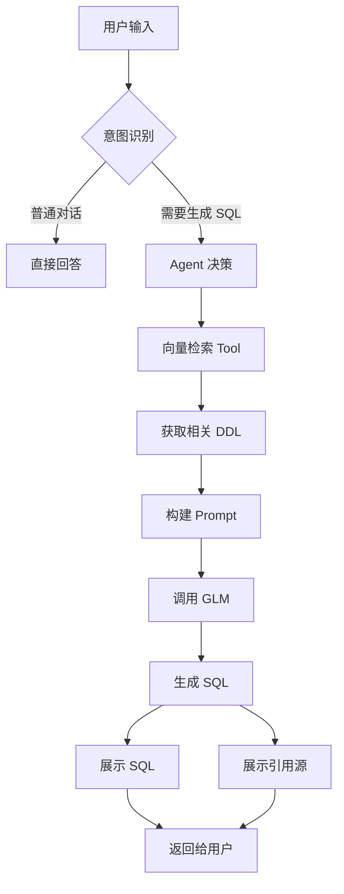

# RAG Text-to-SQL 系统 MVP 需求文档（优化版）

## 📋 项目概述

**项目名称**：RAG Text-to-SQL 智能查询系统

**项目目标**：构建一个基于 RAG（检索增强生成）技术的智能 SQL 生成系统，用户可以上传数据库 DDL 文件，通过自然语言描述生成精确的 SQL 语句。

**核心价值**：降低 SQL 编写门槛，让非技术人员也能通过自然语言与数据库交互。

---

## 🎯 功能需求

### 1. DDL 文件管理模块

#### 1.1 文件上传功能
- **支持的数据库类型**：
  - MySQL
  - PostgreSQL
  - Oracle
- **上传方式**：文件上传（.sql 格式）
- **处理流程**：
  1. 解析 DDL 文件，提取表结构、字段、索引、约束等元数据
  2. 将 DDL 信息**向量化**并存储到**内存向量库**
  3. 支持多个 DDL 文件上传（支持多数据库 schema）
  4. 为每个上传的文件生成唯一标识
- **状态管理**：
  - ✅ 已上传且向量化完成
  - ⏳ 向量化处理中
  - ❌ 解析失败（提示错误原因）

#### 1.2 DDL 预览与展示
- 上传 DDL 后，展示解析出的表结构
- 显示内容包括：
  - 表名
  - 字段名、类型、约束
  - 索引信息
  - 外键关系
- 支持**树形结构**展示多表关系

#### 1.3 文件管理界面 🆕
- **文件列表展示**：
  - 文件名称
  - 上传时间
  - 向量化状态
  - 包含的表数量
- **文件操作**：
  - ✅ 查看详情（DDL 预览）
  - ✅ 删除文件（同步删除向量数据）
  - ✅ 重新向量化（如需更新）
- **批量操作**：
  - 批量删除
  - 一键清空所有文件

### 2. 智能对话与 SQL 生成模块 🆕

#### 2.1 双模式交互 🆕
系统支持两种对话模式，**智能自动切换**：

**模式 1：普通对话模式**
- 用户可以与系统进行正常对话
- 系统作为智能助手回答数据库相关问题
- 示例场景：
  - "什么是主键？"
  - "我应该如何设计用户表？"
  - "这个错误信息是什么意思？"

**模式 2：SQL 生成模式**（自动触发）
- **触发条件**：系统识别到用户需要生成 SQL 时自动切换
- **识别关键词**："查询"、"统计"、"插入"、"更新"、"删除"、"找出"、"计算"等
- **自动启用 RAG 检索**：调用向量数据库检索相关 DDL

#### 2.2 智能 SQL Agent 架构 🆕

系统采用 **Agent 架构**，赋予大模型自主决策能力：

**Agent 能力定义**：
1. **意图识别能力**
   - 判断用户是否需要生成 SQL
   - 识别 SQL 操作类型（SELECT/INSERT/UPDATE/DELETE）
   
2. **自主向量检索能力** ⭐ 核心创新
   - Agent **自行决策**是否需要检索 DDL
   - 自主调用向量数据库，获取相关表结构
   - 根据查询复杂度决定检索深度
   
3. **专家身份设定**
   - Prompt 明确定义："你是一位专业的数据分析专家，精通多种数据库的 SQL 语法"
   - 熟悉 MySQL、PostgreSQL、Oracle 的语法差异
   - 能够生成符合最佳实践的 SQL 语句

**Agent 工作流程**：
```
用户输入
  ↓
[意图识别] → 普通对话？ → 直接回答
  ↓
  需要生成 SQL？
  ↓
[自主决策] 需要哪些表的信息？
  ↓
[向量检索] 调用向量库，获取相关 DDL
  ↓
[SQL 生成] 基于检索到的表结构 + 用户需求生成 SQL
  ↓
[结果返回] SQL + 引用的 DDL 片段
```

#### 2.3 查询能力范围
- **支持的 SQL 操作**：
  - ✅ SELECT（查询）
  - ✅ INSERT（插入）
  - ✅ UPDATE（更新）
  - ✅ DELETE（删除）
- **支持的复杂查询**：
  - JOIN（多表关联）
  - 子查询（Subquery）
  - 聚合函数（COUNT、SUM、AVG、MAX、MIN）
  - GROUP BY / HAVING
  - ORDER BY / LIMIT
  - 窗口函数（PARTITION BY）🆕

#### 2.4 可解释性与透明度 🆕

**引用源展示** ⭐ 核心功能：
- 生成 SQL 时，**必须展示引用的 DDL 片段**
- 显示格式：
  ```
  📋 引用的表结构：
  
  [表名：users]
  CREATE TABLE users (
    id INT PRIMARY KEY,
    username VARCHAR(50),
    email VARCHAR(100)
  )
  
  [表名：orders]
  CREATE TABLE orders (
    id INT PRIMARY KEY,
    user_id INT,
    FOREIGN KEY (user_id) REFERENCES users(id)
  )
  ```

- 用户可以清晰看到 **SQL 生成的依据**，增强信任度

**引用追溯功能**：
- 在生成的 SQL 语句旁边显示"📍 查看引用源"按钮
- 点击后高亮显示对应的 DDL 片段
- 支持跳转到原始文件位置

#### 2.5 功能限制
- ❌ 不需要查询历史记录功能
- ❌ 不执行 SQL 语句（仅生成）
- ✅ 但可以进行 **SQL 语法验证**（可选增强功能）

### 3. GLM 模型集成

#### 3.1 配置方式
- 用户只需提供 **GLM API Key**
- 系统自动配置并连接 GLM 模型

#### 3.2 Agent 增强配置 🆕
- **系统 Prompt 预设**：
  - 定义专家身份："你是一位精通数据库的专业分析专家"
  - 明确向量检索调用方式
  - 设定 SQL 生成规范
- **向量检索工具注册**：
  - 将向量数据库查询能力注册为 Agent 可用的 Tool
  - Agent 可自主决策何时调用该 Tool
- **多轮对话支持**：
  - 维护对话上下文
  - 支持 SQL 的迭代优化（"请加上分页"、"再加一个过滤条件"）

---

## 🏗️ 技术架构

### 前端技术栈
- **框架**：Vue.js 3
- **UI 组件库**：Element Plus / Ant Design Vue
- **状态管理**：Pinia
- **构建工具**：Vite
- **部署产物**：npm run build

### 后端技术栈
- **语言**：Python 3.9+
- **核心框架**：
  - **LangChain**：Agent 编排和 RAG 实现
  - **LangGraph**：Agent 工作流管理 🆕
  - **LangChain Tools**：向量检索工具封装
- **向量存储**：内存向量库（FAISS / Chroma）
- **AI 模型**：GLM（通过 API Key 集成）
- **DDL 解析**：sqlparse / sqlglot

### Agent 技术架构 🆕

#### Agent 核心组件
```python
# Agent 架构示意
SQLGeneratorAgent:
  - tools: [VectorSearchTool, SQLValidatorTool]
  - memory: ConversationBufferMemory
  - llm: GLM with system_prompt
  - decision_maker: ReActAgent
```

**关键技术点**：
1. **ReAct Agent 模式**：让 LLM 自主推理和行动
2. **Tool Calling**：LLM 可以调用预定义的工具（如向量检索）
3. **Memory Management**：维护多轮对话的上下文

### 向量化处理流程 🆕
```
DDL 文件上传
  ↓
[解析] sqlparse 提取表结构
  ↓
[分块] 每个表单独作为一个 Document
  ↓
[向量化] Embedding Model 生成向量
  ↓
[存储] FAISS/Chroma 内存向量库
  ↓
[索引] 建立快速检索索引
```

### 部署架构
- **部署方式**：单进程启动
- **流程**：
  1. 前端代码执行 `npm run build`
  2. 编译产物复制到 `backend/static`
  3. Python 后端启动时同时提供前后端服务（FastAPI static files）

---

## 📐 开发规范

### 后端架构规范

#### 1. DDD 分层架构（适配 Python）

采用领域驱动设计（DDD），分层如下：

- **Interface Layer（接口层）**：
  - API Endpoints（FastAPI routes）
  - Request/Response DTOs（Pydantic models）

- **Application Layer（应用层）**：
  - Application Services
  - Use Case 实现
  - Agent Orchestration 🆕

- **Domain Layer（领域层）**：
  - Domain Models（领域实体）
  - Domain Services
  - Repository Interfaces
  - DDL Entity、SQLQuery ValueObject 🆕

- **Infrastructure Layer（基础设施层）**：
  - Repository Implementations
  - 外部服务调用（GLM API、向量库）
  - Agent Tools 实现 🆕

#### 2. Python POJO 定义规范

- 使用 **Pydantic** 定义数据模型：
  - BaseModel：用于 DTO 和领域对象
  - 使用类型注解确保类型安全
  - 利用 Field 定义验证规则

示例：
```python
from pydantic import BaseModel, Field
from typing import List, Optional

class DDLFile(BaseModel):
    """DDL 文件领域实体"""
    id: str
    filename: str
    content: str
    tables: List[str]
    status: str = Field(default="pending")
    
    def parse(self) -> List['TableSchema']:
        """解析 DDL 文件"""
        pass
```

#### 3. 面向对象编程原则

- 遵循 **SOLID 原则**
- 合理使用设计模式：
  - **策略模式**：不同数据库类型的 DDL 解析策略 🆕
  - **工厂模式**：Agent 和 Tool 的创建
  - **装饰器模式**：日志记录、错误处理
- 避免面向过程式编程

#### 4. 代码质量规范

- **重构**：识别并规避《重构（Refactoring)》中描述的代码坏味道：
  - 重复代码（Duplicated Code）
  - 过长方法（Long Method）
  - 过大类（Large Class）
  - 过长参数列表（Long Parameter List）

- **Python 最佳实践**：
  - 使用类型注解（Type Hints）
  - 使用 dataclass 或 Pydantic 管理数据
  - 遵循 PEP 8 编码规范
  - 使用上下文管理器（with statement）
  - 合理使用装饰器和生成器

---

## 🎨 用户体验设计

### 界面布局 🆕

#### 主界面（三栏布局）
```
┌─────────────────────────────────────────────┐
│  [RAG Text-to-SQL 系统]      [⚙️ 设置]      │
├────────────┬────────────────────┬───────────┤
│            │                    │           │
│  文件管理  │    对话区域        │ DDL 预览  │
│            │                    │           │
│  📁 files  │    💬 聊天界面     │ 📋 结构   │
│  - file1   │                    │           │
│  - file2   │    [SQL 结果展示]  │ 表：users │
│            │                    │ - id      │
│  [上传]    │    [引用源显示]    │ - name    │
│            │                    │           │
└────────────┴────────────────────┴───────────┘
```

#### 交互流程示意
1. **左侧**：上传和管理 DDL 文件
2. **中间**：与 Agent 对话，生成 SQL
3. **右侧**：查看引用的表结构

### 关键交互点 🆕

#### 对话交互
- **自动识别意图**：系统自动判断是普通对话还是 SQL 生成
- **实时反馈**：
  - "🔍 正在检索相关表结构..."
  - "💡 找到 3 个相关表：users, orders, products"
  - "⚙️ 正在生成 SQL..."

#### SQL 展示
- **语法高亮**：使用 Monaco Editor 或 CodeMirror
- **一键复制**：点击复制按钮
- **引用源追溯**：点击查看使用了哪些表

---

## 📊 数据流图 🆕



---

## 🚀 MVP 交付范围

### 核心功能（必须实现）
- ✅ DDL 文件上传和向量化
- ✅ 文件管理界面（列表、删除）
- ✅ 双模式对话（普通对话 + SQL 生成）
- ✅ Agent 架构（自主向量检索）
- ✅ SQL 生成（支持 SELECT/INSERT/UPDATE/DELETE）
- ✅ 引用源展示（告知用户使用了哪些表）

### 增强功能（可选）
- ⭐ SQL 语法验证
- ⭐ 多轮对话优化（"再加一个条件"）
- ⭐ DDL 关系图可视化
- ⭐ 导出 SQL 到文件

---

## 📝 非功能需求 🆕

### 性能要求
- DDL 向量化：<5 秒（单个文件）
- SQL 生成响应时间：<3 秒
- 对话响应时间：<2 秒

### 可用性要求
- 支持主流浏览器（Chrome、Firefox、Safari）
- 界面适配桌面端（暂不考虑移动端）

### 安全性要求
- GLM API Key 加密存储
- 上传的 DDL 文件仅存储在内存，不持久化

---

## ✅ MVP 验收标准

### 功能验收
- [ ] 用户能够成功上传 DDL 文件并看到解析结果
- [ ] 用户能够通过自然语言生成准确的 SQL 语句
- [ ] 系统能够自动识别对话意图（普通对话 vs SQL 生成）
- [ ] 生成 SQL 时能够展示引用的 DDL 片段
- [ ] 文件管理界面能够查看、删除文件

### 质量验收
- [ ] SQL 生成准确率 ≥ 80%（基于测试用例）
- [ ] 向量检索相关性 ≥ 85%
- [ ] 代码符合 DDD 分层架构
- [ ] 无明显的代码坏味道

---

## 🎯 核心创新点总结

1. **Agent 自主决策架构** ⭐
   - LLM 可以自主调用向量检索工具
   - 不是简单的 RAG，而是智能的 Agent

2. **双模式智能交互** ⭐
   - 普通对话 + SQL 生成自动切换
   - 提升用户体验，降低使用门槛

3. **可解释性设计** ⭐
   - 明确展示 SQL 生成的依据
   - 增强用户信任度

4. **专家身份设定** ⭐
   - Prompt 中明确定义为"数据分析专家"
   - 提升 SQL 生成质量

---

## 📚 附录：关键技术选型对比

### 向量库选型
| 特性 | FAISS | Chroma |
|------|-------|--------|
| 性能 | 极快 | 较快 |
| 易用性 | 中等 | 简单 |
| 内存占用 | 低 | 中等 |
| **推荐** | ✅ MVP 阶段推荐 | 备选方案 |

### Agent 框架选型
| 特性 | LangChain + LangGraph | AutoGPT | AgentGPT |
|------|----------------------|---------|----------|
| 成熟度 | 高 | 中 | 低 |
| 文档质量 | 优秀 | 一般 | 一般 |
| Tool 生态 | 丰富 | 较少 | 较少 |
| **推荐** | ✅ 强烈推荐 | ❌ | ❌ |

---

**文档版本**：v2.0（优化版）
**最后更新**：2026-01-24
**优化重点**：Agent 架构、双模式交互、可解释性、文件管理界面
