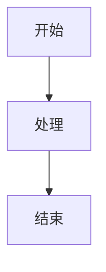

# Markdown Publisher Skill

此技能将简单的 Markdown 文档转换为带有 **内联 CSS** 的精美 HTML。这确保了当 HTML 内容被复制粘贴到经常剥离外部样式表的第三方平台（如微信公众号、电子邮件或 CMS 编辑器）时，视觉呈现保持一致。

## 目的

当出现以下情况时使用此技能：

- 你需要将 markdown 文章发布到需要样式化 HTML 的平台。
- 你希望确保 "Thoughtworks" 或其他品牌样式在复制粘贴过程中得到保留。
- 你需要自动转换 **Mermaid** 图表（如 `graph TD`）为图片，以便在不支持脚本的平台显示。
- 你需要将 markdown 中引用的**本地图片**自动转换为内联 base64 格式，方便直接复制粘贴。
- 你需要防止**冒号后内容换行**的问题（特别是在微信公众号等富文本编辑器中）。

## 用法

### 基本转换

要使用默认的 'Thoughtworks' 主题转换 markdown 文件：

```bash
python3 scripts/convert_md.py /path/to/your/article.md
```

这将在同一目录中生成 `/path/to/your/article.html`。

### 选择主题

你可以按名称指定主题：

```bash
python3 scripts/convert_md.py /path/to/your/article.md --theme thoughtworks
```

主题位于 `themes/` 目录中，为 JSON 文件。

## 可用主题

- **thoughtworks** (默认): 深青色背景，珊瑚色标题，专业技术博客外观。

## 添加新主题

要创建新主题：

1. 在 `themes/<theme-name>.json` 中创建一个 JSON 文件。
2. 为以下键定义样式：`container`, `article`, `h1`, `h2`, `p`, `blockquote`, `code_block_wrapper`, `code`, `img`, `ul`。
3. 样式应为原始 CSS 字符串（例如，`"color: red; margin: 10px;"`）。

## 图片处理

此技能会自动处理 markdown 中的图片引用：

### 本地图片转换

- **本地图片**（相对路径或绝对路径）会自动转换为 base64 内联格式
- 转换后的 HTML 可以直接复制粘贴到富文本编辑器，无需单独上传图片
- 支持的格式：PNG, JPG, JPEG, GIF, WebP, SVG, BMP
- **智能图片大小控制**：
  - **外部引用图片**（本地和远程）：统一 450px
  - **Mermaid 图表**：根据元素数量和复杂度自动调整
    - 自动识别图表类型（流程图、时序图、甘特图、类图、状态图等）
    - 统计元素数（节点/参与者/状态/类/任务等）
    - 统计关系数（连接/消息/转换/继承等）
    - 复杂度 = 元素数 × 2 + 关系数
    - 简单图（复杂度 ≤ 10）：300px
    - 中小图（复杂度 11-30）：450px
    - 中等图（复杂度 31-50）：600px
    - 复杂图（复杂度 > 50）：900px

示例：

```markdown


```

这些本地图片会被自动转换为：

```html

```

### 远程图片

- **远程图片**（以 `http://` 或 `https://` 开头）保持原始 URL 不变
- 已经是 base64 格式的图片（`data:` 开头）也保持不变

示例：

```markdown

```

这些图片会保持原始 URL：

```html

```

### Mermaid 图表

- Mermaid 图表代码块会自动渲染为 PNG 图片并转换为 base64 内联格式
- 使用 `--scale 3` 参数生成高清图片，确保在各种屏幕上清晰显示

示例：

````markdown

````

会被转换为内联的 PNG 图片。

### 代码块格式保护

代码块（包括 YAML、JSON、Python 等）在复制到富文本编辑器时，格式容易丢失（缩进消失、空格压缩等）。本工具提供完善的格式保护：

**保护机制**：

- **空格保护**：将连续空格转换为不间断空格（`&nbsp;`）交替模式，防止缩进和空格被压缩
- **等宽字体**：使用 `Courier New` 等等宽字体，确保代码对齐清晰
- **换行保留**：使用 `white-space: pre-wrap` CSS 属性，保持原始换行
- **Tab 支持**：设置 `tab-size: 4`，正确显示 Tab 缩进

**适用范围**：

所有代码块语言，包括但不限于：YAML、JSON、Python、JavaScript、Java、Shell、XML、SQL 等。

**示例**：

输入：

````markdown
```yaml
services:
  web:
    image: nginx
    ports:
      - "80:80"
```
````

输出：

代码块中的所有缩进和空格都会被保护，复制到微信公众号等富文本编辑器后格式完全保持不变。

### 冒号换行修复

为了解决在微信公众号等富文本编辑器中冒号后内容被意外换行的问题，转换器会自动在冒号后插入零宽连接符（Zero Width Joiner, `&#8205;`）。

**处理规则**：

- 中文冒号（：）和英文冒号（:）都会被处理
- 零宽连接符不可见，不影响显示效果
- 有效防止富文本编辑器在冒号处断行

**示例**：

输入：

```markdown
**配置项：** 这是说明内容
标题：这是正文内容
```

转换后：

```html
<strong>配置项：</strong>&nbsp;这是说明内容 标题：&#8205;这是正文内容
```

复制到微信公众号后，冒号和后续内容保持在同一行，不会被意外换行。

## 使用建议

### 文件大小注意事项

- Base64 编码会增加约 33% 的文件大小
- 对于包含大量或大尺寸图片的文章，生成的 HTML 文件可能较大
- 建议在发布前优化图片（压缩、调整尺寸）

### 图片路径

- 相对路径基于 markdown 文件所在目录解析
- 建议使用相对路径（如 `./images/pic.png`）以便项目移动
- 如果图片不存在，会保留原始路径并输出警告信息
