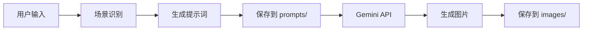

# 智能图片生成器

一个智能图片生成系统，自动识别场景类型，协作设计提示词，使用 Gemini 生成高质量图片。

## 🚀 快速开始

### 1️⃣ 环境准备（首次使用）

```bash
# 检查环境（推荐）
./check-env.sh

# 或手动检查
bun --version  # 需要 1.0.0+
```

**需要准备**：

- ✅ [Bun](https://bun.sh) 运行时
- ✅ [Google Chrome](https://google.com/chrome) 浏览器
- ✅ Google 账号
- ✅ 能访问 gemini.google.com

### 2️⃣ 安装依赖

```bash
cd skills/custom-skills/smart-image-generator
bun install
```

### 3️⃣ 生成你的第一张图片

```bash
# 从文件生成
bun scripts/generate-prompt.ts \
  --scene cover \
  --style notion \
  --content "AI时代研发提效：完整的软件研发工作流"

# 生成图片
bun scripts/generate-image.ts \
  --prompt 项目根目录/smart-image-generator-output/prompts/cover-notion-2026-01-29.md
```

**首次使用会发生什么**：

1. 🌐 自动打开 Chrome 浏览器（只打开1个窗口）
2. 👤 你在浏览器中登录 Google 账号（最多5分钟）
3. ✅ 登录成功，浏览器自动关闭
4. 🎨 开始生成图片

**后续使用**：直接生成，无需登录！

**登录优化**：
- ✅ 只弹出1个浏览器（已修复双窗口bug）
- ✅ 5分钟超时（支持2FA验证）
- ✅ 登录状态自动保存

---

## 🔐 账号管理

### 换号/重新登录

如果需要切换Google账号或重新登录：

**方法1：通过AI命令（推荐）**

只需告诉AI：

```
"我想换个账号"
"重新登录"
"切换账号"
"登出"
```

AI会自动：

1. ✅ 检测到换号意图
2. ✅ 清除当前登录状态
3. ✅ 告知下次使用时会弹出浏览器重新登录

**方法2：手动执行脚本**

```bash
cd skills/custom-skills/smart-image-generator
bun scripts/logout.ts
```

**输出示例**：

```
🔐 正在清除登录状态...

════════════════════════════════════════════════════════════
清除结果：
════════════════════════════════════════════════════════════
Cookies文件          ✅ 已删除
Chrome Profile       ✅ 已清除
════════════════════════════════════════════════════════════

✅ 登录状态已清除

💡 下次使用时会自动弹出浏览器重新登录
```

**检查登录状态**

```bash
bun scripts/logout.ts --check
```

**详细说明**：参见 [ACCOUNT_MANAGEMENT.md](./ACCOUNT_MANAGEMENT.md)

---

## 💡 核心功能

### 🌍 智能语言识别

**中文内容 → 中文图片**（自动添加语言标记）

```markdown
Create a notion-style cover (16:9, Chinese text):
**Visual**:

- Main focus: 专业现代的构图 ← 中文描述
```

**英文内容 → 英文图片**（无语言标记）

```markdown
Create a notion-style cover (16:9):
**Visual**:

- Main focus: professional composition ← 英文描述
```

### 📂 统一输出目录

所有输出自动保存到 `smart-image-generator-output/`：

```
项目根目录/smart-image-generator-output/
├── prompts/   # 提示词文件
└── images/    # 生成的图片
```

**三级优先级**：

1. 用户指定路径（最高）
2. 输入文件同目录（中等）
3. 项目根目录（最低）

---

## 📖 使用指南

### 生成提示词

```bash
# 最简单：自动输出
bun scripts/generate-prompt.ts \
  --scene cover \
  --content "你的内容"

# 指定风格
bun scripts/generate-prompt.ts \
  --scene flowchart \
  --style obsidian \
  --content "流程描述"

# 自定义输出位置
bun scripts/generate-prompt.ts \
  --scene poster \
  --content "海报内容" \
  --output custom/path/prompt.md
```

**支持的场景**：`cover` | `flowchart` | `poster` | `mindmap` | `note`  
**支持的风格**：`notion` | `obsidian` | `blueprint` | `warm`

### 生成图片

```bash
# 使用默认输出路径
bun scripts/generate-image.ts \
  --prompt path/to/prompt.md

# 自定义输出位置
bun scripts/generate-image.ts \
  --prompt path/to/prompt.md \
  --output custom/path/image.png
```

---

## ⚙️ 环境要求（详细）

### 必需软件

#### 🔧 Bun 运行时

**安装**：

```bash
curl -fsSL https://bun.sh/install | bash
```

**验证**：

```bash
bun --version  # 需要 ≥ 1.0.0
```

#### 🌐 Google Chrome

**macOS**：

```bash
brew install --cask google-chrome
```

**Linux**：

```bash
wget https://dl.google.com/linux/direct/google-chrome-stable_current_amd64.deb
sudo dpkg -i google-chrome-stable_current_amd64.deb
```

**Windows**：从 [google.com/chrome](https://google.com/chrome) 下载安装

#### ✅ 验证环境

```bash
# 使用检查脚本
./check-env.sh

# 或手动检查
bun --version
ls "/Applications/Google Chrome.app"  # macOS
which google-chrome                   # Linux
```

### 可选软件

- **Node.js** 18+ (如果不使用 Bun)
- **npm** 9+ (配合 Node.js)

---

## 🐛 故障排除

### 问题 1：中文乱码

**症状**：生成的图片中文字符显示为方框或乱码

**解决**：系统已自动修复

- ✅ 中文内容自动添加 `(Chinese text)` 标记
- ✅ 描述自动切换为中文
- ✅ 无需手动调整

### 问题 2：登录失败

**症状**：浏览器无法打开或登录超时

**解决方案**：

```bash
# 1. 检查 Chrome 是否安装
ls "/Applications/Google Chrome.app"  # macOS
which google-chrome                   # Linux

# 2. 检查网络连接
curl -I https://gemini.google.com
curl -I https://accounts.google.com

# 3. 手动删除 cookies 重新登录
rm -rf ~/.cache/puppeteer/gemini-cookies.json
```

### 问题 3：Bun 未找到

**症状**：`command not found: bun`

**解决方案**：

```bash
# 重新安装 Bun
curl -fsSL https://bun.sh/install | bash

# 添加到 PATH（如需要）
echo 'export PATH="$HOME/.bun/bin:$PATH"' >> ~/.bashrc
source ~/.bashrc
```

### 问题 4：生成失败

**症状**：生成过程报错或超时

**解决方案**：

```bash
# 1. 检查依赖
bun install

# 2. 清理缓存
rm -rf node_modules
bun install

# 3. 重新登录
rm -rf ~/.cache/puppeteer/gemini-cookies.json
```

---

## 📚 技术细节

### 架构概览

```
智能图片生成器
├── scripts/
│   ├── generate-prompt.ts      # 提示词生成
│   ├── generate-image.ts       # 图片生成
│   └── lib/
│       └── gemini-client.ts    # Gemini API 客户端
├── references/
│   ├── scene-types/            # 场景模板
│   └── styles/                 # 风格定义
└── output/
    └── smart-image-generator-output/
        ├── prompts/            # 生成的提示词
        └── images/             # 生成的图片
```

### 核心技术栈

- **Bun** - 快速 JavaScript 运行时
- **TypeScript** - 类型安全
- **Puppeteer** - 浏览器自动化
- **Chrome DevTools Protocol** - 浏览器控制
- **Gemini Web API** - 图片生成

### 工作流程



---

## 🤝 贡献指南

欢迎提交 Issue 和 Pull Request！

**开发设置**：

```bash
git clone <repo>
cd smart-image-generator
bun install
bun test
```

---

## 📄 许可证

MIT License

---

## 🔗 相关链接

- [Gemini](https://gemini.google.com) - Google AI 模型
- [Bun 文档](https://bun.sh/docs) - Bun 运行时
- [Puppeteer 文档](https://pptr.dev) - 浏览器自动化
- [SKILL.md](./SKILL.md) - 技能详细文档

---

**版本**: v2.0.0  
**最后更新**: 2026-01-29  
**作者**: VB Coding Demo

🎉 立即开始生成你的第一张智能图片！
